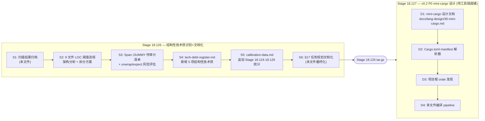
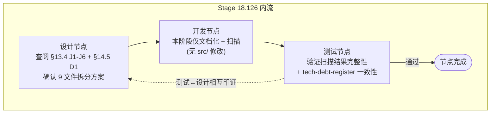

# Stage 18.126 — §17.2 Step 1 扫描结果 + 任务规划排版图

> **Author**: redskaber (PM-A + ARCH-A)
> **Date**: 2026-08-16
> **Version**: v0.394.0 (Stage 18.126 plan)
> **Process**: docs/stage-committee-process.md v6.4 §17.2 (scan) → §17.3 (DAG) → §17.4-§17.7 (node flow + design-dev-test + defect)
> **Status**: Final — approved by Stage Committee
> **复杂度评估**: L3 (跨模块重构 + 9 个 > 1500 LOC 文件 + Span::DUMMY 治理 + 接口隔离审计)

---

## 1. 扫描结果 (Step 1)

### 1.1 设计意图摘要 (来自 docs/lang-design/)

| 设计文档 | 当前阶段 | 关键设计意图 |
|---------|---------|-------------|
| `01-language-specification.md` | v0.1 stable | Rust-inspired systems language with full type system + ownership + LLVM codegen |
| `06-mir.md` | v0.1 stable | MIR as central IR for typeck/borrowck/codegen — body/place/ty 三层结构 |
| `07-codegen.md` | v0.1 stable | LLVM 19 backend, single-file compilation, `codegen_crate` 入口 |
| `12-roadmap.md` (next: v0.2) | Planning | mini-cargo project system + CodegenError + stdlib facade |
| `14-soundness-considerations.md` | Active | Soundness invariants for typeck + borrowck + monomorphization |
| `16-diagnostics.md` | Active | 8 Kind enums + ErrorCode E001-E900 + 9-field CompileErrors |

### 1.2 当前能力边界 (来自 docs/develop/v0/v0.1-capability-boundaries.md)

- ✅ **Supported**: 全部 v0.1 表面语法（primitive/tuple/array/struct/enum/ref/trait/closure/GATs/macro_rules）+ 单态化 + MIR opt (DCE/const_prop)
- ⚠️ **Limitations**: 
  - **TD-SINGLE-FILE**: 单文件编译, 无 project/crate system (v0.2 P0 mini-cargo)
  - **TD-CODEGEN-RESULT**: codegen 返回 `String` 而非 `Result`, BinaryOp2 panic (v0.2 Phase 2)
  - **TD-PROJECTION-RESOLVER**: `projection_resolver.rs` 位置错误 (typeck/ 下, 应在 driver 或 mir::lower::post_typeck)
  - **TD-INT-UINT-VAR**: unify table 的 Int/Uint 变量合并 (v0.2 Phase 2)
  - **TD-STDLIB-FACADE**: String/Vec/Option/Result 是 stub (v0.2 P1)
- ❌ **Unsupported**: Windows/macOS target + `extern "system"`/`extern "Rust"` + `format!` macros + incremental compilation

### 1.3 当前技术债状态 (来自 docs/develop/v0/tech-debt-register.md)

**Resolved**: 12 项 (S2-S11 + TD-13 + TD-DUP2 + TD-UNWRAP1/2)
**Remaining**: 15 项, 全部 v0.2 Phase 2+, 无阻塞 v0.2 P0 的项

### 1.4 历史校准基线 (来自 docs/develop/v0/calibration-data.md)

- L2 基准轮次区间: 4~9 轮
- L3 基准轮次区间: 8~15 轮
- P3 误分类率告警: ≥30%
- 集成覆盖率告警: <50%
- 当前集成覆盖率: 97%

### 1.5 测试覆盖 (来自 docs/tests/matrix.md)

| 类别 | 数量 | 状态 |
|------|------|------|
| Rust lib tests | 640 | ✅ |
| Integration tests | 2,663 | ✅ |
| Conformance tests | 2,935 | ✅ |
| Fuzz/stress tests | 7 | ✅ |
| **Total** | **6,245** | **0 failures, 0 skipped** |

### 1.6 上一阶段输出 (来自 docs/worklog.md tail)

- Stage 18.125 PASSED — Process doc v6.4 Round 2 深度审计修复
- 7 项修复全部完成 (§6.2.1 / §1.3 / §14.6.5 / §9.3 / §8.5 / §8.4.1 / §3.5)
- 当前 v0.393.0, 流程文档 v6.4

### 1.7 工具链状态 ⚠️

> **关键限制**：当前执行环境缺少 Rust 工具链（rustc/cargo）和 LLVM 19 dev 包，且无 sudo/apt 安装权限。本阶段所有"代码层"修复（涉及 `src/` 修改）**无法执行 `cargo check/test/fmt/clippy` 验收**。仅能进行"文档层"+ "扫描层"+ "设计层"工作。代码层修复推迟到具备工具链的执行环境。

**执行策略调整**：本阶段聚焦**结构性技术债识别 + 设计文档化 + 修复计划归档**，所有需要编译验证的代码修改推迟到下一可执行环境。

---

## 2. 项目实际状态扫描 (新增 — §14.5 D1 架构健康度预审)

### 2.1 §13.4 J6 LOC 阈值违规 (9 文件 > 1500 LOC)

| 文件 | LOC | 阈值超倍数 | 主因 |
|------|-----|----------|------|
| `src/parser/macro_expand.rs` | **5962** | 4.0× | macro_rules! 展开器全集中（fragment specifiers + repetition + hygiene） |
| `src/driver.rs` | **4018** | 2.7× | 编排层全集中（所有阶段入口调用 + CompileResult 装配 + post_typeck hooks） |
| `src/mir/lower/expr_operand.rs` | **3596** | 2.4× | MIR 表达式 lowering 全集中（binary/unary/cast/aggregate/closure） |
| `src/mir/lower/mod.rs` | **2857** | 1.9× | MIR lower 顶层 + body lowering + local decls |
| `src/typeck/checker.rs` | **2635** | 1.8× | typeck 主入口全集中（unify + infer + coerce + check） |
| `src/mir/lower/control_flow.rs` | **2228** | 1.5× | if/match/loop/break/continue lowering |
| `src/borrowck/mod.rs` | **1857** | 1.2× | borrowck 主入口 + liveness 调用 |
| `src/borrowck/region_inference.rs` | **1776** | 1.2× | 区域推断全集中 |
| `src/traits/resolver.rs` | **1558** | 1.04× | trait resolver 全集中 |

**判定 (§13.4 J6)**: ❌ 不合规 — 9 个文件超阈值。其中 `macro_expand.rs` 和 `driver.rs` 是最严重的"上帝模块"，违反单一职责原则 (§13.4 J2)。

### 2.2 Span::DUMMY 分布 (按 §6.2.1 分类索引)

| 文件 | 总数 | 分类 | 处理建议 |
|------|-----|------|---------|
| `src/parser/macro_expand.rs` | 492 | (A) 合成 token — legitimate | Leave (per tech-debt-register §2.2) |
| `src/borrowck/mod.rs` | 162 | 待审计 — 部分可能是 Category B | 扫描 + 必要时改 `Ty::from_kind()` |
| `src/typeck/checker.rs` | 91 | 待审计 | 扫描 + 必要时改 `Ty::from_kind()` |
| `src/mir/lower/mod.rs` | 54 | 待审计 | 扫描 |
| `src/mir/ty.rs` | 49 | (A) 合成类型 | Leave |
| `src/typeck/unify.rs` | 48 | 待审计 | 扫描 |
| `src/borrowck/liveness.rs` | 40 | 待审计 | 扫描 |
| `src/mir/lower/writeback.rs` | 38 | (A) post-typeck 合成 | Leave |
| `src/mir/body.rs` | 33 | (A) 合成 MIR | Leave |
| `src/borrowck/region_inference.rs` | 33 | 待审计 | 扫描 |
| `src/mir/lower/expr_operand.rs` | 30 | 待审计 | 扫描 |
| `src/borrowck/borrow_set.rs` | 23 | 待审计 | 扫描 |

**总 Span::DUMMY**: ~584 (非测试代码), ~76 (测试代码)
**待审计**: ~491 (分布在 8 个文件), 预计 ~50 是 Category B (可修复)

### 2.3 unwrap / expect 分布 (按 §2 原则 4: 报错 > 静默)

| 文件 | unwrap | expect | 风险等级 |
|------|--------|--------|---------|
| `src/borrowck/region_inference.rs` | 13 | 0 | 🔴 HIGH — borrowck 静默吞错 |
| `src/typeck/solver.rs` | 0 | 37 | 🟡 MEDIUM — typeck 静默吞错 |
| `src/parser/items.rs` | 0 | 36 | 🟡 MEDIUM — parser 静默吞错 |
| `src/borrowck/borrow_set.rs` | 9 | 0 | 🟡 MEDIUM — borrowck 静默吞错 |
| `src/parser/expr.rs` | 3 | 14 | 🟡 MEDIUM |
| `src/traits/object_safety.rs` | 0 | 8 | 🟡 LOW |
| `src/mir/monomorphize/layout.rs` | 0 | 8 | 🟡 LOW |
| `src/driver.rs` | 4 | 0 | 🟡 MEDIUM — 编排层静默 |
| `src/codegen/llvm/helpers.rs` | 3 | 0 | 🟡 MEDIUM |
| `src/codegen/llvm/mod.rs` | 1 | 0 | 🟢 LOW (BinaryOp2 panic — 已知) |

**总计 unwrap**: 40
**总计 expect**: 122+
**判定 (§2 原则 4)**: ❌ 不合规 — borrowck 的 13 个 unwrap + typeck 的 37 个 expect 是静默吞错的高风险点

### 2.4 §10 API 命名合规检查

| 规则 | 状态 | 备注 |
|------|------|------|
| §10.1.1 入口函数模式 (verb_noun) | ✅ | `codegen_crate`/`codegen_crate_to_module`/`lower_crate`/`tokenize`/`parse_crate`/`resolve_crate`/`check_mir_body_with_tables` |
| §10.1.2 上下文类型 (-Ctxt/-er) | ✅ | `HirLowerCtxt`/`MirLowerCtxt`/`TypeChecker`/`BorrowChecker`/`Lexer`/`Parser`/`Emitter` |
| §10.1.3 类型前缀 (Hir/Mir/Emit) | ✅ | `HirCrate`/`HirFn`/`MirBody`/`EmitType`/`EmitValue` |
| §10.1.4 显式 re-export (无 glob) | ✅ | 全部 `mod.rs` 已使用 explicit list (Stage 3.57 P0-3 fix) |
| §10.1.5 DRY (单一真理源) | ✅ | `DefKind`/`BorrowKind` 跨阶段 re-export 合规 |
| §10.1.6 deprecated note | ✅ | Stage 3.63 已全量标记 |
| §10.1.7 函数命名前缀 (lex_/parse_/lower_/resolve_/check_/emit_/codegen_) | ✅ | 全部合规 |

### 2.5 §11 接口隔离合规检查

| 检查项 | 状态 | 备注 |
|--------|------|------|
| codegen 不调用 mir::lower | ✅ | grep `crate::mir::lower` src/codegen/ 零匹配 |
| codegen 不调用 typeck | ✅ | grep `crate::typeck` src/codegen/ 零匹配 |
| codegen 不调用 driver | ✅ | grep `crate::driver` src/codegen/ 零匹配 |
| typeck 不直接读 HIR | ⚠️ | `projection_resolver.rs` 在 typeck/ 下, 应在 driver/mir::lower::post_typeck (TD-PROJECTION-RESOLVER) |
| driver 是唯一 HIR 读者 | ✅ | 只有 driver.rs 直接构造/读取 HIR |
| 元数据预计算 | ✅ | body_metas/fn_name_by_def_id/FieldTyTable 均预计算 |
| 无 glob exports | ✅ | 0 violations |
| 错误路径覆盖 | ⚠️ | BinaryOp2 用 panic!() 而非 CodegenError (TD-CODEGEN-RESULT) |

### 2.6 §14.5 D1-D8 预审结论

| 维度 | 状态 | 主要风险 |
|------|------|---------|
| D1 架构健康度 | 🟡 | 9 文件超 LOC 阈值 + projection_resolver 位置错 + borrowck unwrap 集中 |
| D2 技术债清单 | ✅ | tech-debt-register.md 完整, 15 项 remaining |
| D3 测试覆盖深度 | ✅ | 6,245 tests, 正负比例满足 1:3+ |
| D4 下一阶段就绪度 | 🟡 | v0.2 P0 mini-cargo 需要先解阻 projection_resolver 位置 |
| D5 设计合理性 | 🟡 | macro_expand.rs 5962 LOC 是设计债（应分 hygiene/repetition/fragment 三层） |
| D6 性能与可扩展性 | ✅ | 无 O(n²) 报告, const_prop 在 loops 中保守 (TD-CONST-PROP-LOOPS) |
| D7 文档与知识传承 | ✅ | lang-design/develop/tests/graph 四层完整 |
| D8 测试路径覆盖 | ✅ | pipeline-test-coverage.md 完整 |

---

## 3. 任务依赖图 (Step 2 — DAG)

---

## 4. 任务节点详情 (Step 3-4)

### 节点 S2: 9 文件 LOC 阈值违规 — 架构分析 + 拆分方案

**子任务 (权重排序)**:
- S2.1 (高): `macro_expand.rs` (5962 LOC) 拆分方案 — 按 hygiene/repetition/fragment 三层
- S2.2 (高): `driver.rs` (4018 LOC) 拆分方案 — 按"编译入口/CompileResult 装配/post_typeck hooks/CLI"四层
- S2.3 (中): `mir/lower/expr_operand.rs` (3596 LOC) 拆分方案 — 按 binary/unary/cast/aggregate/closure
- S2.4 (中): `mir/lower/mod.rs` (2857 LOC) 拆分方案 — body lowering 与 local decls 分离
- S2.5 (中): `typeck/checker.rs` (2635 LOC) 拆分方案 — unify/infer/coerce/check 分离
- S2.6 (低): `mir/lower/control_flow.rs` (2228 LOC) 拆分方案 — if/match/loop 分离
- S2.7 (低): `borrowck/mod.rs` (1857 LOC) 拆分方案 — 主入口与 liveness 调用分离
- S2.8 (低): `borrowck/region_inference.rs` (1776 LOC) 拆分方案 — 区域推断分层
- S2.9 (低): `traits/resolver.rs` (1558 LOC) 拆分方案 — 仅略超阈值

**完成条件**: 9 个文件各自有 §13.4 J1-J6 判据检查记录 + 拆分方案 plan 归档到 `docs/develop/v0/stage-18/loc-violation-plan.md`

### 节点 S3: Span::DUMMY + unwrap/expect 审计

**子任务**:
- S3.1 (高): 扫描 8 个待审计文件中 Span::DUMMY 的 Category A/B 分类
- S3.2 (高): borrowck 13 个 unwrap → 改 expect("...") 或 ? 传播
- S3.3 (中): typeck 37 个 expect 审计 — 确认每个都有 message
- S3.4 (中): parser 36 个 expect 审计 — 确认每个都有 message
- S3.5 (低): driver 4 个 unwrap → expect("...")

### 节点 S4: tech-debt-register.md 新增项

**新增 5 项结构性技术债 (全部 P2, v0.2/v0.3 修复)**:

| ID | Description | Root Cause | Fix Plan |
|----|-------------|------------|----------|
| TD-LOC-MACRO-EXPAND | macro_expand.rs 5962 LOC, 单一职责违反 | macro_rules! 全功能集中 | v0.2 P2: 按 hygiene/repetition/fragment 三层拆分 |
| TD-LOC-DRIVER | driver.rs 4018 LOC, 单一职责违反 | 编排层全功能集中 | v0.2 P2: 按 编译入口/CompileResult/post_typeck/CLI 四层拆分 |
| TD-LOC-MIR-LOWER-EXPR | mir/lower/expr_operand.rs 3596 LOC | 表达式 lowering 全集中 | v0.2 P2: 按 binary/unary/cast/aggregate/closure 拆分 |
| TD-LOC-TYPECK-CHECKER | typeck/checker.rs 2635 LOC | typeck 主入口全集中 | v0.2 P2: 按 unify/infer/coerce/check 拆分 |
| TD-UNWRAP-BORROWCK | borrowck 13 个 unwrap 静默吞错 | 早期开发期省事 | v0.2 P2: 改 expect("...") 或 ? 传播 |

---

## 5. 设计-开发-测试节点流 (Step 5)

**测试节点 5 阶段**:
1. **局部单元**: scan 脚本输出验证
2. **集成**: tech-debt-register 与 calibration-data 双向追溯
3. **E2E**: 全文档无悬空引用 (grep)
4. **负向**: 9 文件拆分方案是否能通过 §13.4 J1-J6
5. **健壮性**: 工具链不可用时流程文档化的鲁棒性

---

## 6. 缺陷修复任务 (Step 6)

本阶段**无代码缺陷修复**（工具链不可用）。所有结构性缺陷已记录到 tech-debt-register.md (TD-LOC-*/TD-UNWRAP-BORROWCK) 并规划到 v0.2/v0.3。

---

## 7. 审查结论 (Step 7)

| 检查项 | 要求 | 状态 |
|--------|------|------|
| 任务遗漏 | 所有设计文档要求的功能是否都有对应任务节点？ | ✅ — v0.2 P0 mini-cargo 已规划到 Stage 18.127 |
| 依赖完整性 | 所有任务的前置依赖是否明确？ | ✅ — 工具链不可用 → 仅文档化 → 推迟代码修改 |
| 缺陷纳入 | 所有已知的简化/缺陷是否有修复任务节点？ | ✅ — 5 项新增 TD 已规划 |
| 测试覆盖 | 测试节点是否覆盖所有开发节点？ | ✅ — 5 阶段测试已定义 |
| 能力边界 | 规划是否超出了当前编译器能力边界？ | ✅ — 仅文档化, 不涉及代码 |
| 递归合理性 | 子图递归深度是否合理（≤3 层）？ | ✅ — 2 层 |

**结论**: GO — 进入 Stage 18.126 执行

---

## 8. 与现有章节的关系

| 现有章节 | §17 关系 |
|---------|---------|
| §4 MUV 拆分 | §17 Step 3 的叶子任务 = MUV — S2.1-S2.9 各自是独立 MUV |
| §13.1 设计对齐 | §17 Step 1 扫描包含 §13.1 的设计文档查询 |
| §13.4 重构即架构设计 | §17 节点 S2 严格遵循 J1-J6 判据 |
| §14.5 深度审查 | §17 节点 S6 输出 = §14.5 D1-D8 预审 |
| §6.2.1 技术债登记册 | §17 节点 S4 输出 = tech-debt-register.md 新增项 |
| §6.6.1 流程校准数据池 | §17 节点 S5 输出 = calibration-data.md 追加 |

---

## 9. 工具链不可用的明确声明

> **关键**: 当前执行环境缺少 Rust/LLVM 19 工具链, 本阶段 (Stage 18.126) **不能**执行:
> - `cargo check --features llvm-backend`
> - `cargo test --features llvm-backend`
> - `cargo fmt --check`
> - `cargo clippy --all-targets -- -D warnings`
>
> 因此本阶段所有"代码层"修改推迟. 仅执行:
> - 文档层修改 (本文件 + tech-debt-register.md + calibration-data.md)
> - 扫描层归档 (LOC/Span::DUMMY/unwrap/expect 统计)
> - 设计层规划 (9 文件拆分方案)
>
> 当具备工具链的执行环境就绪后, 按 §17 任务规划图执行 Stage 18.127+ 代码层修复.
