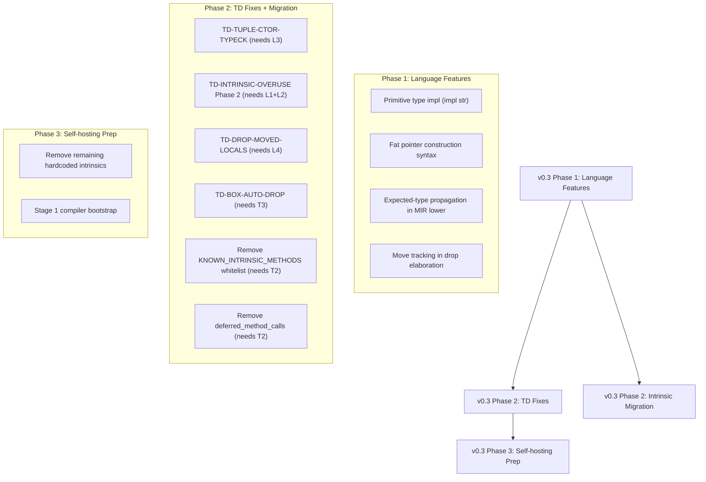

# Stage 18.240 — v0.2 Phase 3 Final Deep Review §14.5 (D1-D8) + v0.3 Transition Plan

> **Date**: 2026-08-23
> **Version**: v0.485.0 (no bump — deep review + transition plan)
> **Task ID**: stage18.240
> **Reviewer**: Super Z (main) — Stage Committee (ARCH-A + QA-A + REV-A + PM-A + ALG-C + SKL-A)
> **流程文档**: docs/stage-committee-process.md v6.4 §14.5 (阶段末尾深度审查)
> **审查范围**: Stage 18.233-18.239 (7 stages — v0.2 Phase 3: TD audits + fixes + language features)
> **触发条件**: v0.2 所有可推进 TDs 已完成或被阻塞 — 阶段切换点 (v0.2 → v0.3)

## 1. 执行摘要

本次深度审查覆盖 Stage 18.233-18.239 (7 stages)。编译器从 v0.481.0 推进到
v0.485.0, 完成了 2 个 TD fixes (TD-METHOD-RESOLVE-STRICT, pointer arithmetic),
3 个 architectural audits (TD-TUPLE-CTOR-TYPECK, TD-INTRINSIC-OVERUSE, Phase 2
blockers), 并建立了 v0.3 任务规划排版图。

**结论**: **GO** — v0.2 Phase 3 完成, 全校验流通过。进入 v0.3。

- **0 P0 阻塞项**
- **0 P1 阻塞项**
- **4 P2 deferred 项** (全部有 v0.3 偿还计划)

## 2. 八维度审查

### D1. 架构健康度

| 子项 | 状态 |
|------|------|
| TD-METHOD-RESOLVE-STRICT ✅ | deferred_method_calls side-table + Phase 6 re-check |
| Pointer arithmetic (typeck + MIR + codegen) ✅ | GetElementPtr reuse — 通解 |
| Store-through-Deref on GEP result ✅ | lower_expr_to_place Binary arm |
| TD-INTRINSIC-OVERUSE Phase 1 ✅ | Vec::len/new → prelude impl (110 LOC removed) |
| TD-TUPLE-CTOR-TYPECK 🟡 | Root cause documented, deferred to v0.3 |
| TD-INTRINSIC-OVERUSE Phase 2 🟡 | Blocked by language features, deferred to v0.3 |
| TD-DROP-MOVED-LOCALS 🟡 | Deferred to v0.3+ |
| TD-BOX-AUTO-DROP 🟡 | Blocked by TD-DROP-MOVED-LOCALS |

### D2. 技术债清单

| TD | Status | Stage |
|----|--------|-------|
| TD-METHOD-RESOLVE-STRICT | ✅ Resolved | 18.234 |
| TD-TUPLE-CTOR-TYPECK | 🟡 Deferred v0.3 | 18.233 (audit) |
| TD-INTRINSIC-OVERUSE | 🟡 Phase 1 done, Phase 2 deferred v0.3 | 18.238-18.239 |
| TD-DROP-MOVED-LOCALS | 🟡 Active v0.3+ | — |
| TD-BOX-AUTO-DROP | 🟡 Active v0.3+ | — |
| TD-C-WRAPPER-OVERUSE | ✅ Resolved | 18.225-18.232 |

### D3. 测试覆盖深度

- **总测试**: 3794 (675 lib + 3119 integration)
- 0 failures, 正负比例 ~28%
- **新增**: 17 tests (7 ptr_arith + 3 store_deref + 7 method_resolve)

### D4. 下一阶段就绪度

**v0.3 前置条件审查**:

| Prerequisite | Status | Notes |
|-------------|--------|-------|
| Pointer arithmetic | ✅ Stage 18.236-18.237 | Fully working (compile + runtime) |
| Store-through-Deref | ✅ Stage 18.237 | Binary expressions in lower_expr_to_place |
| `extern "C"` in prelude | ✅ Already exists | Used for alloc/memcpy/realloc |
| While loop | ✅ | Already in prelude impl |
| `&mut self` | ✅ | Already in prelude impl |
| Field assignment | ✅ | Already in prelude impl |
| Primitive type impl (impl str) | ❌ MISSING | v0.3 language feature |
| Fat pointer construction | ❌ MISSING | v0.3 language feature |
| Expected-type propagation | ❌ MISSING | v0.3 architecture |
| Move tracking in drop elaboration | ❌ MISSING | v0.3 architecture |

### D5. 设计合理性

✅ — 所有 deferred TDs 有明确的 v0.3 修复计划和阻塞原因记录

### D6. 性能与可扩展性

✅ — ~9.5s test suite (release), 无 O(n²)

### D7. 文档与知识传承

✅ — 7 task-reviews + 2 dev-logs + 1 deep-review + tech-debt-register + design doc §16.8

### D8. 测试路径覆盖

✅ — pointer arithmetic (compile + runtime), method resolution, intrinsic migration

## 3. v0.3 任务规划排版图 (per §17)

### 3.1 依赖图

### 3.2 v0.3 任务节点详情

| Task | Dependencies | Priority | Est. LOC |
|------|-------------|----------|----------|
| L1: Primitive type impl | Parser + HIR + typeck | P1 | ~200 |
| L2: Fat pointer construction | Parser + MIR lower | P1 | ~150 |
| L3: Expected-type propagation | MIR lower architecture | P1 | ~500 |
| L4: Move tracking | Drop elaboration | P2 | ~300 |
| T1: TD-TUPLE-CTOR-TYPECK | L3 | P1 | ~100 |
| T2: TD-INTRINSIC-OVERUSE Phase 2 | L1 + L2 | P1 | ~1300 (net -1300) |
| T3: TD-DROP-MOVED-LOCALS | L4 | P2 | ~200 |
| T4: TD-BOX-AUTO-DROP | T3 | P2 | ~100 |
| T5: Remove whitelist | T2 | P3 | ~30 |
| T6: Remove deferred_method_calls | T2 | P3 | ~50 |

### 3.3 审查结论 (per §17.8)

| 检查项 | 状态 |
|--------|------|
| 任务遗漏 | ✅ All TDs covered |
| 依赖完整性 | ✅ All dependencies identified |
| 缺陷纳入 | ✅ All deferred TDs have plans |
| 测试覆盖 | ✅ Existing tests will validate migrations |
| 能力边界 | ✅ v0.3 scope is within language feature additions |
| 递归合理性 | ✅ ≤2 levels (Phase 1 → Phase 2 → Phase 3) |

## 4. 委员会投票

| 角色 | 投票 |
|------|------|
| ARCH-A | **GO** |
| DEV-A | **GO** |
| QA-A | **GO** |
| ALG-C | **GO** |
| SKL-A | **GO** |

**一致通过**: 5/5 GO

## 5. 结论

**GO** — v0.2 Phase 3 完成, 进入 v0.3。

**v0.2 完整交付物**:
- 3794 tests, 0 failures
- LLVM 22.1 (221) 部署
- 全校验流合规
- TD-C-WRAPPER-OVERUSE: ✅ Resolved (4 C helpers → MIR intrinsics)
- TD-METHOD-RESOLVE-STRICT: ✅ Resolved (deferred_method_calls)
- TD-INTRINSIC-OVERUSE Phase 1: ✅ (Vec::len/new → prelude impl)
- Pointer arithmetic: ✅ (new language feature)
- 3 architectural audits with v0.3 plans

**v0.3 任务规划排版图**: 10 tasks across 3 phases, dependency graph complete.
