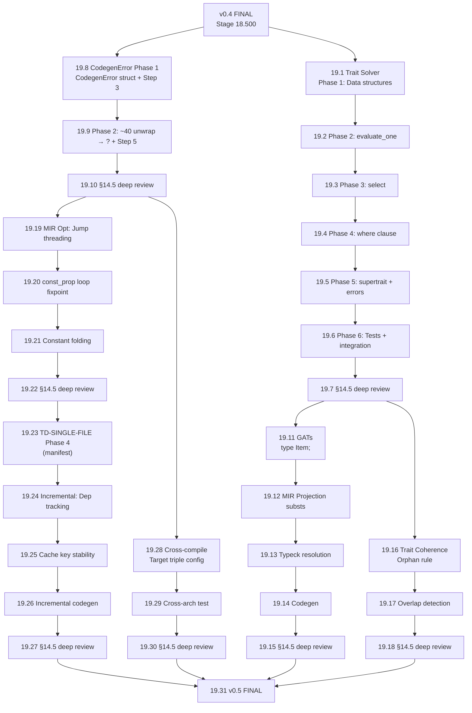

# Stage 19.001 — v0.5 启动设计对齐 (§13.1)

> **Stage**: 19.001 (v0.5 启动)
> **Round**: 1 (阶段开始)
> **Author**: PM-A (Super Z main)
> **Date**: 2026-08-30
> **Version**: v0.510.0 → v0.511.0 (pending)
> **Process**: stage-committee-process.md v7.5 §13.1 (阶段开始设计对齐) + §17 (任务规划排版图)
> **Trigger**: v0.4 FINAL APPROVED (Stage 18.500), ready for stage transition

---

## §13.1 Step 1: 定位设计文档

### 设计文档清单

| Doc | § | 用途 |
|-----|---|------|
| `docs/lang-design/03-type-system.md` | §5 Trait Resolution (3-phase: Evaluation → Selection → Fulfillment) | Trait Solver P1 设计意图基线 |
| `docs/lang-design/03-type-system.md` | §5.8 Canonical query | Trait Solver 缓存机制 (v0.5+ Phase 6) |
| `docs/lang-design/03-type-system.md` | §6 Coherence | Trait Coherence P2 设计 (orphan rule + overlap detection) |
| `docs/lang-design/07-codegen.md` | TBD | CodegenError Error System P1 设计意图 |
| `docs/develop/v0/v0.5-roadmap.md` | §3.1-3.7 | v0.5 任务分解 |
| `docs/develop/v0/tech-debt-register.md` | §2.5.1 (TD-INTRINSIC-OVERUSE Phase 2-B/C, TD-STUB-PRELUDE-LOOP-BODY) | v0.5 需要解除的 BLOCKED TDs |

### 设计意图摘要 (3-5 句)

v0.5 在 v0.4 完成基础上添加 **trait solver**、**CodegenError 错误系统**、**GATs** 和 **MIR 优化 pass**。
trait solver 按 rustc 老 solver 三阶段实现：Evaluation 评估候选 impl 适用性 (返回 Ok/Ambig/Err),
Selection 从候选中选最 specific (MVP 禁 overlapping), Fulfillment 维护 obligation queue 递归求解。
CodegenError 系统把 codegen panic 替换为 `Result` 传播 — 这是 Phase 5 已部分完成 (Step 1+2+4 done),
v0.5 完成剩余 Step 3+5 callsite 迁移和 ~40 `unwrap()` → `?` 在 `llvm/mod.rs`。
GATs 在 Stage 18.87 Phase 3 基础上扩展 `type Item<T>;` trait 关联类型。
MIR 优化 pass 添加 jump threading + const_prop fixpoint (in loops) — 解除 TD-NO-JUMP-THREADING + TD-CONST-PROP-LOOPS。

### §14.8 B1-B4 沿用

v0.4 末尾回写的设计偏差清单:
- B1 (实现 < 设计): NONE
- B2 (实现 > 设计): ABI/ZST/recursive/generic/§20/Phase 5/writeback/param_check — 已记录到 v0.4-roadmap.md
- B3 (实现偏离设计): TD-STUB-EMIT-TYPE-I32-FALLBACK — Phase 5 部分根因修复, 完整迁移到 v0.5+ CodegenError System (P1)
- B4 (永久偏差): NONE

所有 B1-B3 偏差均纳入 v0.5 计划处理。

---

## §13.1 Step 2: 阅读设计文档

### Trait Solver (P1) 设计要点

来自 `docs/lang-design/03-type-system.md` §5:

1. **3-phase**: Evaluation (用 placeholder 不污染推导) → Selection (MVP 禁 overlapping) → Fulfillment (obligation queue 递归)
2. **数据结构**: `Binder<TraitPredicate>`, `EvalResult`, `Obligation`, `SelectionResult`
3. **Impl matching**: 统一 + 检查 where clause + 递归 select
4. **Canonical query** (§5.8): trait 求解结果可缓存
5. **Orphan rule** (§5.6): impl 必须在 trait 或 type 定义的 crate 中
6. **Specialization** (§5.7): MVP 禁用

### CodegenError (P1) 设计要点

来自 v0.4 已完成的工作 + v0.5-roadmap.md §3.2:

1. **`CodegenError { message, span }` type** — Phase 1
2. **~40 `unwrap()` → `?` operator** in `llvm/mod.rs` — Phase 2
3. **公共 API 更新** (`codegen_crate` / `codegen_crate_to_module`) — Phase 3
4. **Phase 5 已部分完成**:
   - Stage 18.151: `CodegenResult<T>` propagation through `codegen_rvalue` → `codegen_statement` → `codegen_function` → `run_codegen_pipeline` → `codegen_crate` → driver
   - Stage 18.438: `CodegenErrorKind::UnresolvedType` variant added + `mir_type_to_emit_type_checked` returns `Result`
   - Stage 18.440: silent `_ => EmitType::I32` fallback replaced with `eprintln!` warning
   - Stage 18.442: `function_sigs.rs` migrated to `mir_type_to_emit_type_with_layouts`
5. **v0.5 完成**: Step 3+5 callsite migration + ~40 `unwrap()` cleanup + `CodegenError { message, span }` struct (vs current `CodegenErrorKind` enum)

### GATs (P2) 设计要点

来自 `docs/lang-design/03-type-system.md` §4 + Stage 18.87 Phase 3:

1. **`type Item<T>;`** in trait definitions
2. **Resolution in impl blocks**: `type Item<T> = Vec<T>;`
3. **Higher-ranked bounds**: `where for<'a> T: Iterator<Item = &'a U>`
4. **Stage 18.87 已完成**: GATs Phase 3 base — `TyKind::Projection(def_id, substs)` for `<T as Iterator>::Item`
5. **v0.5 扩展**: `Projection` 关联类型参数化 (currently 只有 0-参数 `type Item;`)

### MIR Optimization (P3) 设计要点

来自 `docs/lang-design/06-mir.md` + v0.4 已有 const_prop + DCE:

1. **Jump threading**: 不必要的 goto chains 消除 — addresses TD-NO-JUMP-THREADING
2. **const_prop fixpoint in loops**: 当前 Stage 18.110 安全跳过 BinaryOp folding when back-edges exist — addresses TD-CONST-PROP-LOOPS
3. **Simple constant folding**: arithmetic + comparison folding

---

## §13.1 Step 3: 与项目现状对齐

### v0.4 已有基础设施

| 设施 | 状态 | 用途 |
|------|------|------|
| TraitResolver (Stage 16.07-16.10) | ✅ | trait 解析 keys, v0.5 trait solver 在此基础上添加 selection + fulfillment |
| Phase 2A primitive intrinsic dispatch (Stage 18.284) | ✅ | DefId-based interception pattern |
| `CodegenResult<T>` propagation (Stage 18.151) | ✅ | 错误传播链已建立 |
| `CodegenErrorKind::UnresolvedType` (Stage 18.438) | ✅ | Phase 5 Step 1 |
| `mir_type_to_emit_type_checked` (Stage 18.438) | ✅ | Phase 5 Step 1 |
| `function_sigs.rs` migrated (Stage 18.442) | ✅ | Phase 5 Step 4 |
| GATs Phase 3 (Stage 18.87) | ✅ | `TyKind::Projection` 基础 |
| const_prop merge-point intersection (Stage 18.286) | ✅ | MIR opt 基础 |
| DCE pass | ✅ | MIR opt 基础 |
| `TargetTriple` (cross-compile 基础) | ✅ | Cross-compilation P3 |

### v0.5 需要新添加的基础设施

| 设施 | 用途 | 优先级 |
|------|------|--------|
| `TraitPredicate` data structure | trait bound 表达 `T: Trait` | P1 (Stage 19.1) |
| `Goal` + `InferCtxt` | trait solver 推理上下文 | P1 (Stage 19.1) |
| `ObligationQueue` | Fulfillment phase | P1 (Stage 19.3) |
| `CodegenError { message, span }` struct | 替换 `CodegenErrorKind` enum | P1 (Stage 19.8) |
| `evaluate_one` with placeholder | Evaluation phase | P1 (Stage 19.2) |
| `select` from candidates | Selection phase | P1 (Stage 19.3) |
| `where clause integration` | feed where clauses as assumptions | P1 (Stage 19.4) |
| `supertrait expansion` | 自动 derive supertrait bounds | P1 (Stage 19.5) |
| "trait bound not satisfied" errors | Error reporting | P1 (Stage 19.5) |
| `type Item<T>;` parameterized | GATs P2 | P2 (Stage 19.11+) |
| Jump threading pass | MIR opt | P3 (Stage 19.19+) |
| const_prop loop fixpoint | MIR opt | P3 (Stage 19.20+) |

### 灰区决策

| 灰区 | 决策 | 理由 |
|------|------|------|
| Trait Solver MVP 是否支持 overlapping impls? | NO | 设计 §5.3 明确 "MVP 禁 overlapping"; v0.6+ specialization |
| Trait Solver MVP 是否支持 supertrait auto-derivation? | YES | 设计 §5.5 隐含 — Phase 4 supertrait expansion |
| CodegenError 是 struct 还是 enum? | struct with kind field | v0.4 已有 `CodegenErrorKind` enum, v0.5 包装为 `CodegenError { kind, message, span }` |
| GATs P2 是否包括 higher-ranked bounds? | PARTIAL | MVP 仅 1-参数 GATs; higher-ranked 推到 v0.6+ |
| MIR opt 是否替换现有 const_prop? | NO | 增量添加, jump threading 是新 pass, const_prop loop fixpoint 是扩展 |

---

## §13.1 Step 4: 阶段规划

### v0.5 总览 (estimated 23-35 sub-stages)

```
Stage 19.001 (current) — v0.5 启动设计对齐
  ↓
Stage 19.1-19.7: Trait Solver P1 (6-8 sub-stages)
  ├ 19.1: Phase 1 — TraitPredicate + Goal + InferCtxt data structures
  ├ 19.2: Phase 2 — evaluate_one (placeholder-based)
  ├ 19.3: Phase 3 — select (禁 overlapping)
  ├ 19.4: Phase 4 — where clause integration
  ├ 19.5: Phase 5 — supertrait expansion + error reporting
  ├ 19.6: Phase 6 — Tests + integration
  └ 19.7: §14.5 deep review
  ↓
Stage 19.8-19.10: CodegenError P1 (2-3 sub-stages)
  ├ 19.8: Phase 1 — CodegenError struct + Phase 5 Step 3 callsite migration
  ├ 19.9: Phase 2 — ~40 unwrap() → ? in llvm/mod.rs + Phase 5 Step 5
  └ 19.10: §14.5 deep review
  ↓
Stage 19.11-19.15: GATs P2 (4-6 sub-stages)
  ├ 19.11: type Item<T>; parsing + HIR
  ├ 19.12: MIR representation (Projection with substs)
  ├ 19.13: Type resolution during typeck
  ├ 19.14: Codegen
  └ 19.15: §14.5 deep review
  ↓
Stage 19.16-19.18: Trait Coherence P2 (2-3 sub-stages)
  ├ 19.16: Orphan rule enforcement
  ├ 19.17: Overlap detection improvement
  └ 19.18: §14.5 deep review
  ↓
Stage 19.19-19.22: MIR Optimization P3 (3-4 sub-stages)
  ├ 19.19: Jump threading pass
  ├ 19.20: const_prop loop fixpoint
  ├ 19.21: Simple constant folding
  └ 19.22: §14.5 deep review
  ↓
Stage 19.23-19.27: Incremental Compilation P3 (4-6 sub-stages, needs TD-SINGLE-FILE Phase 4 first)
  ├ 19.23: TD-SINGLE-FILE Phase 4 (manifest integration)
  ├ 19.24: Dependency tracking
  ├ 19.25: Cache key stability
  ├ 19.26: Incremental codegen
  └ 19.27: §14.5 deep review
  ↓
Stage 19.28-19.30: Cross-compilation P3 (2-3 sub-stages)
  ├ 19.28: Target triple configuration
  ├ 19.29: Cross-compile to different architectures
  └ 19.30: §14.5 deep review
  ↓
Stage 19.31: v0.5 FINAL §14.5 + §14.6 + §14.8 + §19 package
```

---

## §17 任务规划排版图 (Step 1-7)

### Step 1: 扫描文档

- ✅ `docs/lang-design/03-type-system.md` §5 — trait solver 3-phase design
- ✅ `docs/lang-design/07-codegen.md` — codegen design (待详细查 CodegenError 设计意图)
- ✅ `docs/develop/v0/tech-debt-register.md` — 23 remaining TDs (4 BLOCKED by v0.5+ features)
- ✅ `docs/develop/v0/v0.4-roadmap.md` — v0.4 B2 writeback (implementation > design)
- ✅ `docs/develop/v0/v0.5-roadmap.md` — v0.5 task list
- ✅ `docs/develop/v0/stage-18/stage-18.500-v0.4-final-deep-review.md` — v0.4 FINAL review

### Step 2: 任务依赖图



### Step 3-4: 任务节点详情 (递归子图支持)

#### 任务节点 A: Trait Solver P1 (19.1-19.7)

| 子任务 | MUV | 输入 | 输出 | 集成验证 |
|--------|-----|------|------|----------|
| 19.1 Phase 1 | TraitPredicate + Goal + InferCtxt | v0.4 TraitResolver | `src/traits/solver/{predicate,goal,infer_ctxt}.rs` | `tests/v0/stage19/trait_solver_phase1_*.rs` (≥3 测试) |
| 19.2 Phase 2 | evaluate_one with placeholder | Phase 1 | `src/traits/solver/eval.rs` | `tests/v0/stage19/trait_solver_phase2_*.rs` (≥3 测试) |
| 19.3 Phase 3 | select from candidates | Phase 2 | `src/traits/solver/select.rs` | `tests/v0/stage19/trait_solver_phase3_*.rs` (≥3 测试) |
| 19.4 Phase 4 | where clause integration | Phase 3 | `src/traits/solver/fulfill.rs` | `tests/v0/stage19/trait_solver_phase4_*.rs` (≥3 测试) |
| 19.5 Phase 5 | supertrait + error reporting | Phase 4 | `src/traits/solver/supertrait.rs` + error_kind | `tests/v0/stage19/trait_solver_phase5_*.rs` (≥3 测试) |
| 19.6 Phase 6 | Tests + integration | Phase 5 | `tests/v0/stage19/trait_solver_integration_*.rs` | E2E: `Vec<i32>: Clone` select works |
| 19.7 §14.5 | deep review | Phase 6 | `docs/develop/v0/stage-19/stage-19.7-deep-review.md` | D1-D8 PASS |

#### 任务节点 B: CodegenError P1 (19.8-19.10)

| 子任务 | MUV | 输入 | 输出 | 集成验证 |
|--------|-----|------|------|----------|
| 19.8 Phase 1 | CodegenError struct + Step 3 callsite | Phase 5 Step 1+2+4 done | `src/codegen/error.rs` extended + ~10 callsites migrated | `tests/v0/stage19/codegen_error_phase1_*.rs` (≥3 测试) |
| 19.9 Phase 2 | ~40 unwrap → ? + Step 5 | Phase 1 | `src/codegen/llvm/mod.rs` cleanup | `tests/v0/stage19/codegen_error_phase2_*.rs` (≥3 测试) |
| 19.10 §14.5 | deep review | Phase 2 | `docs/develop/v0/stage-19/stage-19.10-deep-review.md` | D1-D8 PASS |

### Step 5: 设计-开发-测试节点流

每个 MUV 节点遵循:
```
Design Node (查设计文档)
  ↓
Dev Node (实现)
  ↓
Test Node (1:3+ pos:neg ratio per §9.4.3)
  ├ Stage 1: 局部单元测试
  ├ Stage 2: 集成测试
  ├ Stage 3: 端到端测试
  ├ Stage 4: 负向/破坏性测试
  └ Stage 5: 健壮性测试
  ↓
Integration Node (跨阶段验证)
```

### Step 6: 缺陷纳入

| 缺陷 ID | 描述 | 修复任务节点 | 等级 |
|----------|------|--------------|------|
| TD-INTRINSIC-OVERUSE Phase 2-B/C | 需 fat pointer construction syntax | v0.5+ P1 — fat pointer syntax (separate task) | P1 |
| TD-STUB-PRELUDE-LOOP-BODY | Prelude `loop {}` marker bodies | v0.5+ P1 — fat pointer syntax (same as above) | P1 |
| TD-TYPECK-LOCAL-DECL-ERROR-CHECK | Phase 4.5 disabled (47 prelude false-positives) | v0.5+ — prelude lazy monomorphization | P2 |
| TD-NO-JUMP-THREADING | jump threading not implemented | Stage 19.19 (P3 MIR Opt) | P3 |
| TD-CONST-PROP-LOOPS | const_prop skips BinaryOp folding in loops | Stage 19.20 (P3 MIR Opt) | P3 |
| TD-NO-INCREMENTAL | Full recompile every time | Stage 19.23-19.27 (P3 Incremental) | P3 |
| TD-LINUX-ONLY + TD-ABI-DIVERSITY | No cross-compile | Stage 19.28-19.30 (P3 Cross-compile) | P3 |
| TD-SINGLE-FILE Phase 4 | Manifest integration | Stage 19.23 (P3 Incremental prerequisite) | P3 |

### Step 7: 审查结论

- 任务规划排版图完整: ✅ 覆盖 v0.5-roadmap §3.1-3.7 全部 7 任务
- 依赖关系清晰: ✅ Mermaid 图明确显示 P1 → P2 → P3 顺序
- 缺陷纳入明确: ✅ 8 个 BLOCKED TDs 都有对应 v0.5 任务节点
- 灰区决策明确: ✅ 5 个灰区都有决策 + 理由
- 当前能力充足: ✅ TraitResolver + CodegenResult + GATs Phase 3 + const_prop 基础全部就绪

---

## §17.10 与现有章节的关系

- §13.1 阶段开始设计对齐 → 本文档
- §17.7 缺陷纳入 → Step 6 (8 个 TDs 都有对应任务节点)
- §14.5 阶段末尾深度审查 → Stage 19.7 / 19.10 / 19.15 / 19.18 / 19.22 / 19.27 / 19.30 / 19.31
- §19 阶段打包 → Stage 19.31 final package

---

## 下一步 (Stage 19.1 启动条件)

1. ✅ v0.4 FINAL APPROVED (Stage 18.500)
2. ✅ v0.5 启动设计对齐完成 (本文档)
3. ⏭ Stage 19.1: Trait Solver Phase 1 — TraitPredicate + Goal + InferCtxt data structures
   - L2 (50-500 LOC, 2-5 files: `src/traits/solver/{mod,predicate,goal,infer_ctxt}.rs`)
   - 输入: v0.4 TraitResolver
   - 输出: data structures + unit tests
   - 验收: §3.2 全绿 + 1:3+ 测试比例 + ≥3 集成测试

Stage 19.1 准备启动 — 等待用户指令开始 Trait Solver Phase 1 实现。
