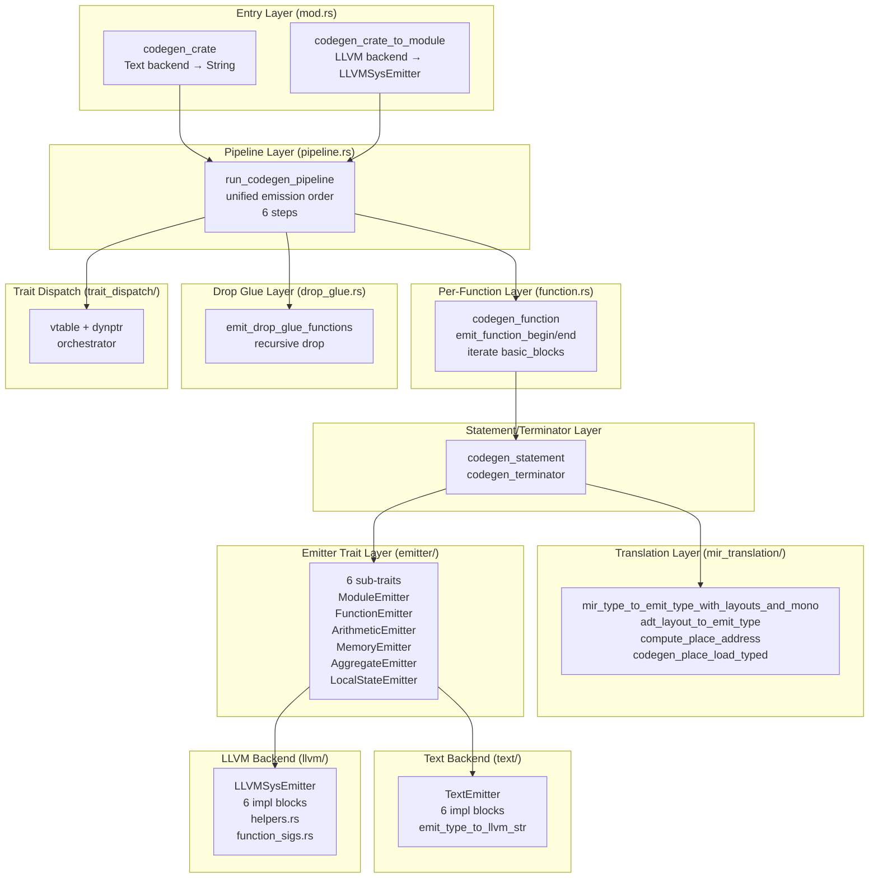
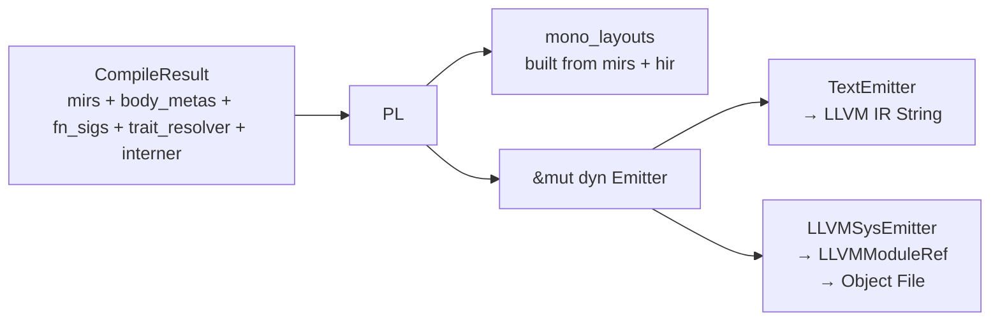

# Codegen Module Architecture (Post-Stage 16.77)

> **Date**: 2026-08-05
> **Version**: v0.263.0
> **Status**: Codegen architecture refactoring COMPLETE (Stages 16.35-16.77)

## Module Structure

```
src/codegen/
├── mod.rs                    — Entry points (codegen_crate, codegen_crate_to_module) + re-exports
├── pipeline.rs               — run_codegen_pipeline (unified emission order)
├── function.rs               — codegen_function + codegen_from_mir + codegen_synthesized_closure_functions
├── drop_glue.rs              — emit_drop_glue_functions
├── emitter/                  — 6 sub-traits + super-trait (Stage 16.76 MUV-1)
│   ├── mod.rs                — Emitter super-trait + blanket impl + EmitType/EmitValue + helpers
│   ├── module.rs             — ModuleEmitter (5 methods)
│   ├── function.rs           — FunctionEmitter (8 methods)
│   ├── arithmetic.rs         — ArithmeticEmitter (11 methods)
│   ├── memory.rs             — MemoryEmitter (6 methods)
│   ├── aggregate.rs          — AggregateEmitter (5 methods)
│   └── local_state.rs        — LocalStateEmitter (4 methods)
├── mir_translation/          — MIR → EmitType translation (Stage 16.76 MUV-3)
│   ├── mod.rs                — re-exports
│   ├── types.rs              — mir_type_to_emit_type_with_layouts[_and_mono]
│   ├── layouts.rs            — adt_layout_to_emit_type
│   ├── places.rs             — 7 place codegen functions (detect_*, compute_*, codegen_place_load_*)
│   └── stdlib.rs             — stdlib_type_kind_to_emit_type
├── operand.rs                — Operand codegen (shared)
├── rvalue.rs                 — Rvalue codegen (shared)
├── statement.rs              — Statement codegen (shared)
├── terminator.rs             — Terminator codegen (shared)
├── dyn_trait_emit.rs         — Dyn Trait text rendering helpers (test-only)
├── text/                     — TextEmitter backend (Stage 16.77 MUV-2)
│   ├── mod.rs                — TextEmitter struct + new() + output_with_globals + helpers
│   ├── module.rs             — impl ModuleEmitter for TextEmitter
│   ├── function.rs           — impl FunctionEmitter for TextEmitter
│   ├── arithmetic.rs         — impl ArithmeticEmitter for TextEmitter
│   ├── memory.rs             — impl MemoryEmitter for TextEmitter
│   ├── aggregate.rs          — impl AggregateEmitter for TextEmitter
│   └── local_state.rs        — impl LocalStateEmitter for TextEmitter
├── llvm/                     — LLVMSysEmitter backend (Stage 16.77 MUV-1)
│   ├── mod.rs                — LLVMSysEmitter struct + new() + Drop + public API
│   ├── module.rs             — impl ModuleEmitter for LLVMSysEmitter
│   ├── function.rs           — impl FunctionEmitter for LLVMSysEmitter
│   ├── arithmetic.rs         — impl ArithmeticEmitter for LLVMSysEmitter
│   ├── memory.rs             — impl MemoryEmitter for LLVMSysEmitter
│   ├── aggregate.rs          — impl AggregateEmitter for LLVMSysEmitter
│   ├── local_state.rs        — impl LocalStateEmitter for LLVMSysEmitter
│   ├── helpers.rs            — private helpers (cstr, is_float, parse_*, collect_cstring)
│   ├── function_sigs.rs      — build_fn_sigs_map (LLVM-only)
│   └── tests.rs              — unit tests
└── trait_dispatch/
    ├── mod.rs                — Trait dispatch orchestrator
    ├── vtable.rs             — Vtable emission
    ├── dynptr.rs             — Dynptr emission
    └── orchestrator.rs       — Combined vtable+dynptr orchestrator
```

## Architecture Layers



## Data Flow



## Key Design Decisions

### 1. Emitter trait split (Stage 16.76 MUV-1)

The original 39-method `Emitter` trait was split into 6 sub-traits per §13.4 J2
(single responsibility). A blanket impl `impl<T: ...> Emitter for T where T: ModuleEmitter
+ FunctionEmitter + ArithmeticEmitter + MemoryEmitter + AggregateEmitter +
LocalStateEmitter {}` preserves `dyn Emitter` compatibility for the 20+ caller sites.

### 2. Backend file organization (Stage 16.77 MUV-1/2)

Each backend's 6 impl blocks are split into separate files, matching the 6
sub-trait structure. This makes it easy to:
- Add a third backend by creating a new directory with 6 impl files
- Modify one sub-trait's implementation without touching others
- Test one sub-trait in isolation

### 3. Shared helpers separation

- `mir_translation/` — shared between text and LLVM backends (pure data translation)
- `llvm/helpers.rs` — LLVM-specific private helpers (cstr, is_float, parse_*)
- `text/mod.rs` — text-specific helpers (emit_type_to_llvm_str, binop_to_llvm_str)

### 4. Pipeline orchestrator (Stage 16.37)

`run_codegen_pipeline` is the single entry point shared by both backends. It
contains the unified emission order:
1. Module header + panic declarations
2. Vtable globals (before function bodies — LLVM needs forward refs)
3. Dyn trait fat-pointer globals
4. Drop glue functions
5. Main MIR function bodies (codegen_from_mir)
6. Synthesized closure function bodies

## History

- **Stage 13.28**: Initial codegen sub-module split (operand/rvalue/statement/terminator)
- **Stage 16.35-16.42**: Codegen architecture refactoring (unified pipeline, dead code sweep)
- **Stage 16.76 MUV-1**: Emitter trait split into 6 sub-traits (39 methods → 5+8+11+6+5+4)
- **Stage 16.76 MUV-2**: `mod.rs` split into pipeline/function/drop_glue/llvm/function_sigs
- **Stage 16.76 MUV-3**: `mir_translation.rs` split into types/layouts/places/stdlib
- **Stage 16.77 MUV-1**: `llvm/mod.rs` split into 8 files (6 impl blocks + helpers + tests)
- **Stage 16.77 MUV-2**: `text/mod.rs` split into 7 files (6 impl blocks)
