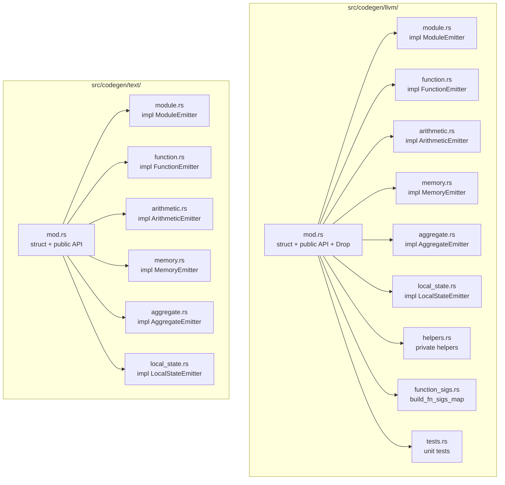
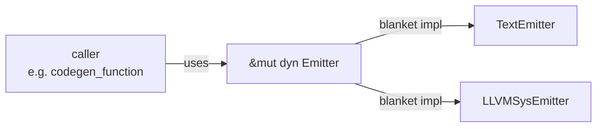

# Emitter Trait Hierarchy

> **Author**: redskaber
> **Date**: 2026-08-05
> **Version**: v0.263.0
> **Status**: ✅ Updated for Stage 16.76 MUV-1 (6 sub-trait split) + Stage 16.77 MUV-1/2 (backend file organization)

## Current Trait Structure (Stage 16.76+)

The original 39-method `Emitter` trait has been split into 6 single-responsibility
sub-traits per §13.4 J2. A blanket impl preserves `dyn Emitter` compatibility for
the 20+ caller sites.

```mermaid
classDiagram
    class ModuleEmitter {
        <<trait>>
        +emit_header()
        +emit_declare(signature: &str)
        +emit_string_global(bytes: &[u8]) EmitValue
        +emit_vtable_global(name, methods) EmitValue
        +emit_dyn_trait_const(name, data, vtable) EmitValue
    }
    class FunctionEmitter {
        <<trait>>
        +emit_function_begin(name, params, ret)
        +emit_function_end()
        +emit_block(label)
        +emit_ret(ty, val)
        +emit_unreachable()
        +emit_br(label)
        +emit_br_cond(cond, then, else)
        +emit_switch(discr, ty, cases, default)
    }
    class ArithmeticEmitter {
        <<trait>>
        +emit_const(val) EmitValue
        +emit_binop(op, ty, lhs, rhs) EmitValue
        +emit_unop(op, ty, operand) EmitValue
        +emit_icmp(op, ty, lhs, rhs) EmitValue
        +emit_fcmp(op, ty, lhs, rhs) EmitValue
        +emit_and(ty, lhs, rhs) EmitValue
        +emit_or(ty, lhs, rhs) EmitValue
        +emit_zext(src, dst, val) EmitValue
        +emit_cast(src, dst, val) EmitValue
        +emit_select(ty, cond, t, f) EmitValue
        +emit_checked_binop(op, ty, lhs, rhs) EmitValue
    }
    class MemoryEmitter {
        <<trait>>
        +emit_alloca(ty, name) EmitValue
        +emit_store(ty, val, ptr)
        +emit_load(ty, ptr) EmitValue
        +emit_gep_field(base, struct_ty, idx) EmitValue
        +emit_gep_index(base, array_ty, idx) EmitValue
        +emit_gep_index_ptr(base, elem_ty, idx) EmitValue
    }
    class AggregateEmitter {
        <<trait>>
        +emit_phi(ty, incoming) EmitValue
        +emit_insertvalue(agg_ty, agg, val_ty, val, idx) EmitValue
        +emit_extractvalue(agg_ty, agg, idx) EmitValue
        +emit_call(fn_name, args, ret_ty) EmitValue
        +emit_dyn_trait_method_call(dynptr, slot, args, ret) EmitValue
    }
    class LocalStateEmitter {
        <<trait>>
        +set_local_ptr(id, ptr)
        +get_local_ptr(id) Option~&EmitValue~
        +set_local(id, val)
        +get_local(id) Option~&EmitValue~
    }
    class Emitter {
        <<super-trait>>
    }
    class TextEmitter {
        +struct TextEmitter
        +new() TextEmitter
        +output_with_globals() String
    }
    class LLVMSysEmitter {
        +struct LLVMSysEmitter
        +new() LLVMSysEmitter
        +to_module() LLVMModuleRef
        +to_object_file(path) Result
        +set_fn_sigs(map)
    }

    Emitter <|.. ModuleEmitter
    Emitter <|.. FunctionEmitter
    Emitter <|.. ArithmeticEmitter
    Emitter <|.. MemoryEmitter
    Emitter <|.. AggregateEmitter
    Emitter <|.. LocalStateEmitter
    TextEmitter ..|> ModuleEmitter
    TextEmitter ..|> FunctionEmitter
    TextEmitter ..|> ArithmeticEmitter
    TextEmitter ..|> MemoryEmitter
    TextEmitter ..|> AggregateEmitter
    TextEmitter ..|> LocalStateEmitter
    LLVMSysEmitter ..|> ModuleEmitter
    LLVMSysEmitter ..|> FunctionEmitter
    LLVMSysEmitter ..|> ArithmeticEmitter
    LLVMSysEmitter ..|> MemoryEmitter
    LLVMSysEmitter ..|> AggregateEmitter
    LLVMSysEmitter ..|> LocalStateEmitter
```



## Method Count Per Sub-trait

| Sub-trait | Methods | Responsibility |
|-----------|---------|----------------|
| `ModuleEmitter` | 5 | module-level globals & declarations |
| `FunctionEmitter` | 8 | function scope & control flow |
| `ArithmeticEmitter` | 11 | value computation from operands |
| `MemoryEmitter` | 6 | stack allocation & pointer arithmetic |
| `AggregateEmitter` | 5 | aggregate construction & calls |
| `LocalStateEmitter` | 4 | local value/pointer mapping |
| **Total** | **39** | (matches original `Emitter` trait) |

## Backend File Organization (Stage 16.77+)

Each backend's 6 impl blocks are split into separate files per §13.4 J2:



## Caller Compatibility

The 20+ caller sites that use `&mut dyn Emitter` continue to work unchanged:



The blanket impl is:
```rust
impl<T> Emitter for T where
    T: ModuleEmitter + FunctionEmitter + ArithmeticEmitter
     + MemoryEmitter + AggregateEmitter + LocalStateEmitter {}
```

## Breaking Change for Implementers

External backends that previously wrote a single `impl Emitter for MyBackend`
must now implement the 6 sub-traits separately. The blanket impl automatically
provides `Emitter` for any type implementing all 6 sub-traits.

## History

- **Stage 3.21**: `Emitter` trait introduced with 36 methods (single trait, single impl)
- **Stage 3.59**: Issue #5 flagged trait bloat (36 methods, deferred decomposition)
- **Stage 13.5**: Second backend (`LLVMSysEmitter`) added → 39 methods, 2 impls
- **Stage 16.38**: Attempted 2-trait split (ModuleEmitter + FunctionEmitter) — blocked
  by ~1000 LOC code movement risk, deferred with documentation groups
- **Stage 16.76 MUV-1**: 6-trait split executed (39 methods → 5+8+11+6+5+4), blanket
  impl preserves dyn compatibility
- **Stage 16.77 MUV-1/2**: Backend file organization — each backend's 6 impl blocks
  split into separate files
