# 项目阶段推进与质量管控流程（Agent Groups）

> **Author**: redskaber
> **Version**: 6.2（MEDIUM 修复：D→C 重编号 + max-retry 守卫 + 权重定义 + worklog 路径 + L1/L2/L3 分层 + ASCII→mermaid）
> **Purpose**: 为 Agent Group 提供清晰、严格、高效、可协调的阶段推进与质量管控 SOP。
> 任何 Agent 拿到本文档即可：**清晰**知道每个阶段/轮次/角色的输入输出与验收标准；**严格**知道哪些是硬性阻断、哪些可酌情；**高效**知道哪些可并行、哪些必须串行、何时可提前收敛；**可协调**知道跨 Agent 协作协议（Task ID / worklog / 升级路径）。

---

## 目录

- [§1 文档导航与角色路由](#1-文档导航与角色路由)
- [§2 核心原则](#2-核心原则)
- [§3 环境与工具管理](#3-环境与工具管理)
- [§4 阶段任务拆分（MUV）](#4-阶段任务拆分muv)
- [§5 审查-修订内循环](#5-审查-修订内循环)
- [§6 缺陷分级](#6-缺陷分级)
- [§7 集成验证协议](#7-集成验证协议)
- [§8 文档同步规则](#8-文档同步规则)
- [§9 测试标准与矩阵](#9-测试标准与矩阵)
- [§10 API 命名标准](#10-api-命名标准)
- [§11 接口隔离](#11-接口隔离)
- [§12 解决方案选择：最优 > 最小](#12-解决方案选择最优--最小)
- [§13 阶段切换与重构](#13-阶段切换与重构)
- [§14 深度审查协议](#14-深度审查协议)
- [§15 项目图管理](#15-项目图管理)
- [§16 变更日志](#16-变更日志)
- [§17 任务规划排版图](#17-任务规划排版图)

---

## 1. 文档导航与角色路由

### 1.1 角色路由表

| 你是… | 先读 |
|-------|------|
| 第一次进入项目的 Agent | §2 → §4 MUV → §1.4 角色映射 → §5 内循环 → §7 集成验证 |
| 准备开新阶段的 Agent | §4 MUV → §5 复杂度预评估 → §8 文档同步 → §13.1 阶段开始设计对齐 → §7.3 阶段门审查 → §14 深度审查 → §14.6 阶段间深度验证 |
| 准备提交门审查的 Agent | §7.3 阶段门审查 → §7.3.1/§7.3.2/§7.3.3 审计规则 → §9 测试矩阵 → §6.3 外循环投票 |
| 子 Agent（被分派任务） | §1.4 角色映射 → §11 接口隔离 → worklog 协议（§8.6） |
| 评审 Agent（审查者） | §6 缺陷分级 → §6.1 技术债分类 → §12 最优 > 最小 → §11 接口隔离 → §9 测试矩阵 |
| 流程维护者 | §16 → 各节末尾"教训来源" |

### 1.2 任务类型精确路由

| 任务类型 | 必读章节 | 关键约束 |
|---------|---------|---------|
| 写代码（新功能） | §2, §4, §10, §11 | API 命名（§10）+ 接口隔离（§11） |
| 写测试 | §9.1, §9.4, §9.5, §7.1 | tests/ 结构 + 矩阵覆盖 + **1:3+ 正负比例（§9.4.3）** |
| 写文档 | §8, §8.3, §9.2, §15 | 文档同步 + LLVM 文档同步 + 图管理 |
| 审查代码 | §6, §10, §11, §14, §2.2 | 缺陷分级 + 命名标准 + 接口隔离 + 深度审查 |
| 重构 | §13, §13.4, §12.3, §11, §14.8 | 最优>最小 + 重构治理 + 阶段末设计回写 |
| 进入新阶段 | §13.1, §4, §7, §9, §14.6, **§17** | 设计对齐 + MUV 拆分 + 集成验证 + 阶段间深度验证 + **任务规划排版图** |
| 环境准备 | §3 | 工具缺失时先查 `scripts/`+`tools/` 再安装 |
| 交付前验收 | §3.2, §8.3 | cargo clean+test+fmt+clippy 全绿 |
| 设计-审查循环 | §13.5 | review agent ↔ design agent 迭代校准 |

### 1.2.1 流程分层应用（L1/L2/L3）

> **目的**：避免小任务承受大流程开销。按任务复杂度（§4.2）分层应用流程协议。

| 复杂度 | 必须执行 | 可跳过 | 典型场景 |
|--------|---------|--------|---------|
| **L1** (≤50 LOC, 1 文件) | §3.2 验收 + §8 文档同步 + §10 命名 | §17 规划图, §14.5 深度审查, §14.6 阶段间验证, §7.3 门审查 | 修 typo, 加测试, 改注释 |
| **L2** (50-500 LOC, 2-5 文件) | §3.2 + §8 + §10 + §7.3 门审查 + §13.1 设计对齐 | §14.5 深度审查 (用 §7.3 替代), §14.6 阶段间验证 | 新功能, 重构模块 |
| **L3** (500+ LOC, 跨模块) | **全部章节** (§1-§17) | 无 | 核心架构变更, 新阶段, 大重构 |

**判定规则**：由 PM-A 在任务开始时判定复杂度。如果执行中发现实际复杂度高于预估，必须升级到对应层级的完整流程。

### 1.3 整体阶段工作流

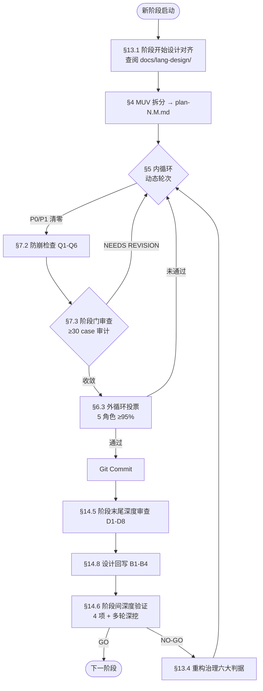

### 1.4 Stage Committee 角色映射

§6.3 的 4 流程角色映射到 Agent Group 9 类 25 个角色：

| 流程角色 | Landin 实现 | Agent 角色 | 权重 | 替补 |
|---------|------------|----------|------|------|
| 架构师/技术负责人 | Compiler Engineer | ARCH-A | 2 票 | ARCH-B / ALG-A |
| 核心开发工程师 | Soundness Reviewer | DEV-A | 1.5 票 | DEV-B/C / ALG-B |
| 质量保证 | Testing & QA Lead | QA-A | 1 票 | QA-B/C / REV-A |
| 产品/业务代表 | Type System Theorist | ALG-C | 1 票 | ARCH-B |
| （附加）Tooling & DX | Tooling & DX Lead | SKL-A | 1 票（不参与加权） | SKL-B |
| （协调） | — | PM-A | — | PM-B/C |
| （记录） | — | REC-A | — | REC-B/C |
| （排期） | — | PL-A | — | PL-B/C |

> Tooling & DX Lead 的 1 票不参与加权通过率计算，但其 NEEDS REVISION 投票仍会触发二次内循环。Landin 编译器无传统"用户"，"产品/业务代表"由 Type System Theorist 担任（确认类型系统语义正确性）。

### 1.5 协作矩阵

| 阶段单元 | 主导 | 必须参与 | 可选参与 |
|---------|------|---------|---------|
| **stage 启动** | PM-A + ARCH-A | PL-A, REC-A | ALG-A, SKL-A |
| **plan 制定** | PL-A | ARCH-A, QA-A | DEV-A, ALG-A |
| **task 实现** | DEV-A | QA-A, REV-A | ALG-A（如涉及算法） |
| **review 审查** | REV-A | ARCH-A, QA-A, ALG-C | DEV-A（解释实现） |
| **gate 审查** | REV-A | 全 5 流程角色 | PM-A, REC-A |
| **文档同步（§8）** | REC-A | 主导 Agent | QA-A（验证） |
| **设计-审查循环（§13.5）** | REV-A ↔ ARCH-A | DEV-A, QA-A | PM-A |

### 1.6 任务分派与升级路径

1. PM-A 接收用户需求 → 评估类型与优先级
2. PL-A 分解为 MUV → 分配 Task ID
3. PM-C 分派给相应 Agent Group → 写入 worklog
4. 主导 Agent 执行 → 每完成一个 MUV 追加 worklog
5. REV-A/B/C 审查 → 在 worklog 标注 PASS/NEEDS REVISION
6. REC-C 归档 → 更新 dev-log + matrix + lang-design（如适用）

| 触发条件 | 升级到 | 升级动作 |
|---------|-------|---------|
| 1 次审查 NEEDS REVISION | 主导 Agent + REV-A | 二次内循环 |
| 2 次审查 NEEDS REVISION | PM-A + ARCH-A | 评估是否需要换主导 Agent |
| 3 次审查 NEEDS REVISION | 技术委员会 | 仲裁 |
| 跨 Agent 冲突 | PM-A | 仲裁（per §8.6.4） |
| 流程违反 §8 | QA-A → PM-A | 标记 P2 缺陷 |
| 架构致命伤 | ARCH-A 一票否决 | 硬性退回（per §6.3） |

---

## 2. 核心原则

### 2.1 总体原则

- **小步快跑 + 深度验证**：每个阶段产出在精度与深度上满足目标。
- **动态自适应 + 分级治理**：兼顾质量与效率（见 §5.2 动态调整、§6 缺陷分级）。
- **数据驱动**：所有轮次与决策基于量化指标，而非主观感受。
- **集成优先**：每个子阶段不仅验证自身内部正确性，还必须验证与上下游子阶段的**集成正确性**（见 §7）。
- **最优 > 最小**（§12）：思考解决方案时优先选择架构上最优的方案，而非"当前改动最小"的方案。
- **阶段间接口隔离**（§11）：阶段之间通过明确的数据契约交互，禁止跨阶段直接调用内部接口。
- **测试矩阵全覆盖**（§9）：每进入下一阶段之前，测试矩阵需要满足近 100% 覆盖率。
- **轮次完成文档同步**（§8）：每轮完成 stage / plan / task / review 等任何阶段单元时，必须同步更新或新建 `docs/develop/` 与 `docs/tests/` 下对应文档。
- **阶段末尾深度审查**（§14）：每个阶段末尾必须执行深度审查，分析"当前架构是否足够支撑进入下一阶段"，主动识别技术债。
- **环境工具自助准备**（§3）：工具缺失时主动查找+安装，不因环境问题阻塞推进。
- **交付前验收校验**（§3.2）：返回结果给用户前必须运行验收命令并确认全绿。
- **Spec 持续演进**（§3.3）：spec 吸收实战经验持续精要化，避免臃肿。
- **重构即架构设计**（§13.4）：当需求或代码触动"重构"时，必须严格依据架构设计、编译相关表达、阶段划分、设计原则（单一职责、单向流动不成环等）、组织结构做科学合理的划分。重构的本质是组织结构设计，不是单纯缩小文件体积。
- **阶段开始设计对齐**（§13.1）：每阶段开始时必须先查阅 `docs/lang-design/` 对应阶段设计文档，结合项目现状做出具体且最优的规划。设计文档是规划的最高优先级参考。
- **阶段末尾设计回写**（§14.8）：每阶段末尾结束前必须对照 `docs/lang-design/` 对应阶段文档与项目实际实现，深入思考理论设计与现实实现之间的偏差，判断二者是否一致、当前阶段哪种最优、是否可重构实现，结论同步回写设计文档。
- **设计-开发-测试互相锚定**（§9.4）：设计、开发、测试三者互相锚定、互相依赖；测试极其重要——严格按测试理论设计，不只是正向测试，更要重点覆盖负向/错误测试。
- **任务规划排版图**（§17）：每个阶段开始前必须构建任务依赖图，按"扫描→依赖图→节点流→递归→设计-开发-测试节点→缺陷纳入"流程规划，确保任务无遗漏、依赖清晰、缺陷有修复计划。

### 2.2 核心设计决策原则

> **来源**：用户在 Stage 14 持续审查中反复强调的决策原则，贯穿所有代码、重构、测试、文档决策。这些原则不是建议而是硬性约束——任何 Agent 在面临设计选择时必须以此为准绳。

以下 9 条原则按优先级排列，冲突时上面的优先：

| # | 原则 | 含义 | 违反示例 |
|---|------|------|---------|
| 1 | **长期 > 短期** | 优先选择长期架构最优方案，而非短期最小改动 | 为赶进度在 codegen 层 hack 而非修复 resolver 根因 |
| 2 | **整体 > 局部** | 优先选择对整体架构最优的方案，而非局部最优 | 优化单个函数性能但破坏了接口隔离 |
| 3 | **显式 > 隐式** | 类型、行为、意图应显式表达，不依赖隐式推断 | 让 codegen 猜测 MIR 层的类型信息而非通过数据传递 |
| 4 | **报错 > 静默** | 遇到不合法输入或不可能状态时必须报错，不静默接受 | 静默将未知方法调用降级为返回 0 |
| 5 | **去除兼容思维** | v0.1 阶段不需要向后兼容——旧代码应被替换而非保留 | 为"兼容旧测试"而保留错误行为 |
| 6 | **通用 > 特例** | 优先实现通用机制，避免逐案特例处理 | 为每种 ADT 形态在 codegen 加单独 `if` 分支 |
| 7 | **API 命名标准化** | 所有公共 API 遵循 §10 命名标准 | 使用 glob re-export 或不一致的命名模式 |
| 8 | **设计驱动测试，测试验证设计** | 测试用例必须按编译流水线阶段全覆盖设计，与设计文档相互印证 | 随意写测试无覆盖矩阵，无法追溯设计意图 |
| 9 | **正确 > 妥协** | 优先选择语义正确（matching 目标语言规范）的方案，而非为了省事而妥协。妥协会累积为技术债 | 为避免修复 NLL 的 `&mut self` 假阳性而选择保留 lexical lifetimes，而非实现真正的 Rust NLL |

**原则间的协同关系**：
- 原则 1-2（长期/整体）是**决策框架**——决定做什么
- 原则 3-4（显式/报错）是**实现准则**——决定怎么做
- 原则 5-6（去兼容/通用）是**架构纪律**——决定不做什么
- 原则 7-8（命名/测试）是**质量保障**——确保做对了
- 原则 9（正确 > 妥协）是**正确性底线**——确保做的是对的事

**原则 9 的执行要求**：
- 当面临"正确但费力"vs"妥协但省事"的选择时，必须选择正确方案
- 除非有**无法拒绝的优点和理由**（例如：物理上不可能、违反 Rust 语义但 v0.2 不支持），否则不得妥协
- 妥协必须在设计文档中显式记录（包含：妥协内容、妥协理由、未来修复计划）
- 审查（§14 深度审查）必须检查是否有未记录的妥协
- 已记录的妥协必须在后续阶段计划中安排修复（不得无限期推迟）

**执行要求**：
- 每次代码变更的 worklog 条目必须注明遵循了哪些原则（如有取舍须说明理由）
- 审查（§14 深度审查）必须检查是否违反了任何原则
- 违反原则的代码即使测试通过也标记为 P1 缺陷

---

## 3. 环境与工具管理

> **核心原则**：工具缺失不应阻塞推进——Agent 应主动查找和安装；缺失前先查 `scripts/` 与 `tools/`，避免重复造轮子。

### 3.1 环境工具检查与准备

**检查时机**：(1) 会话开始时；(2) 执行命令报 "command not found" 时；(3) 用户明确要求验证（`cargo test` 等）时。

**操作流程**（Stage 18.123: ASCII-art → mermaid）：

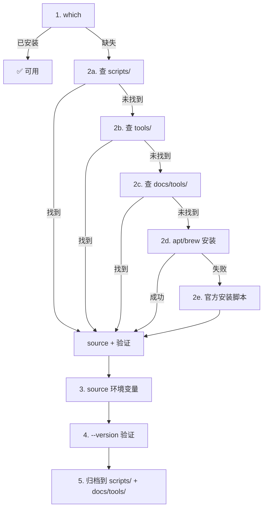

**Landin 项目必需工具**：

| 工具 | 用途 | 安装方式 | 文档位置 |
|------|------|---------|---------|
| `rustc` + `cargo` | 编译+测试 | `curl https://sh.rustup.rs \| sh -s -- -y` | `docs/tools/rust/` |
| `rustfmt` | 格式检查 | `rustup component add rustfmt` | `docs/tools/rust/` |
| `clippy` | lint 检查 | `rustup component add clippy` | `docs/tools/rust/` |
| `llvm-config` + `llvm-sys` | LLVM 19 后端 | `source scripts/setup-llvm-env.sh` | `docs/llvm/` |
| `llc` / `opt` / `lld` | LLVM IR 验证+链接 | 随 LLVM 19 安装 | `docs/llvm/` |
| `zip` / `tar` | 打包 | `apt install zip` / `apt install tar` | `docs/tools/zip/` |

**规则**：
- 安装失败时记录到 worklog 并告知用户，不静默跳过。
- 安装成功后继续推进任务，不等用户确认。
- 自定义安装/配置脚本必须归档到 `scripts/<sub_dirname>/`，对应文档同步到 `docs/tools/<sub_dirname>/`。

### 3.2 交付前验收检查

**原则**：返回包给用户前，必须实际运行验收命令并确认全绿。

**验收命令**（Landin 项目）：
```bash
cargo clean && cargo build --features llvm-backend && cargo check --features llvm-backend && cargo fmt && cargo clippy --all-targets --features llvm-backend && cargo test --features llvm-backend
```

**验收标准**：

| 命令 | 要求 | 失败处理 |
|------|------|---------|
| `cargo clean` | 成功（无 exit code 要求） | — |
| `cargo build --features llvm-backend` | 编译成功 | 修复编译错误，不交付 |
| `cargo check` | 0 errors, 0 warnings (快速类型检查) | 修复类型错误/unused 警告，不交付 |
| `cargo test` | `0 failed`（ignored 可接受） | 修复代码或更新测试，不交付 |
| `cargo fmt` + `cargo fmt --check` | exit 0（零 diff） | 运行 `cargo fmt` 修复 |
| `cargo clippy --all-targets` | `0 warnings` | 修复 lint，不交付 |

**流程**：
1. 完成代码+文档改动
2. 运行 `cargo clean`
3. 运行 `cargo build --features llvm-backend` — 必须成功
4. 运行 `cargo check` — 必须 0 errors + 0 warnings（快速类型检查，捕获 unused_mut 等）
5. 运行 `cargo test` — 必须全绿
6. 运行 `cargo fmt`（apply）+ `cargo fmt --check`（验证）
7. 运行 `cargo clippy --all-targets` — 必须 0 warnings
8. 全绿后打包 tar.gz 并返回
9. worklog 记录验收结果（actual test count + fmt/clippy exit codes）

**`cargo check` 的作用**：
- 比 `cargo build` 更快的类型检查（不生成代码）
- 捕获 `unused_mut`、`unused_variables`、`dead_code` 等警告
- 在 `cargo build` 之后、`cargo test` 之前运行，提供早期反馈
- 不替代 `cargo clippy`（clippy 有更多 lint 规则）

**禁止**：
- ❌ 跳过验收直接交付（即使"语法看起来对"）
- ❌ 标记 "pending env verification" 然后交付（应先装环境再验证）
- ❌ clippy 有 warning 但交付（除非用户明确豁免）
- ❌ `cargo check` 有 warning 但忽略（即使 clippy 通过）

### 3.3 Spec 持续演进原则

**原则**：spec 吸收实战经验持续优化，内容精要，避免臃肿。

**演进触发**：
- 每个阶段完成后（§14 深度审查发现流程缺陷）
- 重复出现的问题（同一类错误发生 ≥2 次）
- 用户反馈
- 审查复盘（§6.6 迭代与自我进化数据）

**演进原则**：
1. **精要 > 冗长**：相同内容用更精简表述；新增条目前先看能否合并到现有章节。
2. **实战 > 理论**：每条规则应有"教训来源"（哪个 stage/round 暴露的问题）。
3. **路由 > 通读**：通过 §1.2 任务路由让 Agent 精确访问，而非通读全文。
4. **合并 > 新增**：能合并到现有 § 的不新建 §；必须新建时附 changelog（§16）。
5. **废弃 > 保留**：过时条目标记 `§DEPRECATED` 并在下一版本删除，不保留死代码。

**反臃肿检查**（每次演进时执行）：
- 有无重复表述同一规则？（合并）
- 有无条目无"教训来源"？（删除或补来源）
- 有无条目从未被引用/执行？（标记废弃）
- 能否用表格/列表替代段落？（优先表格）

**版本管理**：
- 每次演进 bump 版本号（v4.0 → v5.0 → ...）
- §16 changelog 记录 diff（新增/修改/删除条目）

### 3.4 工具/脚本目录管理

> **目的**：把"工具/脚本/文档分离管理"从隐式约定固化为流程规则。避免 Agent 反复重新实现已有工具。

**目录约定**：

| 目录 | 用途 | 示例 |
|------|------|------|
| `scripts/<sub_dirname>/` | 环境配置脚本、安装脚本、构建脚本 | `scripts/rust/setup.sh`, `scripts/dev/bootstrap.sh` |
| `tools/<sub_dirname>/` | 自研工具、命令行辅助、代码生成器 | `tools/debug/dump_mir.rs`, `tools/codegen/inspect_ll.py` |
| `docs/tools/<sub_dirname>/` | 工具使用文档、设计文档 | `docs/tools/rust/README.md`, `docs/tools/debug/dump_mir.md` |
| `docs/scripts/<sub_dirname>/` | 脚本使用文档 | `docs/scripts/dev/bootstrap.md` |

**强制规则**：
1. **缺失前先查**：发现需要某工具/脚本时，**必须先**检查 `scripts/`、`tools/`、`docs/tools/` 是否已存在等价实现，避免重复造轮子。
2. **新工具归档**：自研工具必须归档到 `tools/<sub_dirname>/`，**同步**编写文档到 `docs/tools/<sub_dirname>/`。
3. **新脚本归档**：环境/构建/部署脚本必须归档到 `scripts/<sub_dirname>/`，**同步**编写文档到 `docs/scripts/<sub_dirname>/`。
4. **工具更新同步文档**：工具/脚本变更后，对应 `docs/tools/` 或 `docs/scripts/` 文档必须同步更新。
5. **`<sub_dirname>` 命名**：按工具领域命名（`rust/`、`debug/`、`codegen/`、`dev/`、`test/` 等），跨阶段共享。
6. **命名遵循 §10**：工具入口函数、CLI 命令、文件名遵循 §10 API 命名标准。
7. **遵守 §11 接口隔离**：工具之间通过明确数据契约交互，不互相调用内部函数。

### 3.5 自动化工具链：auto-query / auto-install / auto-configure

> **目的**：把"工具缺失时手动查找+手动安装"升级为"自动化工具链"，最大化 Agent 自助能力。

**三个必备工具**（缺失时必须实现并归档到 `tools/dev/`）：

| 工具 | 职责 | 入口 | 文档 |
|------|------|------|------|
| `auto-query` | 检测工具是否已安装、查询包管理器是否有对应包、查询 `tools/`+`scripts/` 是否有等价实现 | `tools/dev/auto-query.sh <tool>` | `docs/tools/dev/auto-query.md` |
| `auto-install` | 根据 `auto-query` 结果自动选择最佳安装路径（项目自带 → 包管理器 → 官方脚本），记录到 worklog | `tools/dev/auto-install.sh <tool>` | `docs/tools/dev/auto-install.md` |
| `auto-configure` | 安装后自动配置环境变量、生成 source 脚本、验证版本 | `tools/dev/auto-configure.sh <tool>` | `docs/tools/dev/auto-configure.md` |

**执行协议**：
```text
工具缺失检测
    │
    ▼
1. auto-query <tool>
    │  ├─ 查 PATH / which <tool>
    │  ├─ 查 tools/<sub_dirname>/
    │  ├─ 查 scripts/<sub_dirname>/
    │  └─ 查包管理器（apt/brew/cargo install）
    │
    ▼
2. auto-install <tool>
    │  ├─ 若项目自带 → 直接使用
    │  ├─ 若包管理器有 → 包管理器安装
    │  └─ 否则 → 官方脚本安装
    │
    ▼
3. auto-configure <tool>
    │  ├─ source 环境变量
    │  ├─ 验证 <tool> --version
    │  └─ 记录到 worklog
    │
    ▼
4. 继续推进任务（不等用户确认）
```

**规则**：
- 三个工具自身遵循 §10 命名标准、§11 接口隔离。
- 安装失败时不静默跳过，必须记录到 worklog 并告知用户。
- 三个工具的源码必须开源到 `tools/dev/`，文档同步到 `docs/tools/dev/`。

---

## 4. 阶段任务拆分（MUV）

> **前置条件**：§17 任务规划排版图必须在本节之前完成。§17 的叶子任务 = MUV。

将阶段目标拆解为可独立验证的最小工作单元（MUV，Minimum Verifiable Unit），保证每个子任务可单独审查、修正和追溯。

### 4.1 MUV 必备字段

| 字段 | 说明 |
|------|------|
| 输入条件（前置依赖） | 上游 MUV / 阶段的输出 ID |
| 输出物 | 代码 / 测试 / 文档（明确路径） |
| 验收标准 | 可量化指标（测试数、覆盖率、IR 检查点） |
| 集成验证用例 | ≥1 个端到端测试覆盖该 MUV 输出被下一阶段正确消费（见 §7） |
| 责任 Agent | 主导角色（§1.4） |
| Task ID | 全局唯一标识，用于 worklog 追溯（见 §8.6） |

### 4.2 MUV 拆分粒度

| 复杂度 | MUV 平均规模 | 子阶段数 |
|--------|--------------|----------|
| L1（文档/配置） | ≤50 LOC / 1 文件 | 1-2 |
| L2（业务逻辑） | 50-500 LOC / 2-5 文件 | 3-6 |
| L3（核心架构） | 500+ LOC / 跨模块 | 5-10 |

---

## 5. 审查-修订内循环

### 5.1 复杂度预评估（启动前）

由 AI Agent 基于以下三项指标预估子任务的问题复杂度等级：

- **代码变动量**（新增/修改 LOC）
- **依赖风险**（跨模块耦合度、接口变更影响面）
- **历史缺陷密度**（同类任务在之前阶段的 P0/P1 发现率）

| 等级 | 描述 | 基准轮次区间 |
| :---: | :--- | :---: |
| L1 | 低复杂度（文档/配置/样式调整） | 2 ~ 4 轮 |
| L2 | 中复杂度（常规业务逻辑增改） | 4 ~ 9 轮 |
| L3 | 高复杂度（核心架构/跨模块变更） | 8 ~ 15 轮 |

### 5.2 执行中的动态调整

- 若循环过程中新发现的 P0/P1 级问题数量超出预期，或修复后引发二次缺陷，Agent 可将轮次上限自动上浮 30%~50%，并记录调整理由。
- 若连续 2 轮仅发现 P3 级轻微问题，Agent 可提前终止循环（无需达到下限轮次）。

### 5.3 退出内循环的硬性标准

退出内循环必须**同时**满足以下条件：

1. 所有 P0（致命）与 P1（严重）级别缺陷必须清零。
2. 产出物完整、一致，足以支撑下一阶段开展。
3. `cargo build --features llvm-backend` 0 warnings。
4. `cargo clippy --all-targets -- -D warnings` 通过。
5. `cargo fmt --check` 通过。
6. **至少 1 个集成测试**证明该子阶段的输出可被下一阶段正确消费（见 §7）。
7. **本轮文档同步完成**（§8）：`docs/develop/` + `docs/tests/` 下所有应更新的文档均已更新或新建。
8. **阶段末尾深度审查完成**（§14.5）：如果本轮是阶段的最末轮（gate review / 收敛轮 / 阶段切换点），必须执行 §14.5 深度审查，输出 `deep-review-roundN.md` 报告。

---

## 6. 缺陷分级

### 6.1 缺陷等级划分

| 等级 | 名称 | 定义（举例） | 处理要求 |
| :---: | :--- | :--- | :--- |
| P0 | 致命 | 系统崩溃、核心流程中断、安全数据泄露、编译器 panic、**P3 技术债被误分类导致实际阻塞** | 强制修复，阻塞退出 |
| P1 | 严重 | 主要功能缺失、严重性能卡顿、API 接口错误、数据丢失 | 强制修复，阻塞退出 |
| P2 | 一般 | 非核心功能异常、边界条件错误、文案重大歧义 | 修复；若遗留需在团队讨论中申报并获 95% 同意，可带技术债进入下一阶段 |
| P3 | 优化 | 代码风格、文档措辞、非关键性能优化 | 不阻塞，直接记录为技术延伸，后续迭代处理 |

### 6.2 技术债分类审查规则

> **根因教训**（来自 Stage 2.x 门审查）：Stage 2.x 的多个 P3 技术债实际为 P0/P1。根因是每个子阶段的委员会投票基于"该子阶段内部测试通过"，但从未验证子阶段之间的集成。每个子阶段都是"孤立正确"但"集成失败"。

**规则**：
1. 每个被标记为 P3 的技术债，在退出内循环前必须由**架构师角色**确认其真实等级。如果该 P3 会影响下一阶段的正确性，则**升级为 P0/P1**，强制在本阶段修复。
2. 判定标准：**如果下一阶段（或下游消费者）的输入依赖该项的输出，且该项的"简化实现"会产出错误结果，则该 P3 必须升级。**
3. 不得以"后续阶段处理"为由推迟会影响集成正确性的 P3。

### 6.3 团队准入讨论（外循环与二次内循环联动）

**角色与权重**：

| 角色 | 职责 | 权重系数 | 特殊权限 |
| :--- | :--- | :---: | :--- |
| 架构师/技术负责人 | 把控技术方向与架构一致性 | 2 票 | 拥有一票否决权（反对即触发二次内循环） |
| 核心开发工程师 | 评估代码实现与可维护性 | 1.5 票 | — |
| 质量保证 | 验证测试覆盖与功能符合度 | 1 票 | — |
| 产品/业务代表 | 确认需求实现与用户体验 | 1 票 | 仅对需求偏差有否决权（触发二次内循环） |

> 注：对于 Landin 编译器项目，"产品/业务代表" 角色由 **Type System Theorist**（ALG-C）担任。

**外循环准入与二次触发规则**：
- **加权总通过率 ≥ 95%** 视为阶段准入通过。
  - 总权重 = 2 + 1.5 + 1 + 1 = 5.5
  - 通过需要 ≥ 5.225 票（即最多 0.275 票反对，约等于 0 反对）
  - 实践中：全员 APPROVED 或 APPROVED WITH MINOR CONCERNS（P3 级）
- **若未通过（反对票超标）**：
  - 不直接退回起点，而是**触发"二次内循环"**。
  - 外循环必须输出**书面定向修正意见**（架构师指出架构缺陷 / QA 指出漏测场景 / 产品指出需求偏差）。
  - Agent 携带该书面意见进入二次内循环，进行**靶向精准修复**，完成后再次提交外循环投票。
- **硬性退回条件（仅限极端情况）**：
  - 架构师投反对票且修正意见指向**不可逆的设计致命伤**；
  - 非架构师累积反对加权票数超过总权重的 40%（即 > 2.2 票）。
- **循环上限**：二次内循环最多触发 **2 次**。若仍未通过，升级至**技术委员会**仲裁。

### 6.4 Git Commit 规范

团队外循环投票**通过**后，方可进入下一阶段。同步执行标准 Git Commit，包含：
- **消息头**（类型 + 范围）：`feat(stageX.Y): 简述`
- **主体**（变更摘要）
- **脚注**（**强制包含**）：
  - 关联需求编号（Stage plan 文档引用）
  - 遗留债务清单（如有，列出 P2/P3 项 + 目标解决阶段 + **真实等级确认**）
  - 本次内循环/二次内循环轮次记录
  - Committee 投票结果（如 "5/0 APPROVED"）

### 6.5 紧急通道（Expedited Lane）

- 针对线上 P0 级紧急漏洞或致命阻断，允许**架构师 + 产品经理**双重签署后，**跳过预评估与外循环投票**，直接进入内循环修复。
- 修复完成后，**事后 24 小时内**必须补齐完整的审计日志（预评估模拟数据 + 修复轮次记录），并纳入下一阶段的复杂度校准数据池。

### 6.6 迭代与自我进化

每个阶段结束后，由 Agent 统计：
- 预估等级与实际轮次的偏差；
- P0/P1/P2 发现密度与分布；
- **P3→P0/P1 误分类率**（来自 Stage 2.x 教训）；
- 外循环否决票的集中领域（架构/测试/需求）；
- 紧急通道触发频次；
- **集成测试覆盖率**（有多少子阶段被端到端测试覆盖）。

以上数据作为**下一阶段复杂度预评估（三项指标）的校准依据**，实现流程的持续优化。

**校准结论**（来自历史阶段数据）：
- L2 基准轮次区间维持 4~9 轮
- L3 基准轮次区间调整为 8~15 轮（Stage 0 v0.1.4 验证了 9 轮的必要性；Stage 3.1-3.45 用满 12 轮）
- **P3 误分类率**：Stage 2.x 中多个 P3 实际为 P0/P1（高误分类率）
- **根因**：子阶段间无集成测试，"孤立正确"但"集成失败"
- **修复**：新增 §7 集成验证协议 + §6.2 技术债分类审查规则

---

## 7. 集成验证协议

> **根因教训**（来自 Stage 2.x 门审查）：每个子阶段的委员会投票基于"该子阶段内部测试通过"，但从未验证子阶段之间的集成。每个子阶段都是"孤立正确"但"集成失败"。Stage 2.x 的多个 P0 全部来自子阶段间的衔接缺失。

### 7.1 集成测试要求

每个子阶段在退出内循环前，**必须**包含至少 **N 个集成测试**（N ≥ 3），其中：

1. **正向集成测试**（≥1 个）：使用真实源码作为输入，运行完整流水线到当前子阶段，断言输出结构正确（非 panic、非 placeholder）。
   - 示例：`fn fib(n: i64) -> i64 { if n < 2 { return n; } fib(n-1) + fib(n-2) }` → 经过 Parse → AST → HIR → Resolve → MIR → TypeCheck，断言所有 `TyKind` 不为 `Error`，所有 `Res` 不为 `Unknown`。

2. **负向集成测试**（≥3 个，**强制要求**）：使用包含已知错误的源码，运行完整流水线，断言正确的错误被检测到。
   - 示例：`fn f() { let x: bool = 42; }` → TypeCheck 应报 type mismatch。
   - **每类错误至少 1 个负向测试**：类型不匹配、借用冲突、move-after-borrow、未定义名称、参数个数错误、不可变重赋值等。
   - **历史教训**（来自 Stage 2.x Round 2 审查）：现有 625 测试 100% 偏向正向 case，导致 9/13 负向用例漏检。**负向测试不是可选项**。

3. **跨阶段消费测试**（≥1 个）：验证当前子阶段的输出可被下一阶段正确消费。
   - 示例：MIR lowering 的输出（`MirBody`）被 TypeChecker 消费后，`local_decls[i].ty` 中的 `Infer` 变量应被解析为具体类型。

#### 7.1.1 负向测试最小覆盖矩阵

对于编译器项目，以下错误类别每个都至少要有 1 个负向集成测试：

| 类别 | 示例 | 必须检测的错误 |
|------|------|----------------|
| 类型不匹配 | `let x: bool = 42;` | typeck: mismatched types |
| 借用冲突 | `let r1 = &mut x; let r2 = &mut x;` | borrowck: borrow conflict |
| Use-after-move | `let t = s; let u = s;` (Str) | borrowck: use of moved value |
| 未定义名称 | `undefined_fn();` | resolve: cannot find value |
| 参数个数错误 | `add(1)` where `fn add(a, b)` | typeck: wrong arg count |
| 不可变重赋值 | `let x = 1; x = 2;` | borrowck: assign to immutable |
| 返回类型错误 | `fn f() -> bool { 42 }` | typeck: return type mismatch |
| 死代码/不可达 | (可选) | (可选) warning |

**审查规则**：在委员会投票前，QA 角色必须验证以上 7 类至少有 6 类被负向测试覆盖。否则触发 NEEDS REVISION。

### 7.2 "孤立正确"防剧行动项

每个子阶段在委员会投票前，**必须**回答以下问题（由 QA 角色审核）：

| # | 问题 | 通过条件 |
|---|---|---|
| Q1 | 本子阶段的输出是否包含 placeholder/stub？ | 如是，列出所有 placeholder + 标注真实等级（P0/P1/P2/P3） |
| Q2 | 下一阶段能否直接消费本子阶段的输出？ | 如否，列出阻断原因 + 修复计划 |
| Q3 | 是否有端到端测试覆盖从源码到本子阶段输出的完整路径？ | 如否，补充至少 1 个 |
| Q4 | 本子阶段标记为 P3 的技术债中，是否有任何一项会影响下一阶段？ | 如是，升级为 P0/P1 并在本阶段修复 |
| Q5 | 本子阶段的 `check_crate`（或等效入口函数）是否被任何调用方实际调用？ | 如否，补充驱动程序 |
| Q6 | 本轮的 `docs/develop/` 与 `docs/tests/` 是否已按 §8 同步？ | 如否，补齐文档后再投票 |

### 7.3 阶段门审查（Stage Gate Review）

在一个**完整阶段**（如 Stage 2.x）的所有子阶段完成后、进入下一大阶段（如 Stage 3）之前，**必须**执行一次**阶段门审查**：

1. 启动一个独立的审查 Agent，对整个阶段做全量审计。
2. 审计覆盖所有子阶段的**集成正确性**，不仅仅是各子阶段的内部正确性。
3. 审计输出：
   - P0/P1/P2/P3 分类列表
   - 每个问题的具体 file:line + 修复建议
   - **阶段准入判定**：APPROVED（可进入下一阶段）或 NEEDS REVISION（需修复后重新审查）
4. 如 NEEDS REVISION，创建修复子阶段（如 Stage 2.4），不允许跳过。

#### 7.3.1 扩展负向审计要求

> **根因教训**（来自 Stage 2.x 三轮审查）：Round 2 加了 19 个负向测试（覆盖 95%），但 Round 3 用 44-case 扩展审计又发现 7 个新 soundness holes。这说明：负向测试数量不是关键，**覆盖广度**才是关键。

**规则**：
1. 每个阶段门审查（§7.3）**必须**使用一个 **≥30 case 的负向审计集**，覆盖 §7.1.1 矩阵的全部 7 类错误。
2. 审计集**必须**包含至少：
   - 10 个单语句负向测试（基础类型系统）
   - 10 个多语句/多函数负向测试（集成正确性）
   - 5 个复杂程序负向测试（嵌套控制流、闭包、递归）
   - 5 个错误恢复测试（一个错误不应导致后续全部 fail）
3. 审计集应该作为 `examples/audit/stageN_gate_audit_r<R>.rs` 提交到仓库，可重运行。
4. 每轮审查的审计集**必须**比上一轮更大或同等规模。

**强制失败条件**：如果审计集 < 30 case 或未覆盖全部 7 类，自动触发 NEEDS REVISION，不允许进入委员会投票阶段。

#### 7.3.2 上轮修复边界 case 测试

> **根因教训**（来自 Stage 2.x Round 4 审查）：Round 3 的 44-case 审计通过后，Round 4 通过测试 *上轮修复的边界 case* 又发现 2 个 P0。

**规则**：
1. 每个阶段门审查的审计集**必须**包含至少 **5 个"上轮修复边界 case"测试**，专门测试上一轮修复可能引入的边界情况。
2. 边界 case 测试应覆盖：
   - InferVar 子类型区分（TyVar vs IntVar vs FloatVar）
   - resolve/unify 时机（绑定前 vs 绑定后）
   - 类型注解 vs 推断（同一类型的两种路径）
   - 错误恢复（一个错误后后续是否正确处理）
   - 跨阶段数据流（HIR → MIR → typeck → borrowck 一致性）
3. 边界 case 测试应作为 `examples/audit/stageN_gate_audit_r<R>.rs` 的独立 group 标注。
4. 如果上轮修复了 N 个 P0，边界 case 测试应 ≥ N 个（每个修复至少 1 个边界测试）。

**强制失败条件**：如果上轮有 P0 修复但本轮审计没有对应的边界 case 测试，自动触发 NEEDS REVISION。

#### 7.3.3 收益递减规则

> **根因教训**（来自 Stage 2.x Round 5 审查）：Round 5 用 60-case + 15-deep 审计发现 **0 个新问题**，所有 Round 4 修复的边界 case 都通过。这表明审计已达到收益递减点。

**规则**：
1. 如果一轮审查发现 **0 个新 P0/P1 问题**，且所有 §7.3.1/§7.3.2 要求满足，则该阶段视为**审查收敛**。
2. 审查收敛后，**下一轮审查可经委员会批准跳过**（需要 ≥4/5 角色同意）。
3. 跳过的审查轮次仍需在 worklog 中记录"审查收敛，跳过 Round N"。
4. 如果委员会认为仍有未覆盖的风险区域，可拒绝跳过并要求继续审查。
5. **下一大阶段启动条件**（强制）：
   - 至少 1 轮审查发现 0 个新问题（审查收敛）
   - 所有 §7.1.1 类别覆盖
   - 所有 §7.3.1/§7.3.2 要求满足
   - 5 角色全票 APPROVED
   - 无 P0 阻塞，P1 全部修复或标记为下一阶段限制

**目的**：防止无限审计循环，让项目在质量保证和进度之间取得平衡。审查不是目的，**质量**才是目的。

---

## 8. 文档同步规则

> **目的**：防止文档与代码脱节。每次代码变更都必须同步更新相关文档，确保项目状态在文档中准确反映。

### 8.1 强制同步项

每次代码更新（含子阶段提交）**必须**同步以下文档：

| 文档 | 更新时机 | 更新内容 |
|------|---------|---------|
| `Cargo.toml` | 每次版本变更 | version 字段 |
| `README.md` | 每次重大变更 | 项目概述、构建说明、特性列表 |
| `docs/develop/v0/stage-N/dev-log.md` | 每次子阶段完成 | 新增开发日志条目 |
| `docs/develop/v0/stage-N/gate-review-roundN.md` | 每次门审查 | 审查报告 |
| `docs/tests/matrix.md` | 每次测试数量/覆盖率变化 | 测试矩阵 |
| `docs/lang-design/NN-*.md` | 当设计文档涉及变更 | 语言设计文档 |
| `RELEASE_NOTES.md` | 每次出包 | 版本号、变更摘要、测试统计 |
| `docs/develop/v0/stage-N/plan.md` | 进入新阶段时 | 阶段计划和子阶段拆分 |

### 8.2 文档质量要求

- **不可有过期信息**：文档中的版本号、测试数量、特性列表必须与代码实际状态一致。
- **变更必须有记录**：每次 commit 如果改变了用户可见的行为，必须在 dev-log.md 或 RELEASE_NOTES.md 中记录。
- **新模块必须有文档**：新增的 `src/` 子模块必须在 `docs/` 中有对应的设计文档或更新到现有文档中。

### 8.3 LLVM 相关文档同步规则

> **原则**：LLVM 后端是 Landin 编译器的核心基础设施，任何涉及 LLVM 集成的变更必须同步更新或新建 `docs/llvm/` 下相关文档。

**强制同步项**：

| 变更类型 | 必须更新的文档 | 更新内容 |
|---------|--------------|---------|
| LLVM IR codegen 逻辑变更 | `docs/llvm/execution-pipeline.md` | 变更的 IR 生成逻辑 + 示例 IR |
| LLVM 版本切换 | `docs/llvm/version-switching.md` | 新版本配置 + 兼容性说明 |
| Object/Bin emission 变更 | `docs/llvm/stage-13.6-object-file-generation.md` | 变更的 emission 流程 |
| Println/格式化输出变更 | `docs/llvm/stage-13.{13,14,16}-*.md` | 对应的输出 emission 文档 |
| 新增 LLVM 相关功能 | `docs/llvm/<功能名>.md`（新建） | 功能描述 + 设计 + 使用方式 |
| LLVM 模块验证变更 | `docs/llvm/execution-pipeline.md` | 验证流程 + 错误处理 |

**检查时机**：每次 `src/codegen/llvm/` 或 `src/codegen/` 下的文件有实质变更时，QA 角色必须验证 `docs/llvm/` 下对应文档是否已同步更新。

### 8.4 文档组织结构规则

#### 8.4.1 顶层目录结构

```text
docs/
├── agent-team/          # Agent 团队角色定义与协作规范
│   ├── 00-requirement-history.md
│   ├── 01-agent-team-overview.md
│   ├── 02-agent-roles-detail.md
│   ├── 03-collaboration-workflow.md
│   ├── 04-agent-skills.md
│   ├── 05-meeting-and-decision-log.md
│   ├── 06-risk-register.md
│   ├── 07-team-charter.md
│   ├── 08-agent-lifecycle.md
│   ├── 09-runtime-protocol.md
│   ├── 10-modernization-roadmap.md
│   └── README.md
├── develop/             # 开发文档（按版本 → 阶段 → 任务三级组织）
│   └── v0/              # 大版本 v0（Stage 0-5 都在 v0 下）
│       ├── stage-0/     # Stage 0：Lexer + Parser + AST
│       ├── stage-1/     # Stage 1：HIR + Name Resolution
│       ├── stage-2/     # Stage 2：MIR + Typeck + Borrowck
│       ├── stage-3/     # Stage 3：LLVM Codegen
│       └── ...
├── lang-design/         # 语言设计文档（00-19 编号）
├── tests/               # 测试文档（与 develop 相互印证）
│   ├── README.md
│   ├── matrix.md
│   └── v0/
│       └── stage-N/
│           └── plan/
├── llvm/                # LLVM 相关文档
├── graph/               # 项目图（mermaid 数据流图，§15）
│   └── <sub_dirname>/
├── tools/               # 工具文档（§3.4）
│   └── <sub_dirname>/
├── scripts/             # 脚本文档（§3.4）
│   └── <sub_dirname>/
├── stage-committee-process.md  # 本文件（流程管控）
├── build-guide.md       # 构建指南
└── testing-guide.md     # 测试指南
```

#### 8.4.2 开发文档层级

开发文档按 **大版本 → 阶段 → 任务** 三级组织：

```text
docs/develop/v0/
├── stage-0/
│   ├── plan.md          # 阶段计划（MUV 拆分、验收标准）
│   ├── status.md        # 阶段状态报告
│   ├── dev-log.md       # 开发日志（按轮次记录）
│   └── gate-review.md   # 阶段门审查报告
├── stage-1/
│   ├── plan.md
│   ├── ...
│   └── gate-review.md
├── stage-2/
│   ├── plan.md
│   ├── gate-review-round1.md   # 多轮审查按 roundN 编号
│   ├── gate-review-round2.md
│   └── ...
└── stage-3/
    ├── plan.md
    ├── dev-log.md
    ├── gate-review-round1.md
    └── ...                       # 至 round14+ (Stage 3.47)
```

**命名规则**：
- `plan.md` — 阶段计划
- `status.md` — 阶段状态
- `dev-log.md` — 开发日志
- `gate-review.md` — 门审查报告（单轮）
- `gate-review-roundN.md` — 门审查报告（多轮，N=1,2,3...）
- `task-{name}.md` — 具体任务文档（如果阶段复杂，按 MUV 拆分）

#### 8.4.3 语言设计文档

语言设计文档按编号组织，反映设计顺序（Stage 18.122 修正：文件名与实际磁盘一致）：

```text
docs/lang-design/
├── 00-overview.md               # 语言概览
├── 01-language-specification.md # 语言规范
├── 02-grammar.md                # 语法
├── 03-type-system.md            # 类型系统
├── 04-ownership-borrowing.md    # 所有权与借用
├── 05-ast.md                    # AST 结构
├── 06-mir.md                    # MIR 设计
├── 07-codegen.md                # LLVM codegen
├── 08-codegen.md                # codegen 补充
├── 08-bootstrap-strategy.md     # 自举策略
├── 09-stdlib.md                 # 标准库
├── 10-toolchain.md              # 工具链
├── 11-testing.md                # 测试
├── 12-roadmap.md                # 路线图
├── 13-stage1-feature-whitelist.md # Stage 1 特性白名单
└── ... (14+ 扩展设计文档)
```

#### 8.4.4 文档格式规范

1. **所有文档必须使用 Markdown 格式**（.md 文件）
2. **每个文档必须有标题**（# 开头）
3. **每个文档必须有元数据头**：
   ```markdown
   # 文档标题

   > **Author**: redskaber
   > **Date**: YYYY-MM-DD
   > **Version**: vX.Y
   > **Status**: Draft / Active / Archived
   ```
4. **代码块必须标注语言**：```rust, ```llvm, ```bash, ```mermaid
5. **表格必须对齐**，使用 GitHub Flavored Markdown 表格语法
6. **交叉引用使用相对路径**：`[Stage 2 计划](../develop/v0/stage-2/plan.md)`
7. **数据流图使用 mermaid**（§15）

#### 8.4.5 文档优先查询规则

> **目的**：在获取用户问题和准备推进项目时，**必须先查询 `docs/` 下的相关文档**，确保决策基于已有设计文档和历史记录，而非凭空推断。

**查询时机**：

| 场景 | 查询目录 | 查找内容 |
|------|---------|---------|
| 用户提出新需求 | `docs/lang-design/` | 是否已有相关设计文档 |
| 准备进入新阶段 | `docs/develop/v0/stage-N/` | 是否已有阶段计划 |
| 修改类型系统 | `docs/lang-design/04-type-system.md` | 类型系统设计 |
| 修改借用检查 | `docs/lang-design/05-ownership-borrowing.md` | 所有权设计 |
| 修改 codegen | `docs/lang-design/07-codegen.md` | codegen 设计 |
| 修改流程 | `docs/stage-committee-process.md` | 当前流程版本 |
| Agent 协作 | `docs/agent-team/` | 角色定义、协作规范 |
| 回顾历史决策 | `docs/agent-team/05-meeting-and-decision-log.md` | 历史决策记录 |
| 查看项目风险 | `docs/agent-team/06-risk-register.md` | 已知风险 |
| 查看术语 | `docs/lang-design/18-glossary.md` | 术语定义 |
| 查看数据流 | `docs/graph/<sub_dirname>/` | 数据流图（§15） |

**强制规则**：
1. **不得跳过查询直接编码**：即使 Agent "知道"答案，也必须先查文档确认是否有更新或变更。
2. **文档与代码冲突时，以代码为准但必须更新文档**：如果发现文档描述与代码实现不一致，以代码实现为准，并在本次提交中修正文档。
3. **新功能必须有设计文档**：在实现新功能前，必须先在 `docs/lang-design/` 中创建或更新对应的设计文档。

**未查询文档直接执行的任务，QA 角色可触发 NEEDS REVISION。**

### 8.5 审查检查

在委员会投票前，QA 角色必须验证：

1. `Cargo.toml` 的 version 是否与最新 commit 一致
2. `README.md` 的特性列表是否反映当前代码能力
3. `dev-log.md` 是否有本次变更的条目
4. 新增模块是否有对应文档
5. `docs/tests/matrix.md` 是否反映最新测试数量
6. **LLVM 相关变更是否同步了 `docs/llvm/` 文档**
7. **`docs/tests/pipeline-test-coverage.md` 是否已更新**
8. **`docs/graph/<sub_dirname>/` 中的数据流图是否已同步**（§15）
9. 文档是否放在正确的 `docs/develop/v0/stage-N/` 目录下
10. 新文档是否有元数据头（Author/Date/Version/Status）
11. 代码块是否标注了语言
12. 文档在 GitHub/编辑器中是否正确渲染（无断裂的 Markdown）

**未通过则触发 NEEDS REVISION。**

### 8.6 Worklog 协议（多 Agent 协作）

所有 Agent（主 + 子）共享单一 worklog 文件：`<repo-root>/worklog.md`，并同步镜像到 `docs/worklog.md`。

**同步规则**：每轮完成时，执行 `cp <repo-root>/worklog.md docs/worklog.md`。
- `docs/worklog.md` 是 `<repo-root>/worklog.md` 在项目目录树内的**完整镜像备份**，始终是最新完整版本。

**读协议**：
- 每个 Agent 启动前**必须**读 worklog 了解前序 Agent 工作。
- 如果发现自己被分派的任务与前序 Agent 工作重叠或冲突，**必须**在开始前在 worklog 中追加一条"冲突声明"并暂停工作等待协调。

**写协议**：
- 每个 Agent 完成自己分派的工作后**必须**追加新 section（**禁止覆盖**已有内容）。
- 每个 section 必须以单独一行 `---` 起始。
- 每个 section 必须包含以下字段：

```markdown
---
Task ID: <task id, e.g. 2-a>
Agent: <agent name, e.g. Super Z (main) / Plan agent / Code reviewer>
Task: <the task you were asked to do>

Work Log:
- <concrete step 1>
- <concrete step 2>
- ...

Stage Summary:
- <key results / important decisions / produced artifacts>
```

**Task ID 命名规则**：

| 格式 | 含义 | 示例 |
|------|------|------|
| `N` | 第 N 个串行任务 | `1`, `2`, `3` |
| `N-a`, `N-b` | 第 N 步的并行子任务 | `2-a`, `2-b` |
| `stageX.Y-rN` | Stage X.Y 的第 N 轮审查 | `stage3.47-r14` |

**冲突解决**：
- 如果两个 Agent 的 worklog section 互相矛盾，以**时间戳较晚**的为准，并由协调 Agent（通常是 PM-A 或 ARCH-A 角色）追加一条"仲裁 section"说明取舍理由。
- 仲裁 section 必须以 `--- ARBITRATION ---` 起始。

**违反后果**：
- **第一次违反**：QA 角色在投票时投 NEEDS REVISION，列出缺失文档清单。
- **第二次违反**（同一 Agent 在同一阶段）：升级为 P2 缺陷，记录到 risk-register，由 PM-A 评估是否需要调整 Agent 分派策略。
- **累计三次违反**：触发 §6.3 硬性退回条件，升级技术委员会仲裁。

---

## 9. 测试标准与矩阵

### 9.1 标准化 tests/ 目录结构

测试代码按"大版本/阶段/轮次类型"三层组织，与 `docs/develop/` 和 `docs/tests/` 双向印证：

```text
tests/
├── v0/                              # 大版本（v0, v1, ...）
│   ├── stage0/                      # 阶段（stage0, stage1, ...）
│   │   ├── plan/                    # 开发轮测试（对应 docs/tests/v0/stage0/plan/）
│   │   │   ├── lexer_tests.rs       # 与 docs/tests/v0/stage0/plan/lexer.md 印证
│   │   │   └── parser_tests.rs
│   │   └── gate/                    # 审查轮测试（对应 docs/tests/v0/stage0/gate/）
│   │       └── gate_review_r1.rs    # 与 docs/tests/v0/stage0/gate/gate-review-round1.md 印证
│   ├── stage1/
│   │   ├── plan/
│   │   └── gate/
│   ├── stage2/
│   │   ├── plan/
│   │   └── gate/
│   ├── stage3/
│   │   ├── plan/
│   │   │   ├── codegen_basic.rs
│   │   │   ├── codegen_overflow.rs
│   │   │   └── codegen_enum.rs
│   │   └── gate/
│   └── stage4/
│       ├── plan/                    # Stage 4 开发轮测试
│       └── gate/                    # Stage 4 审查轮测试
├── common/                          # 共享测试辅助（mod.rs, helpers）
└── legacy/                          # 迁移期保留的扁平测试（逐步迁移到 v0/stage-N/）
    ├── lexer.rs
    ├── parser.rs
    └── ...
```

**强制规则**：
1. **新测试必须按 `tests/v0/stage-N/plan/` 或 `tests/v0/stage-N/gate/` 放置** — 不允许直接添加到 `tests/` 根目录。
2. **现有扁平 `tests/*.rs` 迁移到 `tests/legacy/`** — 通过 `mod` 重导出保持可用，逐步迁移到新结构。
3. **每个测试文件必须有对应的 `docs/tests/v0/stage-N/` 文档** — 双向印证。
4. **`tests/common/` 放共享辅助** — 如 `mod.rs`、`helpers.rs`、测试工具函数。

### 9.2 标准化 docs/tests/ 目录结构

测试文档与开发文档双向印证：

```text
docs/tests/
├── README.md                        # 测试文档索引
├── matrix.md                        # 全局测试矩阵（覆盖率追踪）
├── pipeline-test-coverage.md        # 流水线路径覆盖（§9.5.1）
└── v0/                              # 大版本
    ├── stage0/
    │   ├── plan/                    # 开发轮测试计划
    │   │   ├── lexer.md             # 与 tests/v0/stage0/plan/lexer_tests.rs 印证
    │   │   └── parser.md
    │   └── gate/                    # 审查轮测试报告
    │       └── gate-review-round1.md
    ├── stage1/
    │   ├── plan/
    │   └── gate/
    ├── stage2/
    │   ├── plan/
    │   └── gate/
    ├── stage3/
    │   ├── plan/
    │   │   ├── codegen_basic.md
    │   │   ├── codegen_overflow.md
    │   │   └── codegen_enum.md
    │   └── gate/
    └── stage4/
        ├── plan/
        └── gate/
```

**强制规则**：
1. **每个测试代码文件必须有对应的测试文档** — `tests/v0/stage-N/plan/X.rs` ↔ `docs/tests/v0/stage-N/plan/X.md`。
2. **测试文档必须包含**：测试目标、覆盖场景、对应代码文件、预期/实际测试数、覆盖率状态。
3. **`matrix.md` 汇总所有阶段覆盖率** — 阶段门审查的输入。

### 9.3 三阶段文档协议

每个阶段的完整生命周期分为三个时期，每个时期有不同的文档要求：

#### 9.3.1 时期 1：阶段开始→末尾（开发轮）

**触发**：每轮代码更新（实现新功能、修复 limitation、重构）。

**必须创建/更新的文档**：

| 文档 | 路径 | 内容 |
|------|------|------|
| **开发计划** | `docs/develop/v0/stage-N/plan-<子阶段>.md` | 本轮开发目标、MUV 拆分、复杂度预评估 |
| **开发日志** | `docs/develop/v0/stage-N/dev-log.md` | 本轮开发日志条目（问题/根因/修复/测试数） |
| **测试计划** | `docs/tests/v0/stage-N/plan/<功能点>.md` | 测试目标、覆盖场景、预期测试数 |
| **测试代码** | `tests/v0/stage-N/plan/<功能点>_tests.rs` | 实际测试代码 |
| **测试矩阵** | `docs/tests/matrix.md` | 更新测试数、覆盖率 |
| **worklog** | `<repo-root>/worklog.md` + `docs/worklog.md` | 追加本轮 Task ID / Work Log / Stage Summary |

**命名约定**：
- 开发计划：`plan-4.1.md`（子阶段号）、`plan-4.2.md`、...
- 测试计划：`nested_modules.md`、`closure_lowering.md`（功能点名）
- 测试代码：`nested_modules_tests.rs`、`closure_lowering_tests.rs`

#### 9.3.2 时期 2：阶段末尾（审查轮 — review / gate）

**触发**：每轮 gate review、收敛轮、审查轮。

**必须创建/更新的文档**：

| 文档 | 路径 | 内容 |
|------|------|------|
| **审查复盘** | `docs/develop/v0/stage-N/gate-review-round<N>.md` | 审计设计、执行、结果、投票、Limitation、结论 |
| **审查测试报告** | `docs/tests/v0/stage-N/gate/gate-review-round<N>.md` | 审计 case 覆盖、测试结果、覆盖率验证 |
| **审计脚本** | `examples/audit/stageN_gate_audit_r<N>.rs` | ≥30 case 审计脚本（可重运行） |
| **测试矩阵** | `docs/tests/matrix.md` | 更新累计审计 case 数 |
| **worklog** | `<repo-root>/worklog.md` + `docs/worklog.md` | 追加本轮审查记录 |

#### 9.3.3 时期 3：阶段完成（深度审查轮 — 完成 review/gate 之后）

**触发**：阶段所有子阶段完成、连续收敛后、进入下一大阶段前。

**必须创建/更新的文档**：

| 文档 | 路径 | 内容 |
|------|------|------|
| **深度审查报告** | `docs/develop/v0/stage-N/deep-review-round<N>.md` | §14.5 八维度审查（D1-D8）+ 委员会投票 + 行动计划 |
| **深度审查测试** | `docs/tests/v0/stage-N/gate/deep-review-round<N>.md` | 跨阶段测试覆盖验证 + 回归验证 + 下一阶段就绪度测试 |
| **dev-log 总结** | `docs/develop/v0/stage-N/dev-log.md` | 阶段总结条目 |
| **测试矩阵** | `docs/tests/matrix.md` | 最终覆盖率确认 |
| **worklog** | `<repo-root>/worklog.md` + `docs/worklog.md` | 追加深度审查记录 |

### 9.4 设计-开发-测试互相锚定原则

> **目的**：把"设计、开发、测试三者互相锚定、互相依赖"从原则性陈述固化为流程硬性规则。测试不是事后补丁，而是与设计、开发同等重要的支柱。

#### 9.4.1 三者锚定关系

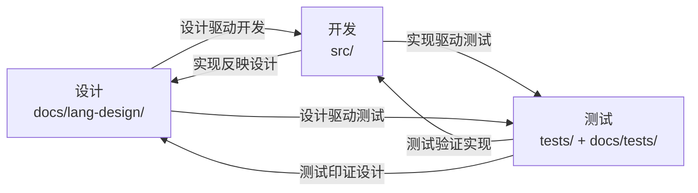

**锚定含义**：
1. **设计 ↔ 开发**：开发严格按设计文档实现；实现走了捷径或填满灰区时，必须按 §14.8 回写设计文档。
2. **开发 ↔ 测试**：每个功能点实现后必须有对应测试；测试结果反向验证实现的正确性。
3. **设计 ↔ 测试**：测试用例必须按设计文档的场景设计；测试覆盖矩阵必须与设计文档章节对应。

#### 9.4.2 测试严格按测试理论设计

**测试理论原则**：
1. **测试用例不是随意的**——必须按测试理论系统化设计（等价类划分、边界值分析、因果图、决策表、状态迁移等）。
2. **测试流与实际设计流和编译管道流能相互印证**——测试用例的组织反映编译流水线阶段结构。
3. **测试条例按标准测试设计书写和组织**——流程清晰、格式统一、可追溯（§9.7）。
4. **覆盖矩阵细粒度、深深度、广范围**——粒度足够细，深度足够深，范围足够广。

#### 9.4.3 负向/错误测试优先原则

> **核心要求**：错误/负向测试比正向测试更重要。

**理由**：
- 正向测试只能证明"功能在预期输入下工作"。
- 负向测试能证明"功能在非预期输入下不会出错、能正确报错"。
- 编译器的核心价值是**拒绝错误程序**——负向测试是验证这一价值的主要手段。
- 历史教训（Stage 2.x）：625 个正向测试 100% 偏向正向 case，导致 9/13 负向用例漏检。

**强制比例：1:3+（正确:错误）**：

| 维度 | 要求 |
|------|------|
| **比例** | 正向测试 : 负向测试 ≥ 1 : 3（即 1 个正向至少配 3 个负向） |
| **下限** | 每个功能点至少 1 个正向 + 3 个负向 |
| **覆盖** | §7.1.1 的 7 类错误每类至少 1 个负向 |
| **复杂度** | 负向测试必须包含简单（单语句）+ 中等（多语句/多函数）+ 复杂（嵌套控制流/闭包/递归）+ 错误恢复 |

**审查强制规则**：
- QA 角色在投票前**必须**验证正负比例满足 1:3+。比例不达标自动触发 NEEDS REVISION。
- §7.3.1 的 ≥30 case 审计集中，负向 case 必须 ≥ 22 个（即 30 case 中至少 22 个负向，正向 ≤ 8 个）。
- §14.5 D3 维度（测试覆盖深度）必须验证正负比例。

### 9.5 测试矩阵覆盖率要求

**每进入下一阶段之前，测试矩阵需要满足近 100% 覆盖率。**

具体含义：
1. **功能覆盖率**：当前阶段计划的所有功能点都有对应的测试。
2. **回归覆盖率**：之前阶段的测试仍然通过（无回归）。
3. **边界覆盖率**：每个功能点至少有 1 个边界 case 测试。
4. **负向覆盖率**：§7.1.1 负向测试矩阵的 7 个类别都有覆盖。
5. **审计覆盖率**：§7.3.1 要求的 ≥30 case 审计每轮通过。
6. **流水线路径覆盖率**：测试用例必须按编译器编译流水线阶段全覆盖——每个流水线阶段都有对应的测试路径，阶段间集成测试覆盖所有相邻阶段对，全流程 E2E 测试覆盖从源码到运行时输出的完整路径。所有分支流（if/else、match arms、loop/break/continue、early return 等）都有测试覆盖。
7. **正负比例覆盖率**：所有功能点的正负测试比例满足 1:3+（§9.4.3）。

**"近 100%"** 的含义：允许 ≤5% 的功能点标记为 `DEFERRED`（有明确的推迟理由和计划），但不允许 `UNTESTED`（没有测试且没有推迟理由）。

#### 9.5.1 编译流水线测试路径覆盖矩阵

> **原则**：测试理论必须与设计理论对应——设计和测试相互印证。测试用例的设计不是随意的，而是根据编译器编译流水线的阶段结构系统化设计的。

**覆盖维度**（3 层 × N 阶段）：

| 层级 | 覆盖范围 | 测试设计要求 |
|------|---------|------------|
| **Tier 1: 阶段内** | 每个编译流水线阶段内部的各功能点 | 每个功能点至少 1 个正向 + 3 个负向测试（§9.4.3） |
| **Tier 2: 阶段间** | 相邻阶段的集成正确性 | 每对相邻阶段至少 1 个集成测试（如 Lexer→Parser, Parser→HIR） |
| **Tier 3: 全流程** | 从源码到运行时输出的完整路径 | run_ok 测试覆盖所有核心特性 + 边界 + 分支流 |

**编译流水线阶段全覆盖要求**：


每个箭头代表一个阶段间集成点，必须有对应的测试路径覆盖。

**分支流测试覆盖要求**：
- 控制流分支：if/else、match arms（含 or-pattern、wildcard、guard）、loop/break/continue、early return
- 数据流分支：struct/tuple/enum 构造与解构、方法调用（含链式）、闭包捕获、数组索引、字段访问（含嵌套）
- 类型系统分支：类型推断（含 Infer→具体）、类型注解、类型转换（as）、泛型（如支持）

**记录要求**：所有测试路径统计完整记录在 `docs/tests/pipeline-test-coverage.md` 单文件中，包含：
1. 每个测试的 ID、名称、覆盖的流水线阶段、预期输出、验证状态
2. 按层级汇总的覆盖率统计表
3. 未验证路径列表及原因
4. 正负测试比例统计

#### 9.5.2 测试用例书写与组织标准

> **原则**：测试条例需要按照标准测试设计书写和组织，流程清晰，测试流与实际设计流和编译管道流能相互印证。

**测试用例标准格式**（conformance tests）：
```landin
// CATEGORY: <e2e|typecheck|borrowck|codegen|soundness|stdlib|integration>
// DESCRIPTION: <一句话描述测试目标>
// EXPECTED: <run_ok|compile_ok|compile_error>
// EXPECTED_STDOUT: <预期标准输出（run_ok 时必填，\n 表示换行）>
// EXPECTED_EXIT_CODE: <预期退出码（可选，默认 0）>
// ERROR_PATTERN: <错误模式（compile_error 时可选）>
// SOURCE: <来源 stage/round>
// POLARITY: <positive|negative>
```

**测试组织规则**：
1. 按编译流水线阶段分类（`00-parse`, `01-typecheck`, `02-borrowck`, `03-codegen`, `04-e2e`, `05-soundness`, `06-stdlib`, `07-integration`）
2. 每个分类下的测试按功能点命名：`<编号>-<功能描述>.lin`
3. run_ok 测试必须有 `EXPECTED_STDOUT` 并实际运行验证
4. compile_error 测试必须有 `ERROR_PATTERN` 或验证编译失败
5. 新增/变更测试时必须同步更新 `docs/tests/pipeline-test-coverage.md`
6. **正负比例审查**：每个分类下的正负比例必须满足 1:3+，不达标的分类标记为 P1 缺陷

### 9.6 标准化 examples/ 目录结构

**examples/ 的定位**：可运行的演示程序（`cargo run --example <name>`），用于 (a) 展示 compiler 公共 API 用法、(b) 阶段审查时的手动审计脚本。**不是**测试套件——测试归 `tests/`（§9.1），审查归 `docs/develop/`。

#### 9.6.1 目录结构

```text
examples/
├── README.md                        # 索引 + 运行说明
├── usage/                           # API 用法演示（长期保留）
│   ├── basic_compile.rs             # compile() + codegen_crate() 基本用法
│   ├── struct_codegen.rs            # 结构体 codegen 演示
│   └── ...
└── audit/                           # 阶段审查脚本（历史归档，不再扩展）
    ├── stage3_gate_audit_r1.rs      # Stage 3 gate review round 1
    ├── stage3_gate_audit_r23.rs     # 最后一轮（保留最新 + 关键轮次）
    └── ...
```

#### 9.6.2 强制规则

1. **新 example 必须按 `examples/usage/` 或 `examples/audit/` 放置** — 不允许直接添加到 `examples/` 根目录。
2. **每个 example 必须有 `//!` 顶部文档注释** — 说明用途、运行方式、对应的阶段/轮次。
3. **`examples/usage/` 的 example 必须使用当前公共 API** — 编译失败的 example 视为 P1 缺陷（API 变更后必须同步更新）。
4. **`examples/audit/` 的 example 是历史归档** — 审查轮次结束后不再维护，但保留作为历史参考；若 API 变更导致编译失败，标记为 `#[allow(dead_code)]` 或移到 `examples/audit/legacy/`。
5. **`examples/README.md` 必须索引所有 example** — 按类别列出 + 运行命令 + 简要说明。

#### 9.6.3 命名规范

| 类别 | 命名 | 示例 |
|------|------|------|
| API 用法 | `<feature>.rs` | `struct_codegen.rs`, `closure_demo.rs` |
| 阶段审查 | `stage<N>_gate_audit_r<R>.rs` | `stage3_gate_audit_r23.rs` |
| 跨阶段审查 | `cross_stage_audit.rs` | — |
| 轮次审查 | `round<N>_audit.rs` | `round5_audit.rs` |

#### 9.6.4 与 tests/ 的区别

| 维度 | `tests/` | `examples/` |
|------|----------|-------------|
| 目的 | 自动化测试（CI 运行） | 手动演示 / 审计脚本 |
| 运行方式 | `cargo test` | `cargo run --example <name>` |
| 失败后果 | 阻断合并 | 不阻断（但 P1 缺陷需修复） |
| 文档要求 | `docs/tests/` 双向印证 | `examples/README.md` 索引 |
| API 变更 | 必须同步更新 | `usage/` 必须更新；`audit/` 可归档 |

#### 9.6.5 维护策略

1. **API 变更时**：必须检查 `examples/usage/` 是否编译失败；失败则立即修复（与 `src/` 改动同一轮次完成）。
2. **阶段闭合时**：该阶段的所有 `audit/` 脚本归档，不再维护。
3. **定期清理**：`audit/` 中超过 5 轮的中间审查脚本可移到 `examples/audit/legacy/`，只保留最新 + 关键轮次。

### 9.7 测试文档格式标准

每个测试文档（`docs/tests/v0/stage-N/plan/X.md`）必须包含：

```markdown
# <功能点> 测试计划

> **阶段**: Stage N.M
> **对应代码**: tests/v0/stage-N/plan/X_tests.rs
> **状态**: ✅ Complete / 🔄 In Progress / ⏳ Deferred

## 1. 测试目标
<一句话描述本测试文件验证什么>

## 2. 覆盖场景

| 场景 | 测试函数名 | 极性 | 状态 | 说明 |
|------|-----------|------|------|------|
| 正常用法 | test_X_basic | positive | ✅ PASS | ... |
| 边界 case | test_X_edge | positive | ✅ PASS | ... |
| 错误 case 1 | test_X_err_1 | negative | ✅ PASS | ... |
| 错误 case 2 | test_X_err_2 | negative | ✅ PASS | ... |
| 错误 case 3 | test_X_err_3 | negative | ✅ PASS | ... |

## 3. 测试统计
- 预期测试数: N
- 实际测试数: N
- 正向: N1
- 负向: N2（比例 N1:N2 = 1:K，K ≥ 3 ✓/✗）
- 覆盖率: 100%

## 4. 依赖
- <前置条件、依赖的模块等>
```

### 9.8 迁移策略

对于现有的扁平 `tests/*.rs`：
1. **立即生效**：新测试必须按 `tests/v0/stage-N/plan/` 放置。
2. **现有扁平文件迁移到 `tests/legacy/`**：通过 `mod` 重导出保持可用。
3. **逐步迁移**：每个 stage 闭合时，将该 stage 的测试迁移到新结构。
4. **迁移完成标志**：`tests/legacy/` 中不再有该 stage 的直接测试文件。

---

## 10. API 命名标准

> **目的**：把 Stage 3.63 跨阶段 audit（§14.6）发现的 9 个 P1 命名不一致问题固化为本流程的硬性规则，避免未来回归。
>
> **触发时机**：任何对 `src/` 下文件的修改都必须遵守本节规则。
>
> **执行者**：所有开发 Agent；REV-A 在代码审查时强制检查。
>
> **完整规则文档**：`docs/develop/v0/api-naming-standard.md`（本节是流程层的引用，完整规则以该文档为准）。

### 10.1 必须遵守的命名规则

1. **入口函数模式**：每个阶段必须暴露一个自由函数入口，模式为 `<verb>_<noun>(<data>: &<Type>, ...) -> <ReturnType>`。需要状态访问的调用者可以使用 struct 方法变体。
   - ✅ `lexer::tokenize(src, &mut interner)`
   - ✅ `parser::parse_crate(tokens, &mut interner)`
   - ✅ `hir::lower::lower_crate(&ast, &interner)`
   - ✅ `resolve::resolve_crate(&mut hir, &mut interner)`
   - ✅ `mir::lower::lower_hir_body_to_mir_full(...)`
   - ✅ `codegen::codegen_crate(&CompileResult)`
   - ❌ 不允许只有 struct 方法入口（除非有明确的状态需求，如 `TypeChecker::check_mir_body_with_tables` 需要 unify 表状态）

2. **上下文类型命名**：
   - lowering 上下文：`<Stage>LowerCtxt<'a>` 模式
     - ✅ `HirLowerCtxt`、`MirLowerCtxt`
   - 分析上下文：`<Stage>Checker` 或 `<Stage>Resolver` 模式（-er 后缀）
     - ✅ `TypeChecker`、`BorrowChecker`、`Resolver`、`Lexer`、`Parser`
   - 可插拔 trait：`<Verb>er` 模式
     - ✅ `Emitter` trait + `TextEmitter` 实现

3. **类型前缀**：参考 `api-naming-standard.md` §4。
   - HIR 类型统一 `Hir` 前缀（`HirItem`、`HirExpr`、`HirCrate` 等）
   - MIR 类型仅在需要时加 `Mir` 前缀（`MirBody`、`MirLowerCtxt`），其他依赖模块路径限定（`mir::Ty`、`mir::Sig`）
   - Codegen 类型统一 `Emit` 前缀（`Emitter`、`EmitType`、`EmitValue`）
   - 跨阶段共享的 ID 类型无前缀（`HirId`、`DefId`、`BodyId` 等）

4. **Re-export 风格**：每个阶段模块的 `mod.rs` **必须**使用显式 re-export 列表，**禁止** glob（`pub use X::*;`）。
   - ✅ `pub use kinds::{Type1, Type2, Type3};`
   - ❌ `pub use kinds::*;`
   - 每个 explicit re-export 列表前必须有注释说明约定

5. **单一真理源（DRY）**：跨阶段消费的类型必须有且仅有一处定义。跨阶段 re-export 通过 `pub use` 允许（用于向后兼容），但定义必须位于架构上正确的模块。
   - ✅ `DefKind` 定义在 `hir::kinds`，`resolve::module_tree` 通过 `pub use crate::hir::DefKind;` re-export
   - ✅ `BorrowKind` 定义在 `mir::lvalue`，`borrowck::mod` 通过 `pub use crate::mir::lvalue::BorrowKind;` re-export

6. **弃用约定**：违反 §11（接口隔离）的遗留入口必须标记 `#[deprecated(note = "...")]`，note 必须指向 §11 合规的替代方案。
   - ✅ `#[deprecated(note = "Use TypeChecker::check_mir_body_with_tables (§11-compliant) or driver::compile instead")]`
   - 模块 re-export deprecated 项时必须用 `#[allow(deprecated)]` 包裹

7. **函数命名前缀**：
   - `lex_`：lexer 内部（`lex_ident`、`lex_number`）
   - `parse_`：parser 内部（`parse_crate`、`parse_expr`）
   - `lower_`：lowering（`lower_crate`、`lower_body`、`lower_hir_ty_to_mir_ty`）
   - `resolve_`：name resolution（`resolve_path`、`resolve_uses`）
   - `check_`：type/borrow checking（`check_mir_body_with_tables`）
   - `emit_`：codegen（`emit_header`、`emit_fat_ptr_type`）
   - `codegen_`：codegen 顶层入口（`codegen_crate`）

8. **错误类型**：所有错误类型使用 `Error` 后缀（`LexError`、`ParseError`、`LowerError`、`ResolveError`、`TypeError`、`BorrowError`）。结构共享 `{ message: String, span: Span }` 最小形态。

### 10.2 审查检查清单

REV-A 在代码审查时必须验证以下项目：

- [ ] 没有新增 `pub use X::*;` glob
- [ ] 没有新增缺少正确阶段前缀的类型
- [ ] 没有新增缺少正确后缀（`Ctxt` / `-er`）的上下文类型
- [ ] 没有新增违反自由函数模式的入口
- [ ] 没有新增跨模块重复定义的类型（违反 DRY）
- [ ] 没有新增 `#[deprecated]` 但缺少 `note = "..."` 的项
- [ ] 如果移动了类型定义，旧模块必须 re-export 用于向后兼容

### 10.3 违反后果

- **第一次违反**：REV-A 投 NEEDS REVISION，列出违反的规则编号
- **第二次违反**（同一 Agent 在同一阶段）：升级为 P2 缺陷，记录到 risk-register
- **累计三次违反**：触发 §6.3 硬性退回条件，升级技术委员会仲裁

### 10.4 跨阶段 audit 中的命名审查

每次 §14.6 跨阶段深度审查必须包含命名标准化审查维度：
- 检查所有 `src/*/mod.rs` 是否使用 explicit re-export（无 glob）
- 检查所有阶段入口是否符合自由函数模式
- 检查所有上下文类型是否符合 `Ctxt` / `-er` 后缀约定
- 检查所有跨阶段共享类型是否符合 DRY（单一真理源）
- 检查所有 deprecated 项是否标记 `note = "..."` 指向替代方案

审查结果记录在 `gate-review-roundN.md` 中，违反项标记为 `L-NAMING-N`（命名债务），按 §6 缺陷等级评估优先级。

---

## 11. 接口隔离

> **背景**：在 Stage 3.30 推进 struct codegen 时发现，codegen 直接调用 `crate::mir::lower::lower_hir_ty_to_mir_ty` 来从 HIR 字段类型推导 LLVM 字段类型。这违反了阶段隔离——codegen（Stage 3）直接调用了 MIR lower（Stage 2.1）的内部函数，而不是通过 MIR 数据结构本身传递类型信息。

### 11.1 核心原则

**项目阶段之间通过明确的数据契约交互，禁止跨阶段直接调用内部接口。**

每个阶段（lexer → parser → HIR → MIR → typeck → borrowck → codegen）是一个"管道节点"。节点之间应该：
1. **高内聚**：每个节点内部实现完整，不依赖其他节点的内部实现细节。
2. **低耦合**：节点之间通过明确的数据结构（AST、HIR、MIR、LLVM IR）交互，而不是函数调用。
3. **可替换**：任何节点可以被等价实现替换（例如把 lexer 换成不同的实现，只要产出相同的 Token 流，parser 不受影响）。
4. **组合优于继承**：节点之间通过组合数据流连接，而不是共享内部状态或互相调用私有函数。

### 11.2 允许的跨阶段访问

以下跨阶段访问是允许的，因为它们是**数据契约**的一部分：

1. **下一阶段读取上一阶段的输出数据结构**：
   - parser 读 lexer 的 `Vec<Token>`
   - HIR lower 读 parser 的 `Crate<ast::Item>`
   - MIR lower 读 HIR 的 `Body`
   - typeck 读 MIR 的 `MirBody`
   - codegen 读 MIR 的 `MirBody`
   - 这些都是"读上游产出的数据"，是管道的正常数据流。

2. **上一阶段定义的公共 API（明确导出的）**：
   - `lower_hir_ty_to_mir_ty` 如果被 `pub` 导出且文档明确说明"供下游使用"，则可以调用。
   - 但这种情况下应该考虑：是否应该把数据直接放在 MIR 里，而不是让下游重新调用 lower 函数？

3. **公共的 ID 类型和工具类型**：
   - `DefId`、`HirId`、`BodyId`、`Span` 等跨阶段共享的 ID 类型。
   - 这些是"基础设施"，不是"内部接口"。

### 11.3 禁止的跨阶段访问

以下跨阶段访问是禁止的，违反时必须在 gate review 中标记为 `L-PIPE-N`（Pipeline coupling debt）：

1. **跨 N 个阶段调用内部函数**：
   - 反例：codegen（Stage 3）调用 `crate::hir::lower::lower_path`（Stage 1.2 的内部函数）。
   - 正确做法：HIR lower 阶段就把路径解析结果放进 HIR 数据结构，codegen 读 HIR 数据结构即可。

2. **下游阶段反向修改上游数据结构**：
   - 反例：codegen 修改 HIR 的 `owners` 字段。
   - 正确做法：codegen 只读 HIR，不修改；如果要修改，应该在上游阶段做。

3. **下游阶段依赖上游的内部实现细节**：
   - 反例：codegen 依赖 MIR lower 用 `fresh_infer_ty` 创建局部变量这一实现细节。
   - 正确做法：MIR lower 应该把局部变量的类型信息完整写进 `LocalDecl.ty`，codegen 只读 `LocalDecl.ty`。

4. **跨阶段共享可变状态**：
   - 反例：codegen 持有 `Rodeo`（interner）的 `&mut` 引用并修改它。
   - 正确做法：interner 在 lex 阶段就冻结，下游只读。

### 11.4 判定"是否违反隔离"的检查清单

在 gate review 中，reviewer 对每个跨阶段访问问以下问题：

1. **数据流向**：是"上游 → 下游"（正常）还是"下游 → 上游"（违规）？
2. **接口性质**：调用的是 `pub` 导出的公共 API，还是模块内部的 `fn` / `pub(crate)`？
3. **可替换性**：如果被调用的阶段换一个等价实现，调用方还能工作吗？
4. **数据契约**：被调用的函数返回的数据，是否本应该作为数据结构字段直接传递？
5. **修复成本**：消除这个耦合需要改多少个文件？如果 ≤3 个，应该立即修复；如果 >3 个，记 `L-PIPE-N` 并在后续 stage 修复。

### 11.5 实施要求

当发现违反 §11 的代码时：
1. **优先修复**：如果修复成本 ≤3 文件，本 stage 内修复。
2. **记录债务**：如果修复成本 >3 文件，记 `L-PIPE-N` 并在 gate review limitation 表中明确"修复需要什么"。
3. **数据下沉**：修复方式优先选择"把数据放进数据结构"而不是"让下游重新调用上游函数"。例如：把 ADT 字段类型放进 `AggregateKind::Adt(def_id, variant, field_tys)` 而不是让 codegen 调用 `lower_hir_ty_to_mir_ty`。
4. **公共 API 标注**：如果某个函数确实需要被下游调用，必须 `pub` 导出并在文档注释中标注"跨阶段公共 API"。

### 11.6 例外情况

以下情况允许跨阶段调用：
1. **driver 层**：`driver.rs` 是"编排层"，可以调用所有阶段的入口函数（`lex`、`parse`、`lower_crate`、`lower_hir_body_to_mir`、`check_mir_body`、`codegen_crate`）。这是它的职责。
2. **测试代码**：测试可以调用任何内部函数来验证行为。
3. **examples/**：示例代码可以调用任何 `pub` API。
4. **临时 spike**：如果用最小方案验证想法（per §12.3），可以临时跨阶段调用，但必须在 worklog 记录"待修复"。

---

## 12. 解决方案选择：最优 > 最小

> **背景**：在 Stage 3.30 设计 struct/ADT codegen 时发现，tuple struct 构造 `Pair(1, 2)` 在 MIR 层被错误地 lower 为 `Terminator::Call`（函数调用），而不是 `Rvalue::Aggregate(Adt, ...)`（聚合构造）。根因可追到 Stage 1.3 的 `Res::Def(DefId)` 没有携带 `DefKind`。
>
> 当时面临两个选择：
> - **最小方案**：在 codegen 层 hack——遇到 `Call` 且目标 `DefId` 对应的 HIR owner 是 `Struct` 时，改用 `insertvalue` 而不是 `call`。改动小，但在 codegen 层硬编码了 typeck 应该负责的语义判断。
> - **最优方案**：在 `Res::Def` 上加 `DefKind` 字段，让 resolver、HIR、MIR lower、typeck、codegen 全栈都能在不需要 hack 的情况下区分 def 类型。
>
> 选最优方案。本节把这条经验固化成流程规则。

### 12.1 核心原则

**当面对"最小改动"与"最优架构"二选一时，选最优架构。**

理由：
- 最小方案的"省下的工作量"是**短期收益**，但累积的"潜在问题复杂度"是**长期负债**。负债会按复利增长。
- 早期阶段（Stage 0-3）的架构债务利息最高——因为后续每一阶段都会基于当前架构叠加新功能，债务会被放大。
- 一步到位的重构成本通常只是最小方案的 2-3 倍，但能避免未来 N 次相同主题的"打补丁"工作（N 通常 ≥5）。

### 12.2 判定"最优"的标准

一个方案是"最优"而非"最小"，当且仅当满足以下至少一条：

1. **消除根因**：直接修复了问题的根本原因，而不是症状。
   - 反例：在 codegen 加 `if func is struct { emit insertvalue }` 是治症；在 `Res::Def` 加 `DefKind` 让 MIR lower 天然正确是治根。
2. **架构对齐**：让代码结构与语言规范/设计文档对齐。
3. **避免特例**：不需要在未来每次扩展时加 `if`/`match` 特例。
4. **跨阶段一致**：让 resolver → HIR → MIR → typeck → codegen 的数据流一致，没有信息丢失或重新推导。

### 12.3 何时仍可选"最小方案"

最小方案在以下情况仍可接受：

1. **紧急通道（Expedited Lane，§6.5）**：P0 阻塞线上功能，先打补丁，下个迭代周期补根因修复。
2. **临时验证**：用最小方案快速验证一个想法是否可行（spike），验证完后要么补成最优方案，要么删除。
3. **最优方案依赖未就绪的前置条件**：例如最优方案需要 Stage 5 的某个基础设施，当前在 Stage 3，可以先打补丁但**必须在 worklog 和 dev-log 里记录"待 Stage 5 修复根因"**，并在该 stage 的 gate review 里列入 limitation 表。

### 12.4 实施要求

当选择最优方案时：
1. **必须更新 worklog 和 dev-log**：明确记录"放弃了最小方案 X，选择了最优方案 Y，理由是 Z"。
2. **必须更新受影响的设计文档**（per §8）：如果方案改变了某个阶段的公共数据结构（如 `Res::Def` 加字段），设计文档同步更新。
3. **必须更新所有 pattern match 点**：最优方案通常会改公共数据结构，所有 match 点必须同步更新，不能留 `// TODO: handle new variant`。
4. **gate review 必须验证"是否真的消除了根因"**：reviewer 不能只看"测试通过"就 APPROVED，必须验证根因确实被修复（例如：新增一个测试，明确验证"以前会走 hack 路径的 case 现在走的是正常路径"）。

### 12.5 反例记录

每个 gate review 报告中，如果发现当前实现有"治症不治根"的代码，**必须**在 limitation 表里标记为 `L-DEBT-N`（Technical Debt），并记录"根因修复需要什么"。这避免了技术债被遗忘。

---

## 13. 阶段切换与重构

### 13.1 阶段开始设计对齐

> **目的**：把"每阶段开始必须先对齐设计文档"从最佳实践固化为流程强制规则。设计文档（`docs/lang-design/`）是项目的设计意图基线，阶段规划必须以它为最高优先级参考。
>
> **触发时机**：每个**新阶段**（含子阶段）启动时的第一次规划。
>
> **执行者**：PM-A 主导规划，ARCH-A 协同解读设计文档，REV-A 审查规划与设计文档的一致性。

#### 13.1.1 对齐流程

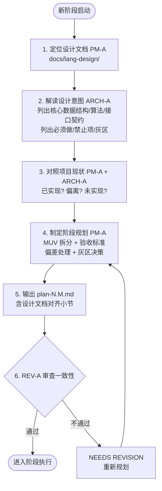

**设计文档定位（按阶段）**：
- Stage 0/1 → `01-language-specification.md` / `02-grammar.md` / `05-ast.md`
- Stage 2 → `03-type-system.md` / `04-ownership-borrowing.md` / `06-mir.md`
- Stage 3 → `07-codegen.md` / `08-bootstrap-strategy.md`
- Stage 4 → `09-stdlib.md` / `10-toolchain.md` / `13-stage1-feature-whitelist.md`
- Stage 5+ → `14-soundness-considerations.md` / `15-attributes.md` / `16-diagnostics.md`

#### 13.1.2 强制要求

1. **设计文档优先级最高**：当设计文档与"经验判断"或"互联网惯例"冲突时，以设计文档为准。如要偏离设计文档，必须在 plan 中显式声明"本阶段偏离 §X.Y，理由是 Z"，并在 §14.8 阶段末尾回写时同步更新设计文档。
2. **规划必须列对齐小节**：`plan-N.M.md` 必须包含"设计文档对齐"小节，最少包含：
   - 对应设计文档章节列表（带链接）
   - 设计意图摘要（3-5 句）
   - 已实现项 / 偏差项 / 未实现项
   - 本阶段灰区决策
3. **灰区决策不可省略**：设计文档未覆盖的灰区必须在 plan 中明确决策，不允许"边做边定"。
4. **沿用上一阶段 §14.8 输出**：上一阶段末尾回写的设计偏差清单必须在本阶段 plan 中显式处理（纠正 / 推迟 / 接受为永久偏差）。

### 13.2 阶段切换期：大胆但谨慎的重构

> **目的**：在当前阶段完全结束、新阶段尚未开始之间的"切换期"，是做架构重构的最佳时机——此时对当前阶段已交付成果零影响，对新阶段是干净基线。
>
> **核心理念**：大胆但谨慎——敢于改架构，但每一步都经过深思熟虑。这个时段是 codegen 流水线重构、数据结构优化、错误系统重组、API 设计调整的最佳窗口。

#### 13.2.1 切换期重构聚焦的 6 个维度

| # | 维度 | 重构内容 | 风险等级 |
|---|------|---------|---------|
| 1 | **设计原则** | 单一职责、单向流动、显式 > 隐式、报错 > 静默等 §2.2 原则的违反点 | 低 |
| 2 | **数据结构选择** | 核心数据结构是否最优（HIR/MIR/AST 的字段布局、enum variant 设计） | 中 |
| 3 | **架构设计** | 模块边界、阶段划分、跨阶段数据契约（§11） | 中 |
| 4 | **流水线组织** | 编译管道是否有"回流"或"回查"反模式，是否有不必要的中间表示 | 高 |
| 5 | **错误系统** | 错误类型层级、错误传播路径、错误恢复策略 | 中 |
| 6 | **API 设计** | 公共 API 命名（§10）、入口函数模式、re-export 风格 | 低 |

#### 13.2.2 切换期重构流程

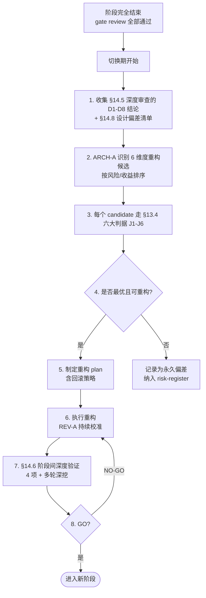

#### 13.2.3 切换期重构的强制规则

1. **大胆**：切换期允许破坏性变更（§13.3 早期阶段规则），不需要向后兼容。
2. **谨慎**：每个重构必须经过 §13.4 六大判据（J1-J6）检查。
3. **回滚就绪**：每个重构 plan 必须包含回滚策略（git revert / branch 隔离 / feature flag）。
4. **测试守护**：重构过程中 `cargo test` 必须零回归（除非显式标注"重构导致测试需更新"并同步更新）。
5. **文档同步**：重构后立即更新 `docs/lang-design/`、`docs/develop/`、`docs/graph/`（§15）。
6. **codegen 流水线重构的特殊地位**：切换期是 codegen 流水线重构（§13.2.1 第 4 项）的最佳时机——因为 codegen 重构影响面最大，需要阶段隔离的环境。

### 13.3 开发阶段变动规则

> **背景**：Landin 编译器当前处于**早期开发阶段**（Stage 0-3），代码变动频繁而且大量。在此阶段，**不需要考虑向后兼容**。
>
> 这意味着：
> - 可以自由重命名、删除、重构公共 API
> - 可以破坏性地修改数据结构
> - 可以移除旧代码而不保留 deprecated 标记
> - 可以删除不再使用的测试（但必须同步删除对应的代码）
>
> **当项目进入 v1.0 稳定阶段后**，本规则将失效，届时需要遵循语义化版本（SemVer）和向后兼容承诺。

**适用范围**：`src/` 所有模块、`tests/` 测试代码、`docs/` 设计文档、`examples/` 示例代码

**不适用范围**：`Cargo.toml` 的 `name`/`edition`、`LICENSE` 文件、已发布的 crate（目前 N/A）

**重构指导原则**：
1. **大胆重构**：如果发现更好的设计，直接改，不要为了"兼容旧代码"而保留过时的实现。
2. **删除优于注释**：不再使用的代码直接删除，不要注释掉保留。Git 历史会记录删除前的版本。
3. **测试随代码变**：重构代码时同步更新测试。删除代码时同步删除测试。
4. **文档随代码变**：重构后立即更新设计文档（per §8）。
5. **一步到位**：不要分多步"渐进迁移"——在早期阶段，一步到位的重构比渐进迁移更高效。
6. **开发期不要引入简写语法**：开发期不引入简写语法，稳定期才是好时机（整体引入）。

### 13.4 重构即架构设计

> **目的**：把"重构 = 组织结构设计"从原则性陈述固化为可操作的流程规则。当用户需求或代码触动"重构"时（无论是模块拆分、文件迁移、接口重组、目录结构调整），Agent 必须严格依据架构设计、编译相关表达、阶段划分、设计原则、组织结构做科学合理的划分，**不得把重构降级为"按 LOC 切片"的体力活**。
>
> **触发时机**：
> 1. 用户明确要求"重构 / 拆分 / 重新组织 / 重新分析"等关键词时
> 2. gate review 发现 LOC 超阈值（mod.rs > 1500 LOC）时
> 3. §14.5 深度审查 D1（架构健康度）识别职责混合时
> 4. §14.8 阶段末尾设计回写识别"实现偏离设计"且可重构时
> 5. §13.2 阶段切换期识别 codegen 流水线重构机会时
>
> **执行者**：ARCH-A 主导架构分析，PM-A 制定拆分计划，REV-A 验证单一职责 + 单向流动合规。

#### 13.4.1 重构的六大判据

任何重构（拆分 / 合并 / 迁移 / 重组）在动手前必须先回答以下 6 个判据。**任一判据答"否"则该重构不合规**，需重新设计：

| # | 判据 | 通过条件 | 反例 |
|---|------|---------|------|
| J1 | **架构设计对齐** | 新结构与 `docs/lang-design/` 对应阶段设计文档的章节划分一致，或对设计文档未覆盖的灰区有明确决策 | 设计文档把 MIR 分为 body / place / ty 三层，重构却按 LOC 把 place 拆成 place_a / place_b 两文件 |
| J2 | **单一职责** | 每个新模块/文件承担且仅承担一个明确的职责（用一句话能描述） | `utils.rs` 同时包含类型转换 + 错误格式化 + IO 助手 |
| J3 | **单向流动** | 模块间依赖关系是无环有向图（DAG）。数据流方向与编译管线方向一致 | A 调用 B，B 调用 C，C 又调用 A（环依赖） |
| J4 | **编译相关表达完整** | 每个模块的"编译相关概念"（数据结构 / 算法 / 接口）在模块内是完整的，不被多个模块共享切割 | 一个 trait 的定义在 A，impl 在 B，方法在 C——分散三个文件无内聚 |
| J5 | **阶段划分清晰** | 新结构尊重编译管线阶段（lexer → parser → HIR → MIR → typeck → codegen），不破坏阶段隔离（§11） | 重构后 codegen 直接调用 parser 内部函数 |
| J6 | **科学合理粒度** | 每个模块的 LOC 在合理区间（mod.rs 建议 < 1500 LOC；子模块建议 100-1500 LOC），且粒度由职责决定而非 LOC | 把 100 LOC 文件拆成 5 个 20 LOC 文件，纯粹为降 LOC |

#### 13.4.2 重构执行流程

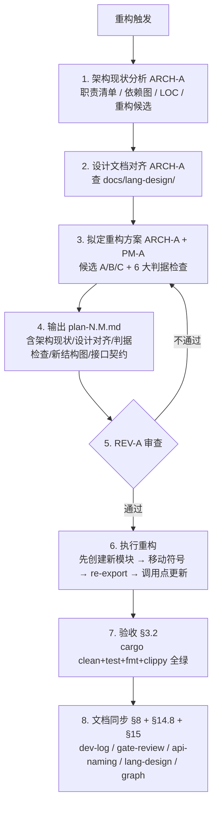

#### 13.4.3 反模式（禁止）

以下重构方式被本节明确禁止，违反时 REV-A 必须 NEEDS REVISION：

1. **按 LOC 切片**：把一个大文件按 N 行切成多个小文件，每个小文件承担多个职责。表面上 LOC 降了，实际职责混合更严重。
2. **隐藏环依赖**：拆分后看似模块清晰，实际通过 `super::` 互相调用形成环。必须用 §11.4 检查清单验证。
3. **跨阶段拆分**：把一个阶段（如 MIR）的代码拆到另一个阶段（如 codegen）的目录下。违反 §11 接口隔离。
4. **空降新设计**：不查阅 `docs/lang-design/`，凭 Agent 主观判断"怎么拆合理"。必须先对齐设计文档（§13.1）。
5. **不留 re-export**：拆分后旧模块直接删除符号定义，导致下游调用点全部断裂。早期阶段虽允许破坏性变更（§13.3），但留 re-export 能显著降低回归风险。
6. **无判据记录**：`plan-N.M.md` 没有"6 大判据检查"小节，无法复核重构合理性。

#### 13.4.4 与 §12 的关系

| 协议 | 触发场景 | 关注重点 |
|------|---------|---------|
| §12 最优 > 最小 | 解决**单个问题**时，最小补丁 vs 根因修复 | 治根 vs 治症 |
| §13.4 重构即架构设计 | 解决**结构性问题**时，如何科学拆分 / 重组 | 单一职责 + 单向流动 + 设计对齐 |

§12 处理"一个问题两种解法"，§13.4 处理"一组结构如何重组"。两者互补：重构时通常先有 §13.4 的架构分析，再用 §12 的"最优 > 最小"原则选择具体实现方案。

### 13.5 设计-审查 Agent 循环

> **目的**：把"review agent 和 design agent 迭代审查与校准设计"从隐式协作固化为流程协议。设计不是一次成型，需要多轮迭代校准才能收敛到最优。
>
> **核心理念**：设计 Agent 和审查 Agent 是两个独立角色——设计 Agent 负责产出方案，审查 Agent 负责挑刺。两者迭代循环直到设计无缺陷且最优。
>
> **触发时机**：
> 1. 任何新设计（数据结构、API、模块拆分、流水线变更）开始时
> 2. §13.4 重构方案拟定阶段
> 3. §13.2 阶段切换期重构候选方案制定阶段
> 4. §14.5 深度审查发现设计缺陷需要重新设计时
>
> **执行者**：ARCH-A 作为设计 Agent 主导方案产出，REV-A 作为审查 Agent 主导缺陷识别与校准。

#### 13.5.1 循环结构

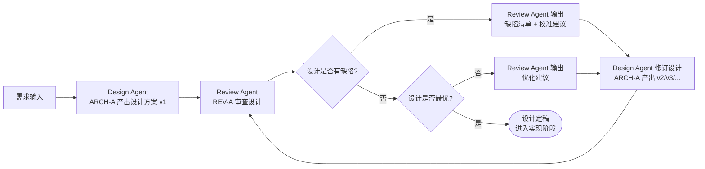

#### 13.5.2 强制规则

1. **角色分离**：设计 Agent（ARCH-A）和审查 Agent（REV-A）必须是不同 Agent，不能由同一 Agent 自审自校。
2. **缺陷分类**：审查 Agent 输出的缺陷必须按 §6 分级（P0/P1/P2/P3）：
   - P0 设计缺陷：会导致编译器 panic / soundness hole / 数据丢失——必须修复
   - P1 设计缺陷：会导致 API 错误 / 接口违反 §11 / 命名违反 §10——必须修复
   - P2 设计缺陷：边界条件处理 / 性能问题——优先修复
   - P3 设计建议：风格 / 措辞 / 微优化——可推迟
3. **校准建议具体**：审查 Agent 不能只说"这里有问题"，必须给出具体的校准建议（"建议改为 X，理由是 Y"）。
4. **设计 Agent 必须回应**：对每个缺陷/建议，设计 Agent 必须明确"采纳"/"拒绝"并说明理由。拒绝 P0/P1 必须有充分理由。
5. **循环上限**：设计-审查循环最多 5 轮。若 5 轮后仍有 P0/P1 未解决，升级到 PM-A + ARCH-B 仲裁。
6. **每轮产出文档**：每轮设计稿必须归档到 `docs/develop/v0/stage-N/design-v<N>.md`，审查清单归档到 `docs/develop/v0/stage-N/design-review-v<N>.md`。
7. **定稿标记**：设计定稿时在文档头标注 `Status: Final`，后续实现严格按定稿执行。

#### 13.5.3 与其他协议的关系

| 协议 | 角色 | 与设计-审查循环的关系 |
|------|------|---------------------|
| §13.1 阶段开始设计对齐 | Design Agent 输入 | 提供设计文档基线 |
| §13.2 阶段切换期重构 | Design Agent + Review Agent 协作场景 | 切换期重构方案必须走循环 |
| §13.4 重构即架构设计 | 循环的具体应用 | 重构方案必须走循环 |
| §14.5 深度审查 D5 设计合理性 | Review Agent 的输出依据 | D5 发现的设计缺陷触发循环 |
| §14.8 阶段末尾设计回写 | 循环的输出归档 | 回写的设计偏差是下一阶段循环的输入 |

---

## 14. 深度审查协议

### 14.1 三层深度审查体系

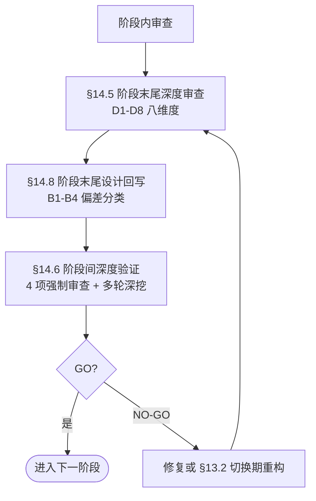

| 协议 | 触发时机 | 审查范围 | 输出 |
|------|---------|---------|------|
| §7.3 阶段门审查 | 每轮 gate review | 单阶段正确性（30+ case 审计） | gate-review-roundN.md |
| §14.5 阶段末尾深度审查 | 阶段切换点 | D1-D8 八维度全面审查 + 下一阶段就绪度 | deep-review-roundN.md |
| §14.6 阶段间深度验证 | 阶段切换前（§14.5 完成后） | 数据流覆盖 + 架构审查 + 三者覆盖 + 隐藏问题 + 多轮深挖 | architecture-review.md / design-impl-test-coverage.md / hidden-problems-assessment.md / refactoring-optimality-review.md / performance-baseline.md / final-assessment.md |
| §14.7 跨阶段架构审查 | 大阶段完成后 | 6 维度架构完整性 + §11 合规 + 数据流校验 | cross-stage-audit.md |

### 14.2 阶段末尾深度审查的 8 个维度（§14.5）

每次深度审查必须覆盖以下 8 个维度，每个维度输出"现状评估 + 风险分析 + 行动建议"三段式结论：

| # | 维度 | 审查问题 | 输出 |
|---|------|---------|------|
| D1 | **架构健康度** | 当前阶段间接口隔离（§11）是否依然健壮？是否出现新的跨阶段耦合？数据流是否清晰？ | 架构图 + 耦合点清单 + 重构建议 |
| D2 | **技术债清单** | 累积了哪些 P2/P3 技术债？哪些是"可接受的"（有明确偿还计划），哪些是"危险的"（影响下一阶段）？ | 技术债表 + 优先级排序 + 偿还计划 |
| D3 | **测试覆盖深度** | 测试矩阵（§9）是否近 100%？是否有"孤立正确但集成失败"的风险？负向测试（§7.1.1）是否覆盖？**正负比例是否满足 1:3+（§9.4.3）**？ | 覆盖率报告 + 缺漏清单 + 补测计划 |
| D4 | **下一阶段就绪度** | 下一阶段（Stage N+1）需要当前阶段提供什么数据/接口？当前是否提供？差距在哪？ | 就绪度清单 + 阻塞项 + 解阻计划 |
| D5 | **设计合理性** | 当前阶段的核心数据结构/算法/接口是否设计合理？是否有"过度设计"或"设计不足"？ | 设计评审 + 简化/增强建议 |
| D6 | **性能与可扩展性** | 当前实现在规模增长时是否会成为瓶颈？是否有 O(n²) 或更差的算法？ | 性能基线 + 瓶颈分析 + 优化建议 |
| D7 | **文档与知识传承** | 文档是否充分？新 Agent 能否仅凭文档理解当前架构？是否有"隐性知识"未记录？ | 文档清单 + 缺漏项 + 补档计划 |
| D8 | **测试路径覆盖与流水线印证** | `docs/tests/pipeline-test-coverage.md` 是否完整覆盖编译流水线所有阶段、阶段间集成点、全流程 E2E？测试流与设计流/编译管道流是否相互印证？所有分支流是否覆盖？ | 路径覆盖矩阵 + 缺漏路径 + 补测计划 |

### 14.3 深度审查执行协议

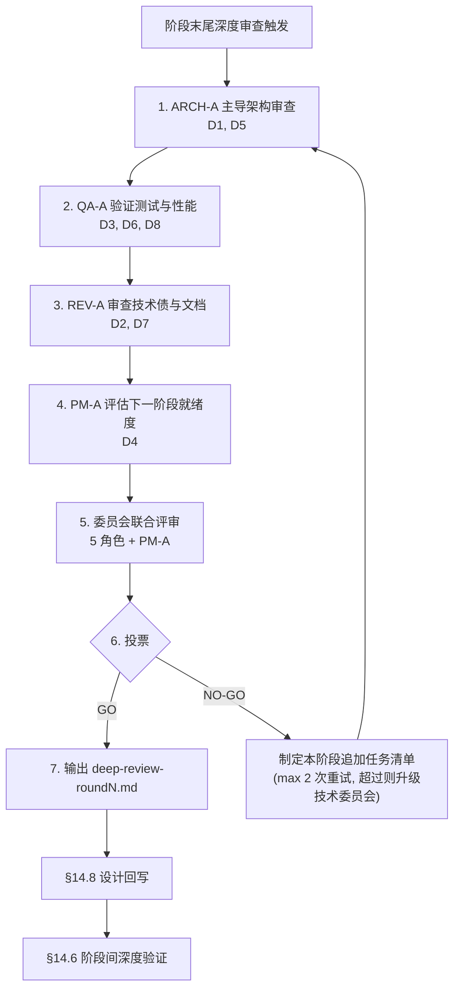

### 14.4 深度审查输出格式

每次深度审查必须输出 `docs/develop/v0/stage-N/deep-review-roundN.md`，包含以下结构：

```markdown
# Stage N 深度审查报告（Round M）

> 审查日期 / 审查者 / 基线版本 / 测试数

## 1. 执行摘要
- 一段话总结：当前阶段是否可以进入下一阶段？
- 阻塞项数量（P0/P1/P2）
- 建议行动：GO / GO-WITH-CONDITIONS / NO-GO

## 2. 八维度审查结论

### D1. 架构健康度
- **现状**：...
- **风险**：...
- **建议**：...

### D2. 技术债清单
| ID | 描述 | 优先级 | 偿还计划 |
|----|------|--------|---------|
| TD-001 | ... | P2 | Stage N+1 |

### D3. 测试覆盖深度
- 覆盖率：X%
- 正负比例：N_pos:N_neg = 1:K（K ≥ 3 ✓/✗）
- 缺漏：...
- 补测计划：...

### D4. 下一阶段就绪度
| 下一阶段需求 | 当前状态 | 差距 | 解阻计划 |
|-------------|---------|------|---------|
| ... | ✅/⚠️/❌ | ... | ... |

### D5. 设计合理性
- 过度设计：...
- 设计不足：...
- 建议：...

### D6. 性能与可扩展性
- 性能基线：...
- 瓶颈：...
- 优化建议：...

### D7. 文档与知识传承
- 文档完整度：X%
- 隐性知识：...
- 补档计划：...

### D8. 测试路径覆盖与流水线印证
- 路径覆盖矩阵：...
- 缺漏路径：...
- 补测计划：...

## 3. 委员会投票
| 角色 | 投票 | 理由 |
|------|------|------|
| ARCH-A | GO / NO-GO | ... |
| DEV-A | GO / NO-GO | ... |
| QA-A | GO / NO-GO | ... |
| ALG-C | GO / NO-GO | ... |
| SKL-A | GO / NO-GO | ... |

## 4. 行动计划
- 本阶段追加任务（如有）：...
- 下一阶段优先任务：...
- 技术债偿还顺序：...

## 5. 结论
GO / GO-WITH-CONDITIONS / NO-GO

## 6. 设计偏差清单（§14.8）
| 设计文档章节 | 偏差类型 | 偏差描述 | 最优判断 | 重构判断 | 回写动作 |
|-------------|---------|---------|---------|---------|---------|
| ... | B1/B2/B3/B4 | ... | ... | ... | ... |
```

### 14.5 阶段末尾深度审查协议

> **目的**：在每个阶段末尾（review / gate / 收敛轮次 / 阶段切换点）执行深度架构审查，主动分析"当前项目的设计、实现、架构是否足够支撑进入下一阶段"，识别技术债并制定偿还计划。
>
> **核心理念**：阶段切换点是技术债影响最大的节点——一个在 Stage N 可以用 1 小时修复的设计缺陷，到 Stage N+2 可能需要 1 周重构。因此阶段末尾是做优化和重构的最佳时机。本协议把"深度审查"从可选行为升级为强制行为。
>
> **触发时机**：
> 1. 每个**大阶段**（Stage 0/1/2/3/4/5）的最末轮 gate review
> 2. 每个**子阶段**（如 Stage 3.63, 3.64...）的收敛轮（§7.3.3 收敛后）
> 3. 用户明确要求"深度审查"或"跨阶段审查"时
> 4. 连续 3 轮 gate review 收敛后（§7.3.3），在进入下一大阶段前
>
> **执行者**：ARCH-A 主导，QA-A 验证，REV-A 审查，PM-A 协调。

#### 14.5.1 完成标准

深度审查完成需满足：
1. 8 个维度全部审查（D1-D8）
2. 每个维度有明确的"现状 + 风险 + 建议"三段式结论
3. 技术债清单完整（所有 P2/P3 项有 ID、优先级、偿还计划）
4. 下一阶段就绪度清单完整（每个需求有状态 + 差距 + 解阻计划）
5. 委员会投票完成（5 角色全部投票）
6. 行动计划明确（GO / GO-WITH-CONDITIONS / NO-GO + 具体任务）
7. 报告输出到 `docs/develop/v0/stage-N/deep-review-roundN.md`
8. **正负测试比例满足 1:3+**（§9.4.3）

#### 14.5.2 何时可以跳过深度审查

以下情况可以跳过 §14.5 深度审查（但必须在 worklog 中记录跳过理由）：
1. **非阶段切换点的普通轮次**——只需 §7.3 阶段门审查
2. **紧急修复轮次**（§6.5 紧急通道）——修复后补审
3. **纯文档更新轮次**——无代码变更

**不可跳过的情况**：
- 任何大阶段（Stage 0/1/2/3/4/5）的最末轮
- 连续 3 轮收敛后进入下一大阶段前
- 用户明确要求时

#### 14.5.3 深度审查发现的问题处理

| 问题类型 | 处理方式 |
|---------|---------|
| 阻塞下一阶段的 P0/P1 | **必须本阶段修复**，不允许带入下一阶段 |
| 影响下一阶段的 P2 | 本阶段修复或制定明确的 Stage N+1 修复计划 |
| 不影响下一阶段的 P2/P3 | 记录为技术债，按 D2 排序偿还 |
| 设计缺陷（D5） | 评估修复成本：≤3 文件则本阶段修复，否则 §13.2 切换期修复 |
| 性能瓶颈（D6） | 除非影响功能正确性，否则记录为 Stage N+2 优化项 |

### 14.6 阶段间深度验证与架构审查协议

> **目的**：在当前阶段末尾之后、下一阶段开始之前，执行全面的深度验证和架构审查，确保项目具备足够强大的基础进入下一阶段。
>
> **核心理念**：阶段切换不仅是"当前阶段完成"的确认，更是"下一阶段可以安全开始"的前置条件。隐藏的问题不会因为进入下一阶段而消失，反而会因为新功能的叠加而变得更复杂、更难修复。因此必须在阶段间执行深度验证，经团队多轮商讨审核通过后才算正式通过。
>
> **触发时机**：
> 1. 每个大阶段（Stage 0/1/2/3/4/5）的最终 gate review 通过后
> 2. 连续 3 轮收敛后进入下一大阶段前
> 3. 用户明确要求"深度审查 / 数据流覆盖 / 架构审查"时
> 4. §14.5 深度审查发现需要进一步验证的问题时
>
> **执行者**：ARCH-A 主导架构审查，QA-A 验证数据流覆盖，REV-A 审查重构最优性，PM-A 协调文档输出。

#### 14.6.1 四项强制审查

阶段间深度验证必须依次完成以下 4 项审查。**任一项未通过则阶段切换不允许进行**。

##### 14.6.1.1 数据流覆盖分支检测（完整性审查）

> **要求**：所有枚举和分支全覆盖（不能缺失），且不能静默处理。

审查内容：
1. **枚举全覆盖**：检查每个 `enum` 的所有 variant 是否在所有 `match` 语句中被显式处理（或有意用 `_` 并注释原因）
2. **无静默处理**：检查所有 `_ => {}` catch-all 是否有明确注释说明为什么静默是安全的。无注释的 catch-all 视为违规
3. **错误路径覆盖**：检查所有 `Result`/`Option` 的 `Err`/`None` 路径是否有处理（不能静默 `.unwrap()` 或 `.expect()` 代替错误处理）
4. **流水线阶段覆盖**：按编译管道（lexer → parser → HIR → resolve → MIR → typeck → borrowck → codegen → driver）逐阶段检查

输出：`docs/tests/pipeline-test-coverage.md` 中的完整性审查小节，含每个阶段的 catch-all 计数、静默处理清单、修复状态。

##### 14.6.1.2 架构设计审查

> **要求**：审查架构是否完整、是否符合要求、结构是否清晰、是否高效、是否易于扩展。

审查内容（按编译管道逐阶段）：
1. **完整性**：当前阶段是否覆盖了 v0.1 表面语法的所有功能？
2. **设计对齐**：实现是否与 `docs/lang-design/` 设计文档一致？
3. **结构清晰性**：模块职责是否单一（§13.4 J2）？依赖是否无环（J3）？
4. **效率**：是否有 O(n²) 或更差的算法？是否有不必要的 clone？
5. **扩展性**：添加新功能（新 token、新 AST 节点、新 MIR 指令）的难度如何？是否需要修改大量调用点？

输出：`docs/develop/v0/stage-N/architecture-review.md`，含每阶段架构评分（✅ 优秀 / ⚠️ 需改进 / ❌ 有问题）和改进建议。

##### 14.6.1.3 设计-实现-测试三者覆盖

> **要求**：测试需要完整覆盖设计，实现能完整反映设计，三者相互印证（§9.4 锚定原则）。

审查内容：
1. **设计 → 实现**：设计文档中的每个功能点是否在代码中实现？列出"设计要求但未实现"清单（B1 偏差，§14.8.1）
2. **实现 → 测试**：代码中的每个功能是否有对应的测试用例？列出"已实现但未测试"清单
3. **测试 → 设计**：测试用例是否覆盖了设计文档中的所有场景？列出"设计要求但未测试"清单
4. **三者一致性**：设计、实现、测试三者描述的行为是否一致？列出"三者不一致"清单

输出：`docs/develop/v0/stage-N/design-impl-test-coverage.md`，含三列对照表（设计点 / 实现状态 / 测试状态）和差距清单。

##### 14.6.1.4 隐藏问题与下一阶段就绪度

> **要求**：当前隐藏的问题是否不会因为进入下一阶段而变得更多和更复杂？

审查内容：
1. **隐藏问题清单**：列出所有已知的隐藏问题（技术债、设计缺陷、性能瓶颈），按"进入下一阶段后的复杂度增长"排序
2. **复杂度增长评估**：每个隐藏问题如果不修复就进入下一阶段，其修复难度会如何变化？（不变 / 2× / 5× / 指数增长）
3. **下一阶段就绪度**：下一阶段需要当前阶段提供什么数据/接口？当前是否提供？差距在哪？
4. **强制修复项**：复杂度增长 ≥ 2× 的隐藏问题必须在本阶段修复

输出：`docs/develop/v0/stage-N/hidden-problems-assessment.md`，含隐藏问题表 + 复杂度增长评估 + 下一阶段就绪度清单。

#### 14.6.2 重构最优性审查

> **要求**：团队审查当前这次重构和优化是否是最为合理最优的。

审查内容：
1. **重构方案评估**：每个已执行的重构是否选择了最优方案（§12）？是否有"治症不治根"的 hack？
2. **数据结构审查**：核心数据结构是否是最优设计？是否具备强扩展、强灵活和高效等编译数据结构组织能力？
3. **管道流程审查**：编译管道的数据流是否最优？是否有不必要的中间表示？是否有"回流"或"回查"反模式？
4. **遗漏审查**：有哪些应该做但被跳过的重构？跳过理由是否充分？

输出：`docs/develop/v0/stage-N/refactoring-optimality-review.md`，含重构评分表 + 数据结构评分表 + 遗漏清单。

#### 14.6.3 多轮深挖验证

> **要求**：需要反复深入到项目细节和深处，经过多轮甚至十几轮的深挖，团队商讨审核通过之后才算正式通过。

执行协议：
1. **最低轮数**：阶段间深度验证至少 3 轮，每轮由不同 Agent 独立执行
2. **发现即修**：每轮发现的问题必须当轮修复或制定明确的修复计划
3. **遗留问题文档**：如果存在遗留问题，必须做相关文档和修复规划
4. **团队商讨**：所有轮次完成后，委员会联合评审（§6.3 外循环投票），5 角色全部投票 GO 才算正式通过
5. **用户确认**：最终结论需用户确认后才算正式通过

#### 14.6.4 性能测试标准

> **要求**：注意性能测试和相关问题，需要关注和相关评测以及相关文档的标准构建、组织、维护更新等。

执行协议：
1. **性能基线**：每个大阶段末尾必须建立性能基线（编译时间 + 运行时间）
2. **性能文档**：性能基线记录在 `docs/develop/v0/stage-N/performance-baseline.md`
3. **性能回归检测**：每次代码变更后运行性能基线，对比是否有回归
4. **性能热点识别**：识别 O(n²) 或更差的算法，记录为优化候选
5. **性能文档维护**：`docs/tests/pipeline-test-coverage.md` 中维护性能基线表，每次变更同步更新

#### 14.6.5 自我强化与迭代

> **要求**：如果在开发和设计中需要什么工具或者其他内容，Agent 都可以根据相关标准流程和结构组织去组织并补充相关文档和组织结构。

执行协议：
1. **工具补充**：Agent 发现需要新工具时，可直接创建并补充文档（如 `tools/debug/` 下的新命令），归档按 §3.4
2. **文档补充**：Agent 发现需要新文档时，可直接创建并补充到 `docs/` 对应目录
3. **组织结构**：Agent 发现需要新的目录或组织结构时，可直接创建并补充说明文档
4. **标准遵循**：所有补充必须遵循 §10 API 命名标准化 + §13.4 重构六大判据 + §11 接口隔离

#### 14.6.6 输出文档集合

阶段间深度验证完成后，必须输出以下文档集合作为阶段性总结和下一阶段的准备工作：

| 文档 | 位置 | 内容 |
|------|------|------|
| 数据流覆盖审查 | `docs/tests/pipeline-test-coverage.md` | 完整性审查小节 |
| 架构设计审查 | `docs/develop/v0/stage-N/architecture-review.md` | 每阶段评分 + 建议 |
| 设计-实现-测试覆盖 | `docs/develop/v0/stage-N/design-impl-test-coverage.md` | 三列对照表 |
| 隐藏问题评估 | `docs/develop/v0/stage-N/hidden-problems-assessment.md` | 问题表 + 就绪度 |
| 重构最优性审查 | `docs/develop/v0/stage-N/refactoring-optimality-review.md` | 评分表 + 遗漏清单 |
| 性能基线 | `docs/develop/v0/stage-N/performance-baseline.md` | 编译+运行基线 |
| 最终评估 | `docs/develop/v0/stage-N/final-assessment.md` | 综合结论 + GO/NO-GO |
| worklog 同步 | `docs/worklog.md` | 所有阶段间验证记录 |

### 14.7 跨阶段架构审查协议

> **目的**：当完成项目对应阶段的所有 stage review 之后，必须执行一次跨阶段深度审查，确保编译流水线的架构完整性。这不是常规的 gate review（§7.3），而是一次**架构级审计**，覆盖阶段内路径、阶段间路径、管道数据流、接口隔离等维度。
>
> **触发时机**：当一个大阶段（如 Stage 3）的所有子阶段完成后，或当用户明确要求"跨阶段审查"时。
>
> **执行者**：ARCH-A 主导，QA-A 验证，REV-A 审查。

#### 14.7.1 审查维度

跨阶段深度审查覆盖以下 6 个维度（Stage 18.123: 重编号 D→C 以避免与 §14.5 D1-D8 冲突）：

| # | 维度 | 审查内容 | 验证方法 |
|---|------|---------|---------|
| C1 | 阶段内路径覆盖 | 每个阶段内部的所有代码路径是否完整覆盖 | 检查测试矩阵 §9，确认每个功能点都有测试 |
| C2 | 阶段间路径覆盖 | 阶段之间的数据流路径是否完整 | 检查 driver.rs 中每个阶段交接点，确认数据正确传递 |
| C3 | 高内聚低耦合 | 每个阶段是否高内聚（职责单一）、低耦合（通过数据契约交互） | grep 检查跨阶段函数调用，确认零违规 |
| C4 | 可插拔可替换 | 每个阶段是否可被等价实现替换 | 检查是否有 trait 接口，是否有数据驱动的元数据传递 |
| C5 | 数据流校验 | 所有数据流路径是否正确传递，无丢失或损坏 | 检查 CompileResult 的字段是否被正确填充和消费 |
| C6 | 路径缺漏补充 | 是否存在未覆盖的代码路径或数据流 | 检查错误处理路径、边界条件、特殊类型 |

#### 14.7.2 §11 合规验证清单

跨阶段审查必须验证以下 §11 合规项：

| 检查项 | 验证方法 | 通过标准 |
|--------|---------|---------|
| codegen 不调用 mir::lower | `grep "crate::mir::lower" src/codegen/` | 零匹配（注释除外） |
| codegen 不调用 typeck | `grep "crate::typeck" src/codegen/` | 零匹配（注释除外） |
| codegen 不调用 driver | `grep "crate::driver" src/codegen/` | 零匹配（数据类型引用除外） |
| typeck 不直接读 HIR | 检查活跃代码路径 | 零 `&HirCrate` 参数 |
| driver 是唯一 HIR 读者 | 检查所有阶段的入口 | 只有 driver 直接读 HIR |
| 元数据预计算 | 检查 CompileResult 字段 | body_metas, fn_name_by_def_id, FieldTyTable 均预计算 |
| 无 glob exports | `grep "pub use.*::\*" src/hir/mod.rs src/mir/mod.rs` | 零匹配 |
| 错误路径覆盖 | gen_ll 检查 has_errors() | 零 gen_ll_unchecked 调用 |

#### 14.7.3 数据流完整性校验

跨阶段审查必须验证以下数据流路径：

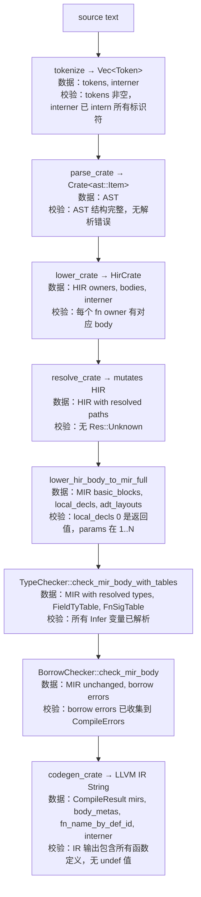

#### 14.7.4 审查完成标准

跨阶段审查完成需满足：
1. 6 个维度全部通过（D1-D6）
2. §11 合规验证清单全部 ✅
3. 数据流完整性校验全部通过
4. 发现的问题全部修复（P0/P1 必须修复，P2 可记录为技术债）
5. 所有测试通过（cargo test 0 failures）
6. clippy 0 warnings，fmt 通过

#### 14.7.5 审查频率

- **常规**：每个大阶段（Stage 0/1/2/3/4/5）完成后执行一次
- **强制**：当用户明确要求"跨阶段审查"时
- **可选**：当连续 3 轮 gate review 收敛后（§7.3.3），可在下一轮加入跨阶段审查维度

### 14.8 阶段末尾设计回写协议

> **目的**：在每个**大阶段末尾**结束前，强制对照 `docs/lang-design/` 对应阶段文档与项目实际实现，深入思考"理论设计 vs 现实实现"的偏差，判断二者一致性、当前最优、是否可重构实现，结论同步回写设计文档。这是把 §13.1（阶段开始设计对齐）形成闭环的关键协议——开始时读设计，结束时写设计，避免设计文档与实现长期脱节。
>
> **核心理念**：理论设计是基线，现实实现是事实。两者必然存在偏差（设计的灰区被实现填满、实现走了捷径偏离设计、设计本身需要修正）。偏差不可怕，可怕的是不识别、不记录、不修正。本协议把"偏差识别与回写"从可选行为固化为强制行为。
>
> **触发时机**：
> 1. 每个**大阶段**（Stage 0/1/2/3/4/5...）的最末轮 gate review
> 2. 连续 3 轮收敛后进入下一大阶段前
> 3. 用户明确要求"对照设计文档审查"时
> 4. §14.5 深度审查 D5（设计合理性）识别设计偏差时
>
> **执行者**：ARCH-A 主导偏差分析，REV-A 验证回写准确性，PM-A 协调纳入下一阶段计划。

#### 14.8.1 偏差分类

理论设计 D（来自 `docs/lang-design/`）与现实实现 I 之间存在 4 类偏差：

| 偏差类型 | 描述 | 处理方式 |
|---------|------|---------|
| **B1 实现 < 设计** | 设计要求但实现未做（设计超前） | 纳入下一阶段计划（§13.1 沿用） |
| **B2 实现 > 设计** | 实现做了但设计未要求（实现超前） | 评估是否补写设计文档（如属于"灰区填满"则补写） |
| **B3 实现 ≠ 设计** | 实现与设计冲突（实现走了捷径） | 评估哪种更优：若实现更优 → 更新设计文档；若设计更优 → 纳入重构计划（§13.4） |
| **B4 设计灰区** | 设计未覆盖但实现已做（设计滞后） | 必须补写设计文档（实现即事实） |

#### 14.8.2 回写流程

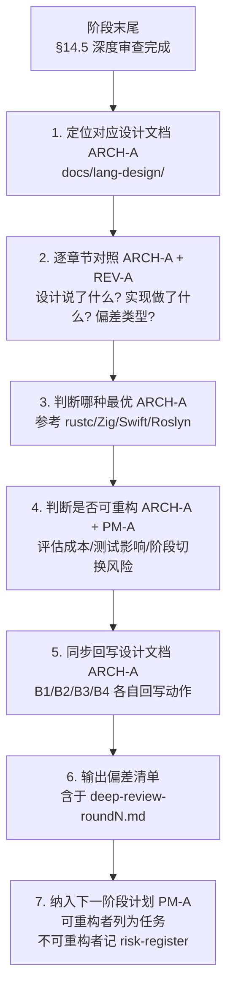

#### 14.8.3 强制要求

1. **大阶段末尾必须执行**：跳过 §14.8 的 deep-review 报告不允许 PASS，必须 NEEDS REVISION 补做。
2. **偏差清单不可省略**：`deep-review-roundN.md` 必须包含"设计偏差清单"小节。即使所有章节都"实现 = 设计"，也必须明确写"无偏差"，并附逐章节对照记录。
3. **回写设计文档是单向的**：只允许"实现 → 设计"回写（把现实实现反映到设计文档），不允许"设计 → 实现"硬塞（让设计文档强行描述未实现的特性）。后者属于 B1，应纳入下一阶段计划。
4. **回写内容最小化**：设计文档只记录"设计 + 理由"，不记录实现细节。实现细节归 `docs/develop/v0/stage-N/dev-log.md`。
5. **可重构不等于立即重构**：B3 偏差即使判定"可重构"，也不强制本阶段立即重构。最佳时机是"本阶段完全结束、新阶段未开始时"（§13.2 切换期重构）——此时重构对当前阶段已交付成果零影响，对新阶段是干净基线。

#### 14.8.4 偏差清单输出格式

```markdown
## 6. 设计偏差清单（§14.8）

| 设计文档章节 | 偏差类型 | 偏差描述 | 最优判断 | 重构判断 | 回写动作 |
|-------------|---------|---------|---------|---------|---------|
| 06-mir.md §2.1 顶层结构 | B3 | 设计要求 MirBody 含 `local_decls: Vec<LocalDecl>`，实现用 `local_decls: Vec<LocalDecl>` ✓ | 二者等价 | N/A | 无 |
| 06-mir.md §3.2 BasicBlock | B1 | 设计要求 `is_cleanup: bool` 字段，实现未做 | 设计更优（影响 unwind 正确性） | 可重构（≤3 文件） | 纳入 Stage 6.X 计划 |
| 07-codegen.md §4 vtable | B4 | 实现已做 vtable emission，设计文档无此章节 | 实现即事实 | N/A | 补写 07-codegen.md §4.X vtable emission |
```

#### 14.8.5 与 §13.1 / §13.4 的闭环关系

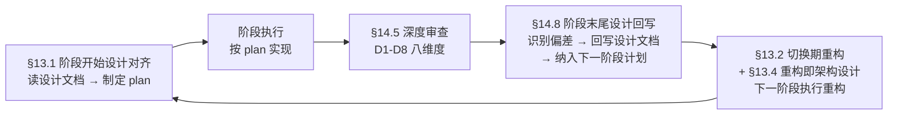

四者形成"读设计 → 实现 → 审查 → 回写 → 重构 → 读设计"的完整闭环。任一环节缺失都会导致设计文档与实现长期脱节，最终演变为"文档是文档、代码是代码"的双轨制——这是项目失控的典型先兆。

---

## 15. 项目图管理

> **标准化项目图文件管理**：使用 mermaid 维护设计/阶段/总数据流图与关键词执行流图。

### 15.1 目的与原则

**目的**：把"用图记录数据流"从可选行为固化为流程规则。图比文字更直观——一张数据流图胜过千行文字描述。

**核心原则**：
1. **统一格式**：所有图使用 mermaid（在 Markdown 中内嵌），不使用外部图片或专有格式。
2. **三层覆盖**：设计层数据流图、阶段层数据流图、总体数据流图齐全。
3. **关键词全覆盖**：所有语言关键词都有执行流图。
4. **同步更新**：设计/实现/测试变更时同步更新图。
5. **标准化管理**：图的命名、组织、版本管理遵循统一规则。

### 15.2 目录结构与命名

**位置**：`docs/graph/<sub_dirname>/`

```text
docs/graph/
├── README.md                          # 图索引
├── overall/                           # 总体数据流图（编译器全流水线）
│   ├── README.md
│   ├── compiler-pipeline.md           # 编译器整体流水线图
│   ├── data-flow-end-to-end.md        # 端到端数据流图
│   └── stage-transition.md            # 阶段切换图
├── design/                            # 设计层数据流图（按 lang-design 章节）
│   ├── README.md
│   ├── 01-lexer-flow.md               # Lexer 数据流图
│   ├── 02-parser-flow.md              # Parser 数据流图
│   ├── 03-ast-structure.md            # AST 结构图
│   ├── 04-type-system-flow.md         # 类型系统数据流图
│   ├── 05-ownership-borrowing-flow.md # 所有权借用数据流图
│   ├── 06-hir-flow.md                 # HIR 数据流图
│   ├── 07-mir-flow.md                 # MIR 数据流图
│   ├── 08-codegen-flow.md             # Codegen 数据流图
│   └── ...
├── stage/                             # 阶段层数据流图（按 stage 编号）
│   ├── README.md
│   ├── stage-0/
│   │   ├── lexer-data-flow.md
│   │   └── parser-data-flow.md
│   ├── stage-1/
│   │   ├── hir-lower-data-flow.md
│   │   └── resolve-data-flow.md
│   ├── stage-2/
│   │   ├── mir-lower-data-flow.md
│   │   ├── typeck-data-flow.md
│   │   └── borrowck-data-flow.md
│   ├── stage-3/
│   │   └── codegen-data-flow.md
│   └── ...
└── keywords/                          # 关键词执行流图（按语言关键词）
    ├── README.md
    ├── control-flow/
    │   ├── if-else.md                 # if/else 执行流图
    │   ├── match.md                   # match 执行流图
    │   ├── loop.md                    # loop 执行流图
    │   ├── while.md                   # while 执行流图
    │   ├── for.md                     # for 执行流图
    │   ├── break.md                   # break 执行流图
    │   ├── continue.md                # continue 执行流图
    │   └── return.md                  # return 执行流图
    ├── data-flow/
    │   ├── let.md                     # let 绑定执行流图
    │   ├── struct.md                  # struct 构造/访问流图
    │   ├── enum.md                    # enum 构造/match 流图
    │   ├── fn.md                      # fn 定义/调用流图
    │   ├── impl.md                    # impl 块流图
    │   └── trait.md                   # trait 定义/实现流图
    └── type-system/
        ├── as.md                      # as 类型转换流图
        ├── generics.md                # 泛型流图
        └── closure.md                 # 闭包流图
```

**`<sub_dirname>` 命名规则**：
- `overall/` — 总体图
- `design/` — 设计层图（按 lang-design 编号）
- `stage/` — 阶段层图（按 stage 编号）
- `keywords/` — 关键词图（按 control-flow/data-flow/type-system 分类）

**文件命名规则**：
- 全小写 + 连字符分隔
- 数据流图：`<主题>-data-flow.md` 或 `<主题>-flow.md`
- 结构图：`<主题>-structure.md`
- 关键词图：`<关键词>.md`（如 `if-else.md`）

### 15.3 四类图标准

#### 15.3.1 设计数据流图

**定义**：描述设计文档中定义的核心数据流——某个设计概念从输入到输出的完整流转过程。

**位置**：`docs/graph/design/<编号>-<主题>-flow.md`

**示例**：`docs/graph/design/07-mir-flow.md`

```markdown
# MIR 数据流图

> **Author**: redskaber
> **Date**: YYYY-MM-DD
> **Version**: v1.0
> **对应设计文档**: docs/lang-design/07-mir.md

## 1. HIR → MIR Lowering 流程

\`\`\`mermaid
flowchart TD
    HIR[HIR Body<br/>owners + bodies] --> LC[MirLowerCtxt]
    LC --> LB[lower_body]
    LB --> BB[lower_basic_block]
    BB --> LS[lower_statement]
    BB --> LE[lower_expr]
    LS --> PL[lower_place]
    LE --> RV[lower_rvalue]
    RV --> AGG[Aggregate Kind<br/>Adt/Tuple/Array]
    RV --> BN[Borrow Kind<br/>Shared/Mut/Unique]
    BB --> TM[Terminator<br/>Call/Return/Goto/Switch]
    LB --> LD[LocalDecls<br/>ty + mutability]
    LB --> MB[MirBody<br/>basic_blocks + local_decls + source]
\`\`\`

## 2. MIR 数据结构关系

\`\`\`mermaid
flowchart LR
    MirBody --> BasicBlocks
    MirBody --> LocalDecls
    MirBody --> SourceScopes
    BasicBlocks --> BasicBlock
    BasicBlock --> Statements
    BasicBlock --> Terminator
    Statements --> Statement
    Statement --> Place
    Statement --> Rvalue
    Terminator --> Call
    Terminator --> Return
    Terminator --> Goto
    Terminator --> SwitchInt
\`\`\`
```

#### 15.3.2 阶段数据流图

**定义**：描述某个开发阶段的实际数据流——代码实现中数据如何在模块间流转。

**位置**：`docs/graph/stage/stage-<N>/<模块>-data-flow.md`

**示例**：`docs/graph/stage/stage-2/typeck-data-flow.md`

```markdown
# Stage 2 Typeck 数据流图

> **Author**: redskaber
> **Date**: YYYY-MM-DD
> **Version**: v1.0
> **对应代码**: src/typeck/

## 1. Typeck 主流程

\`\`\`mermaid
flowchart TD
    Input[MirBody<br/>from MIR Lower] --> TC[TypeChecker::new]
    TC --> CK[check_mir_body_with_tables]
    CK --> BB[遍历 BasicBlocks]
    BB --> ST[遍历 Statements]
    ST --> UR[unify / resolve]
    UR --> UT[UnificationTable]
    CK --> FT[FieldTyTable 填充]
    CK --> FS[FnSigTable 填充]
    CK --> ER[CompileErrors 收集]
    CK --> Output[Typed MirBody<br/>+ Tables + Errors]
\`\`\`
```

#### 15.3.3 总体数据流图

**定义**：描述编译器从源码到目标代码的完整数据流——所有阶段的端到端视图。

**位置**：`docs/graph/overall/compiler-pipeline.md`

```markdown
# Landin 编译器总体数据流图

> **Author**: redskaber
> **Date**: YYYY-MM-DD
> **Version**: v1.0

\`\`\`mermaid
flowchart TD
    SRC[Source Text<br/>*.lin]
    L[Lexer]
    T[Vec Token]
    P[Parser]
    AST[Crate ast::Item]
    HL[HIR Lower]
    HIR[HirCrate]
    R[Resolver]
    RHIR[Resolved HIR]
    ML[MIR Lower]
    MIR[MirBody]
    TC[TypeChecker]
    TMIR[Typed MIR]
    BC[BorrowChecker]
    CMIR[Checked MIR]
    CG[Codegen]
    IR[LLVM IR String]
    EM[Emission]
    OBJ[Object File]
    LK[Linker]
    BIN[Executable]

    SRC --> L --> T --> P --> AST --> HL --> HIR --> R --> RHIR
    RHIR --> ML --> MIR --> TC --> TMIR --> BC --> CMIR
    CMIR --> CG --> IR --> EM --> OBJ --> LK --> BIN
\`\`\`
```

#### 15.3.4 关键词执行流图

**定义**：描述某个语言关键词从源码解析到代码生成的完整执行流——该关键词在编译器各阶段如何被处理。

**位置**：`docs/graph/keywords/<分类>/<关键词>.md`

**示例**：`docs/graph/keywords/control-flow/if-else.md`

```markdown
# `if` / `else` 关键词执行流图

> **Author**: redskaber
> **Date**: YYYY-MM-DD
> **Version**: v1.0

## 1. if/else 在各阶段的处理

\`\`\`mermaid
flowchart TD
    SRC[if cond \{ then \} else \{ else \}]
    LX[Lexer<br/>识别 if/else 关键字 token]
    PS[Parser<br/>parse_if_expr → ast::Expr::If]
    HL[HIR Lower<br/>lower_if → HirExpr::If]
    ML[MIR Lower<br/>lower_expr_if → Terminator::SwitchInt]
    TC[Typeck<br/>cond: bool, then/else: 同类型]
    BC[Borrowck<br/>两个分支的借用独立]
    CG[Codegen<br/>LLVM IR: br + label + phi]

    SRC --> LX --> PS --> HL --> ML --> TC --> BC --> CG
\`\`\`

## 2. MIR 层的 if-else lowering

\`\`\`mermaid
flowchart TD
    IF[HirExpr::If cond, then, else_opt]
    IF --> LC[lower_expr cond → Operand]
    LC --> CT[cast to bool if needed]
    CT --> BB1[BasicBlock: then_block]
    IF --> LT[lower_expr then → then_block terminators]
    IF --> LE[lower_expr else_opt → else_block]
    BB1 --> SW[Terminator::SwitchInt<br/>discriminant: cond, targets: then/else]
    SW --> EB[else_block or unreachable]
    EB --> MT[Merge block with phi if needed]
\`\`\`
```

### 15.4 图同步规则

**触发时机**：以下变更必须同步更新对应的图：

| 变更类型 | 必须更新的图 | 更新内容 |
|---------|------------|---------|
| 设计文档变更（`docs/lang-design/`） | `docs/graph/design/<对应编号>-flow.md` | 设计数据流图同步变更 |
| 实现新增/修改模块（`src/`） | `docs/graph/stage/stage-<N>/<模块>-data-flow.md` | 阶段数据流图同步变更 |
| 编译流水线变更（新增阶段/调整阶段顺序） | `docs/graph/overall/compiler-pipeline.md` | 总体数据流图同步变更 |
| 新增/修改语言关键词 | `docs/graph/keywords/<分类>/<关键词>.md` | 关键词执行流图同步变更 |
| MIR/HIR 数据结构变更 | `docs/graph/design/06-hir-flow.md` 或 `07-mir-flow.md` | 数据结构关系图同步变更 |
| §13.4 重构 | 所有相关图 | 重构后立即同步 |
| §14.5 深度审查发现设计偏差 | `docs/graph/design/` 对应图 | 偏差回写后同步更新 |

### 15.5 图审查检查

在委员会投票前，QA 角色必须验证（补充 §8.5 第 8 项）：

1. 设计变更是否同步了 `docs/graph/design/` 对应图
2. 实现变更是否同步了 `docs/graph/stage/` 对应图
3. 流水线变更是否同步了 `docs/graph/overall/` 对应图
4. 新增关键词是否补充了 `docs/graph/keywords/` 对应图
5. 所有图是否使用 mermaid 格式（无外部图片）
6. 所有图是否有元数据头（Author/Date/Version）
7. 所有图是否标注对应设计文档/代码/关键词来源

**未通过则触发 NEEDS REVISION。**

### 15.6 与其他协议的关系

| 协议 | 与 §15 的关系 |
|------|--------------|
| §8 文档同步规则 | §15 是 §8 的子规则——图是文档的一部分 |
| §13.1 阶段开始设计对齐 | 设计对齐时同步查阅 `docs/graph/design/` 中的图 |
| §13.4 重构即架构设计 | 重构 plan 必须包含新结构图（§13.4.2 步骤 4） |
| §14.5 深度审查 D1 架构健康度 | D1 输出"架构图 + 耦合点清单"即引用 §15 的图 |
| §14.5 深度审查 D8 测试路径覆盖 | D8 验证测试流与 §15 的图是否相互印证 |
| §14.6.1.1 数据流覆盖分支检测 | 输出到 `docs/tests/pipeline-test-coverage.md` 时引用 §15 的总体数据流图 |
| §14.8 阶段末尾设计回写 | 设计偏差回写时同步更新 `docs/graph/design/` 对应图 |

### 15.7 标准化项目图管理

**目的**：把"图管理"从零散行为升级为标准化管理，确保图的质量、一致性、可追溯性。

**管理原则**：
1. **版本管理**：每个图必须有 `Version` 字段，变更时 bump 版本号。
2. **来源标注**：每个图必须标注对应的设计文档/代码/关键词来源。
3. **审查纳入**：图变更纳入 §8 文档同步审查 + §14.5 深度审查。
4. **索引维护**：`docs/graph/README.md` 必须索引所有图，按类别列出 + 链接 + 简要说明。
5. **命名规范**：遵循 §15.2 的命名规则，全小写 + 连字符分隔。
6. **格式统一**：所有图使用 mermaid 在 Markdown 中内嵌，不使用外部图片或专有格式。

---

## 16. 变更日志

### 16.1 流程版本历史

| 版本 | 阶段 | 关键变更 |
| :--- | :--- | :--- |
| v1.0 | Stage 1.1 | 初始流程：5 角色 + 投票规则 + 4-7 轮 |
| v2.0 | Stage 2.0 | 动态自适应轮次 + 缺陷分级 + 加权投票 + 紧急通道 |
| v3.0 | Stage 2.4 | **集成验证协议** + P3 误分类审查 + 阶段门审查 + "孤立正确"防崩 |
| v3.1-v3.4 | Stage 2.4f-2.4i | 负向测试矩阵（§7.1.1）+ 扩展审计（§7.3.1）+ 边界 case（§7.3.2）+ 收益递减（§7.3.3） |
| v3.5-v3.8 | Stage 3.6-3.10 | 文档同步规则（§8）+ Author 标注 + 文档组织结构（§8.4）+ 文档优先查询（§8.4.5） |
| v3.9-v3.11 | Stage 3.18-3.30 | 开发阶段变动规则（§13.3）+ 最优>最小（§12）+ 接口隔离（§11） |
| v3.12-v3.13 | Stage 3.42-3.47 | 测试矩阵全覆盖（§9）+ 轮次完成文档同步 |
| v3.14-v3.15 | Stage 3.60-3.63 | 跨阶段深度审查（§14.7）+ API 命名标准化（§10） |
| v3.16-v3.22 | — | 阶段末尾深度审查（§14.5）+ 三阶段文档协议（§9.3）+ worklog 同步（§8.6）+ examples/ 标准化（§9.6）+ 环境/验收/Spec 演进（§3）+ 重构即架构设计（§13.4）+ §2.0 核心决策原则 + LLVM 文档同步（§8.3）+ 流水线测试路径覆盖（§9.5.1）+ D8 维度 |
| v3.23 | Stage 14.114 | **阶段间深度验证与架构审查协议**（§14.6）— 4 项强制审查 + 多轮深挖 + 性能测试 + 自我强化 |
| v4.0 | Stage 14.114+ | 结构重构 + 新增 §A-§F：项目图管理（§15）+ 工具/脚本目录（§3.4）+ 自动化工具链（§3.5）+ 设计-开发-测试锚定（§9.4）+ 1:3+ 正负比（§9.4.3）+ 阶段切换期重构（§13.2）+ 设计-审查循环（§13.5） |
| **v5.0** | **Stage 16.75** | **重构 v4.0：100% 覆盖原版意图，精简表达。** 合并冗余 changelog、移除历史覆盖矩阵与"v4.0 新增"标记、合并类似 mermaid 图、用表格替代段落、补充开发期不引入简写语法（§13.3.6）、明确 §3.2 验收命令需 `--features llvm-backend`、强化 §5.3 退出标准对 llvm-backend 的要求 |
| **v6.0** | **Stage 18.120** | **优化重构 v5.0 + 新增 §17 任务规划排版图。** 100% 保留 v5.0 全部规则。新增 §17：七步任务规划流程（扫描→依赖图→节点流→递归→设计-开发-测试节点→缺陷纳入→优化补充）。§17 将阶段任务规划从线性列表升级为依赖图+节点流模型。更新 §2.1 总体原则 + §1.2 路由表添加 §17 引用。 |
| **v6.1** | **Stage 18.122** | **深度审查修复：8 个 HIGH+MEDIUM 问题。** 修正 §8.4.3 lang-design 文件名（与实际磁盘一致）、修正 P3 误分类数量矛盾（12 vs 17 → 统一表述）、修复 4 个断裂交叉引用（§2.0/§8.6.4/§13.3.6/§A-§F）、§3.2 验收命令补全 cargo check、§4 头部添加 §17 前置条件标记、§3.1 工具表添加 LLVM 工具链、§17.2 扫描表添加路线图+Agent 技能。 |
| **v6.2** | **Stage 18.123** | **MEDIUM 修复：6 项。** §14.7 D1-D6 → C1-C6 重编号（避免与 §14.5 D1-D8 冲突）、§17.8 + §14.5 添加 max-retry 守卫、§17.4 "权重"定义、§8.6 worklog 路径相对化（`<repo-root>/worklog.md`）、§1.2.1 新增 L1/L2/L3 流程分层应用、§3.1 ASCII-art → mermaid。 |

### 16.2 v5.0 关键改进

1. **精简化**：从 v4.0 的 2633 行精简到约 1700 行，去除冗余 changelog（25+ 行历史版本细节合并为 1 行）+ 移除 v3.23→v4.0 覆盖矩阵（纯历史性）+ 移除"v4.0 新增"标记（已成为基线）+ 合并类似 mermaid 图。
2. **表达精要化**：用表格替代段落（§3.1 检查时机、§6.6 校准结论、§13.3 适用范围等）；用列表替代散文（§13.3 重构指导原则）。
3. **补充 v4.0 缺失**：
   - §3.2 验收命令补充 `--features llvm-backend`（v4.0 验收命令与 §5.3 退出标准未对齐）
   - §5.3 退出标准第 3 条补充 `--features llvm-backend`（v4.0 仅说 `cargo build` 0 warnings，未指明 backend）
   - §13.3 第 6 条新增"开发期不要引入简写语法，稳定期才是好时机（整体引入）"
4. **100% 保留所有硬性规则**：v4.0 的所有 9 条核心设计决策原则、所有 MUV 字段、所有缺陷等级、所有集成测试要求、所有审查协议（§7.3.1-§7.3.3、§14.5 D1-D8、§14.6 4 项、§14.7 6 维度、§14.8 B1-B4）、所有命名标准、所有接口隔离规则、所有图管理规则——100% 覆盖。
5. **路由更清晰**：§1.2 任务路由表更紧凑，移除"Spec 演进"行（合并到 §3）。

### 16.3 v4.0 → v5.0 覆盖确认

v5.0 完整保留 v4.0 的全部规则内容，100% 覆盖。差异仅在表达形式：

| v4.0 章节 | v5.0 章节 | 差异 |
|-----------|-----------|------|
| §1 文档导航 | §1 文档导航 | 合并路由表，移除冗余说明 |
| §2 核心原则 | §2 核心原则 | 100% 保留 |
| §3 环境与工具 | §3 环境与工具 | §3.2 验收命令补充 `--features llvm-backend` |
| §4 MUV 拆分 | §4 MUV 拆分 | 100% 保留 |
| §5 内循环 | §5 内循环 | §5.3 退出标准第 3 条补充 `--features llvm-backend` |
| §6 缺陷分级 | §6 缺陷分级 | §6.6 校准基线表精简为结论 |
| §7 集成验证 | §7 集成验证 | 100% 保留 |
| §8 文档同步 | §8 文档同步 | 100% 保留 |
| §9 测试标准 | §9 测试标准 | 100% 保留 |
| §10 API 命名 | §10 API 命名 | 100% 保留 |
| §11 接口隔离 | §11 接口隔离 | 100% 保留 |
| §12 最优>最小 | §12 最优>最小 | 100% 保留 |
| §13 阶段切换 | §13 阶段切换 | §13.3 新增第 6 条"开发期不引入简写语法" |
| §14 深度审查 | §14 深度审查 | 100% 保留 |
| §15 项目图管理 | §15 项目图管理 | 100% 保留 |
| §16 变更日志 | §16 变更日志 | 精简版本历史 + 移除覆盖矩阵 + 移除"设计意图来源" + 移除"反臃肿检查"（均为描述性内容，非操作规则） |

---

## 17. 任务规划排版图

> **目的**：将阶段任务规划从"线性列表"升级为"依赖图+节点流"模型，确保任务无遗漏、依赖清晰、缺陷有修复计划、设计-开发-测试三者锚定。
>
> **触发时机**：每个新阶段（含子阶段）启动时的第一次规划，在 §13.1 设计对齐之后、§4 MUV 拆分之前。
>
> **执行者**：PM-A 主导规划，ARCH-A 协同解读设计文档，REV-A 审查规划与设计文档的一致性。

### 17.1 任务规划排版图七步流程

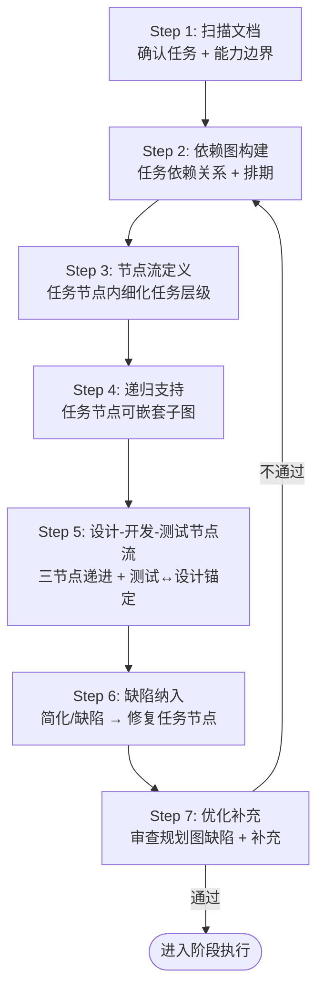

### 17.2 Step 1: 扫描文档 — 确认任务与能力边界

**执行者**：PM-A + ARCH-A

扫描以下文档，确认当前阶段的任务范围和编译器能力边界：

| 扫描目标 | 目的 | 输出 |
|---------|------|------|
| `docs/lang-design/` 对应阶段设计文档 | 确认设计意图 | 设计意图摘要 (3-5 句) |
| `docs/develop/v0/tech-debt-register.md` | 确认当前技术债状态 | 已解决项 + 剩余项清单 |
| `docs/develop/v0/v0.1-capability-boundaries.md` | 确认当前能力边界 | 已支持/限制/不支持列表 |
| `docs/develop/v0/v0.5-roadmap.md` (或当前路线图) | 确认长期路线图对齐 | 当前版本在路线图中的位置 |
| `docs/agent-team/04-agent-skills.md` | 确认 Agent 团队能力 | 可用技能清单 |
| `docs/tests/matrix.md` | 确认当前测试覆盖 | 测试计数 + 覆盖率 |
| `docs/worklog.md` (尾部) | 确认上一阶段输出 | 上一阶段 Stage Summary |
| `docs/develop/v0/stage-N/` (最新 gate-review) | 确认审查结论 | GO / GO-WITH-CONDITIONS / NO-GO |

**强制规则**：
1. 不得跳过扫描直接规划——即使 Agent "知道"当前状态，也必须先查文档确认。
2. 扫描输出必须包含"能力边界确认"——明确当前编译器能做什么、不能做什么。
3. 如果文档与实际状态不一致，以代码为准但必须在本阶段修正文档（per §8.4.5）。

### 17.3 Step 2: 依赖图构建 — 任务依赖关系与排期

**执行者**：PM-A

基于 Step 1 的扫描结果，构建任务依赖图：

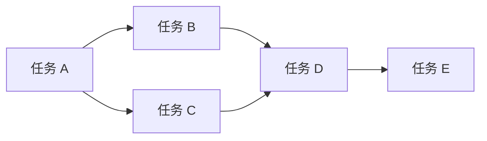

**依赖图规则**：

| 规则 | 说明 |
|------|------|
| 有向无环图 (DAG) | 任务依赖图必须是 DAG——不允许循环依赖 |
| 边 = 执行依赖 | A → B 表示 B 的前置条件是 A 完成 |
| 节点 = 任务节点 | 每个节点是一个"任务节点"（见 Step 3） |
| 并行执行 | 无依赖关系的节点可并行执行 |
| 排期 = 拓扑排序 | 按拓扑排序确定执行顺序 |

**输出**：任务依赖图（mermaid 格式）+ 拓扑排序后的执行计划。

### 17.4 Step 3: 节点流定义 — 任务节点内细化任务层级

**执行者**：PM-A + ARCH-A

每个任务节点内部细化任务层级流：

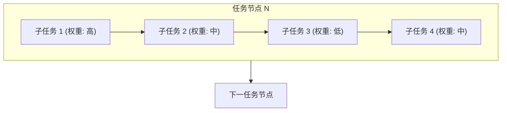

**节点内规则**：

| 规则 | 说明 |
|------|------|
| 任务权重 | 权重仅作用于节点内任务排序（高→低），不影响跨节点执行顺序。权重含义：**高**=阻塞型/核心路径任务；**中**=重要但可并行；**低**=辅助/文档类 |
| 节点完成条件 | 节点内所有任务 + 子任务全部完成，才能根据执行流边进入下一任务节点 |
| 任务层级 | 节点内任务可有父子关系（子任务是父任务的细化） |
| MUV 对齐 | 每个叶子任务对应一个 MUV（§4），有明确的输入条件、输出物、验收标准 |

### 17.5 Step 4: 递归支持 — 任务节点可嵌套子图

**执行者**：PM-A

任务节点本身也可以是一个任务依赖子图（递归）：

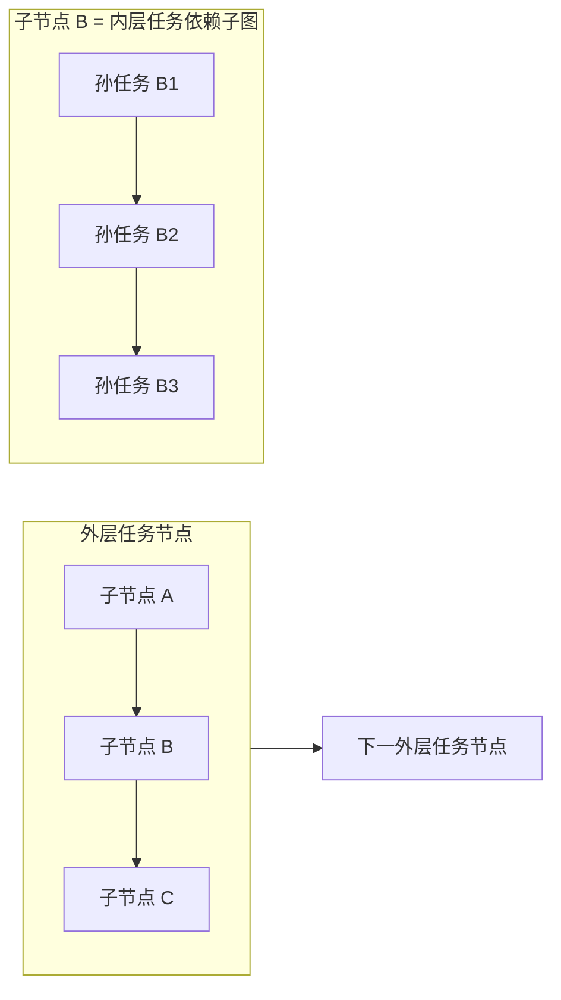

**递归规则**：
1. 任何任务节点可以展开为子依赖图。
2. 子图的完成条件 = 子图内所有叶子任务完成。
3. 递归深度无硬性限制，但建议 ≤3 层（避免过度规划）。
4. 子图的执行顺序遵循同一套拓扑排序规则。

### 17.6 Step 5: 设计-开发-测试节点流 — 三节点递进

**执行者**：ARCH-A (设计) + DEV-A (开发) + QA-A (测试)

每个任务节点的内部流应遵循"设计节点 → 开发节点 → 测试节点"递进模式：

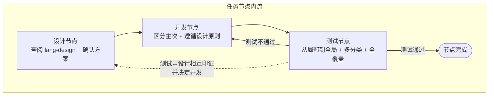

**三节点规则**：

| 节点 | 职责 | 输出 |
|------|------|------|
| 设计节点 | 查阅 `docs/lang-design/`，确认方案，输出设计摘要 | 设计意图 + 数据结构 + 接口契约 |
| 开发节点 | 按设计实现代码，区分任务主次关系，遵循 §2.2 设计原则 | 代码 + MIR/IR 验证 |
| 测试节点 | 按测试理论设计测试用例，从局部到全局，多分类，全覆盖 | 测试用例 + 覆盖矩阵 |

**测试节点递进图**：

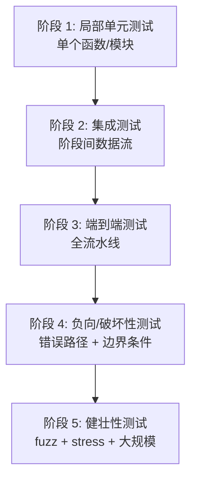

**测试↔设计锚定**（per §9.4）：
- 测试用例必须与设计文档相互印证——测试验证设计意图，设计驱动测试用例。
- 如果测试发现设计缺陷，必须回到设计节点修正设计（测试 → 设计反馈边）。
- 如果开发实现偏离设计，测试应捕获偏差（测试 → 开发反馈边）。

### 17.7 Step 6: 缺陷纳入 — 简化/缺陷 → 修复任务节点

**执行者**：PM-A + ARCH-A

如果当前开发过程存在缺陷或简化，必须将完整修复缺陷与简化纳入任务规划排版图：

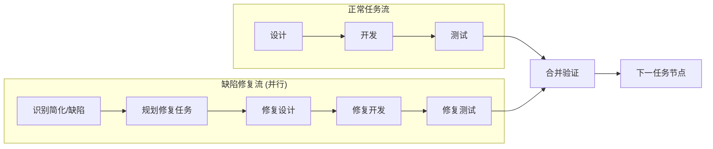

**缺陷纳入规则**：

| 规则 | 说明 |
|------|------|
| 识别 | 在设计/开发/测试/审查/修复/重构/文档更新任何流程中发现简化或缺陷时，必须识别并记录 |
| 规划 | 将修复任务作为独立任务节点纳入依赖图（不遗漏） |
| 优先级 | 修复任务的优先级按 §6 缺陷分级确定（P0 阻塞、P1 重要、P2 可延后） |
| 文档化 | 简化/缺陷的原因及描述必须记录在开发/设计文档中（per §8） |
| 修复计划 | 每个简化/缺陷必须有明确的修复计划（目标版本 + 修复方案） |
| 适用范围 | 此条例适用于：设计、开发、测试、审查、修复优化重构、复写更新等所有流程 |

### 17.8 Step 7: 优化补充 — 审查规划图缺陷

**执行者**：REV-A

审查任务规划排版图的完整性：

| 检查项 | 要求 |
|--------|------|
| 任务遗漏 | 所有设计文档要求的功能是否都有对应任务节点？ |
| 依赖完整性 | 所有任务的前置依赖是否明确？是否有缺失的依赖边？ |
| 缺陷纳入 | 所有已知的简化/缺陷是否有修复任务节点？ |
| 测试覆盖 | 测试节点是否覆盖所有开发节点？是否有负向/破坏性测试？ |
| 能力边界 | 规划是否超出了当前编译器能力边界？超出的部分是否有前置任务？ |
| 递归合理性 | 子图递归深度是否合理（≤3 层）？是否有过度规划？ |

**不通过时**：回到 Step 2 重新构建依赖图。**最多重试 3 次**；3 次不通过则升级到 PM-A + ARCH-A 仲裁，由 PM-A 决定是否缩减范围或调整设计意图。

### 17.9 任务规划排版图输出格式

任务规划排版图必须输出到 `docs/develop/v0/stage-N/plan.md`，包含以下结构：

```markdown
# Stage N 任务规划排版图

## 1. 扫描结果 (Step 1)
- 设计意图摘要: ...
- 能力边界: ...
- 技术债状态: ...

## 2. 任务依赖图 (Step 2)
```mermaid
graph LR
    A[任务 A] --> B[任务 B]
    ...
```

## 3. 任务节点详情 (Step 3-4)
### 任务节点 A: ...
- 子任务 A1 (权重: 高): ...
- 子任务 A2 (权重: 中): ...
- 完成条件: ...

### 任务节点 B: ... (递归子图)
```mermaid
...
```

## 4. 设计-开发-测试节点流 (Step 5)
### 任务节点 A 内流:
- 设计节点: ...
- 开发节点: ... (主任务: ..., 次任务: ...)
- 测试节点: ... (阶段 1-5)

## 5. 缺陷修复任务 (Step 6)
### 缺陷 D1: ...
- 原因: ...
- 修复计划: ...
- 修复任务节点: ...

## 6. 审查结论 (Step 7)
- GO / NEEDS REVISION
```

### 17.10 与现有章节的关系

| 现有章节 | §17 关系 |
|---------|---------|
| §4 MUV 拆分 | §17 Step 3 的叶子任务 = MUV；§17 是 §4 的前置规划 |
| §13.1 设计对齐 | §17 Step 1 扫描包含 §13.1 的设计文档查询；§17 在 §13.1 之后执行 |
| §5 审查-修订内循环 | §17 Step 7 审查 = §5 内循环在规划层面的应用 |
| §9.4 设计-开发-测试锚定 | §17 Step 5 三节点流 = §9.4 在任务规划层面的实例化 |
| §6 缺陷分级 | §17 Step 6 缺陷纳入使用 §6 的分级标准 |
| §14 深度审查 | §17 在阶段开始时执行，§14 在阶段末尾执行——首尾呼应 |

---

**This document is the single source of truth for the Landin development
process. All agents (main + subagents) must follow it. v6.2 effective
from Stage 18.123+.**
